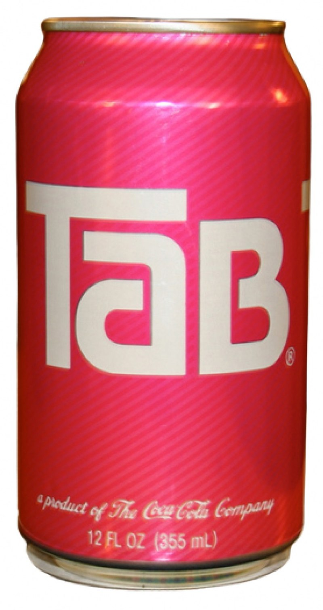
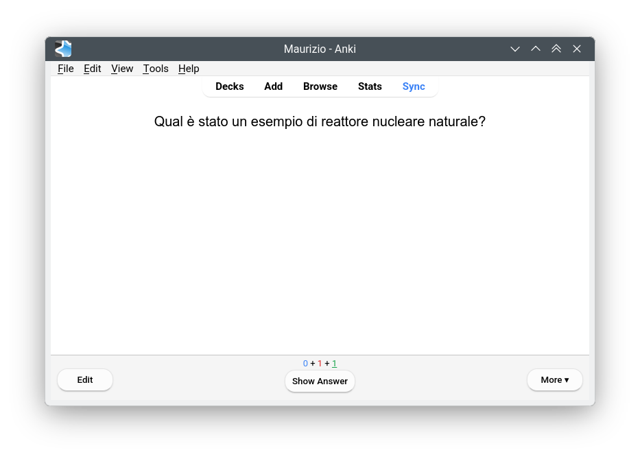
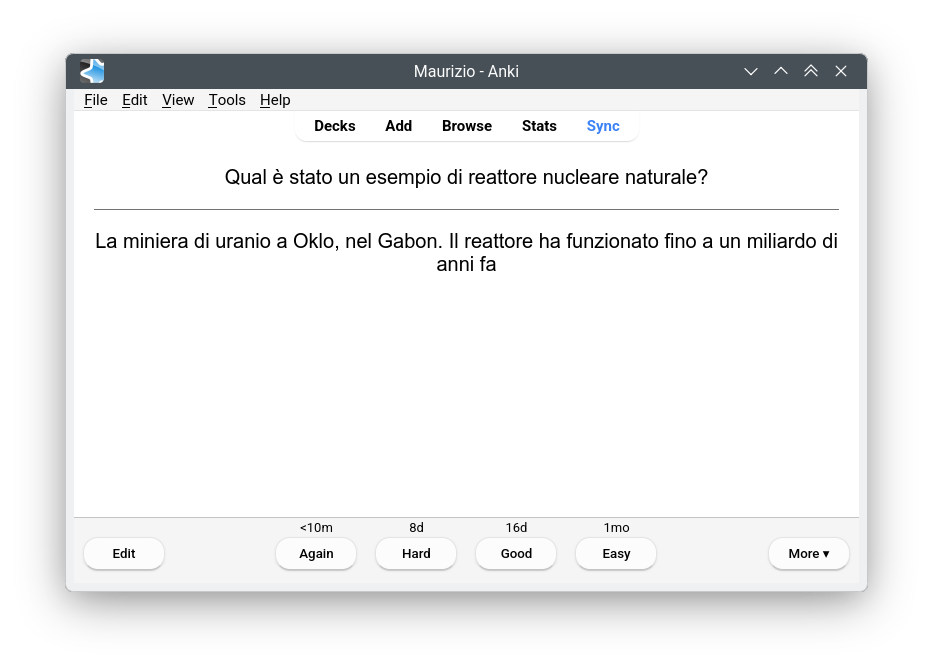
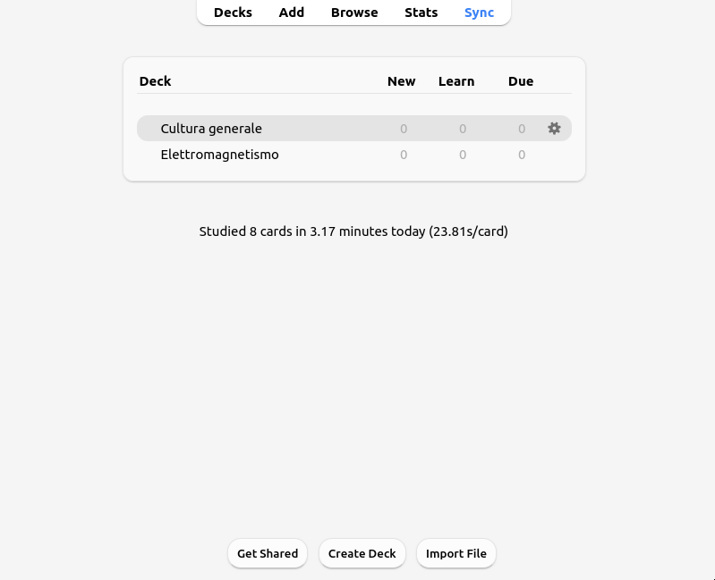
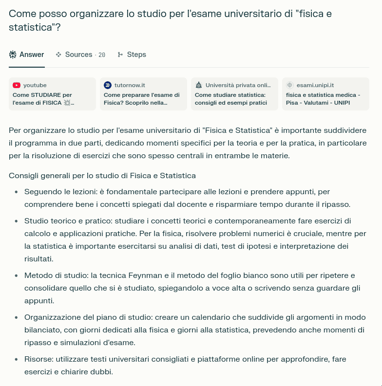
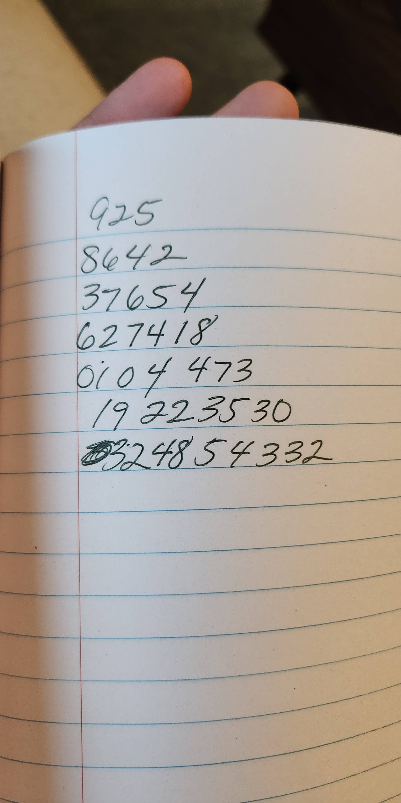
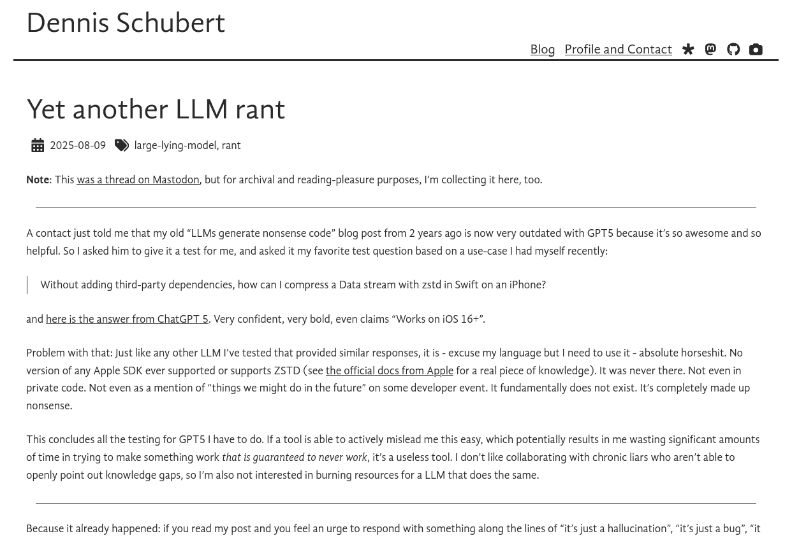
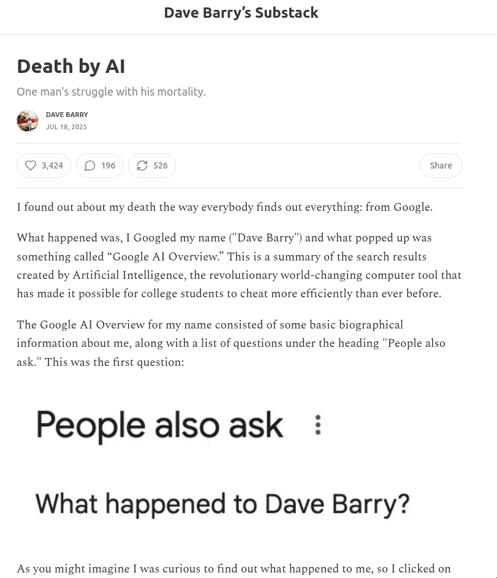

# Introduzione al corso

# Queste slides

-   Il materiale delle lezioni di questo modulo dell’insegnamento sarà fornito in forma di slide come quelle che state vedendo ora.

-   Non c’è un libro di testo consigliato: le slide dovrebbero bastare per la preparazione.

-   Queste slides sono disponibili all'indirizzo [ziotom78.github.io/tecniche-audio](https://ziotom78.github.io/tecniche-audio/), e sono navigabili.

-   Se vi è più comodo, potete ottenere una versione PDF producendola da soli: basta aggiungere `?print-pdf` alla fine della URL e stampare la pagina da browser in un file PDF (vedi le [istruzioni dettagliate](https://revealjs.com/pdf-export/)).

---

{height=640px}

<https://ziotom78.github.io/tecniche-audio/>

# Modalità d’esame

-   Esame scritto della durata di 60 minuti
-   Articolato in:
    -  5 domande a risposta multipla
    -  2 domande a risposta aperta breve
    -  Analisi di un caso pratico

# Fare domande a lezione

-   È una triste consuetudine che gli studenti universitari siano timidi nel fare domande…

-   Ma fare domande è un ottimo modo per capire meglio gli argomenti.

-   Se la domanda è sincera, **non è mai stupida**!

# Inquisitori accademici onorari

-   Per abituare gli studenti a intervenire a lezione, ho inventato il prestigioso titolo di **Inquisitore accademico onorario** 🎓: all’inizio di ogni lezione conferirò questo titolo ad alcuni di voi, che dovranno fare **almeno una domanda** durante la lezione (è permesso farne più di una!) Questo non vieta agli altri di fare domande se non hanno capito qualcosa, ovviamente!

-   Non è come le interrogazioni delle superiori. Al contrario: qui **l’interrogato sono io**!

-   Vorrei che per la fine di questo ciclo di 10 lezioni tutti abbiano rivestito almeno una volta questo ruolo.

# Introduzione all’argomento di oggi

- Oggi parleremo di *misure*!

- E iniziamo con una domanda: quando misuriamo? Perché è importante saper misurare?

# Cosa significa misurare?

# Esempio della (mia) vita reale

Malattia di Kawasaki!

# Uova sode

{height=600px}

# Come si misura

# Due sistemi a confronto

- In Italia si usa il Sistema Metrico Decimale, dove le misure sono espresse in metri, secondi, kilogrammi, etc.

- Non è l’unico sistema! Avete mai sentito parlare di piedi, pollici, once, galloni, acri…? Questo è il cosiddetto “sistema imperiale britannico”, usato nel Regno Unito; gli USA ne impiegano uno molto simile.

- Avete in mente casi dove avete usato le unità di misura britanniche?

---

{height=640px}

# Il sistema imperiale

-   Le sue radici sono antichissime: certe convenzioni derivano dall’Impero Romano!

-   Ha suddivisioni apparentemente illogiche. Per esempio, queste sono le misure delle lunghezze:

    #. 1 miglio = 8 furlong (“stadi”)
    #. 1 furlong = 10 catene
    #. 1 catena = 66 piedi
    #. 1 piede = 30 pollici

-   Secondo voi, perché si usano divisioni così strane?

# Criteri di divisibilità

-   Nella vita quotidiana capita spesso di dover dividere una misura in più parti.

-   Ad esempio, cosa fate se dovete cucinare una cena per sei persone, ma la ricetta riporta gli ingredienti per quattro persone?

# Numeri più divisibili di altri

-   Ci sono numeri che hanno molti divisori, come il 12 (che ha 2, 3, 4 e 6 come divisori), e altri che sono messi peggio, come il 17 (un numero primo!).

-   Nella vita quotidiana è molto comodo avere a che fare con numeri facili da dividere.

-   Lo sapevano bene i Sumeri, che usavano infatti un sistema duodecimale, ossia in base 12 (basato sull’anatomia della mano umana!) anziché decimale come il nostro.

# Divisibilità dei primi 30 numeri

# Divisibilità nel sistema imperiale

-   Un miglio è lungo 5280 piedi. Il numero 5280 ha ben **quarantotto** divisori: 2, 3, 4, 5, 6, 8, 10, 11, 12, 15, 16, 20…

-   Al contrario, un numero “tondo” come 1000 ha appena sedici divisori: 2, 4, 5, 8, 10, 20… Questo significa che quando si divide 1000 per qualcosa, è più probabile dover gestire numeri con la virgola.

-   Ecco perché gli antichi romani preferivano multipli diversi dal 10: all’epoca i numeri con la virgola erano sconosciuti, e si contava solo con gli interi!

# Misure di volume

-   Lo stesso principio si vede anche nelle misure di volume:

    -   1 gallone = 4 quarti
    -   1 quarto = 2 pinte
    -   1 pinta = 2 cup (tazze)
    -   1 cup = 8 fluid ounces (fl oz)

-   Si suddivide progressivamente per 2 o multipli di 2, e ci sono tante suddivisioni: è meno necessario usare numeri con la virgola.

# Esempio pratico

-   Una ricetta per quattro persone dice di usare “1 tazza di farina” (negli USA si misura la farina in volumi anziché in grammi: è più pratico!)

-   Io però voglio preparare la ricetta per sei persone. Come faccio?

    #. Divido una tazza per quattro: siccome una tazza sono 8 fl oz, ottengo 2 fl oz a persona
    #. Moltiplico per sei: sono 12 fl oz, che equivalgono a “1 tazza e 4 fl oz”

-   Provate a pensare cos’avreste fatto se invece la dose di farina fosse stata 150 g…

# Altri esempi

-   Per misurare il peso (meglio: la massa! lo vedremo nella prossima lezione), si usa la libbra, che equivale a 16 once

-   Però l’uso di dividere una libbra in 16 once è stato introdotto nel 1300 per uniformarsi al sistema francese; prima una libbra era divisa in 12 once! (Questa era la divisione usata nell’Impero Romano)

-   Anche nella suddivisione di sterline in penny il Regno Unito seguiva (fino al 1971) lo stesso principio: una sterlina (“£”) valeva 20 scellini (“s”), ed uno scellino valeva 12 pence (“d”, dal latino *denarius*).

# Perché proprio queste unità?

-   Dito, piede e cubito erano usate già dagli egizi, arrivate ai romani tramite i greci

-   Quest’antichissima origine è riflessa nell’uso di alcune parole inglesi, che anziché derivare dalle lingue germaniche sono di origine latina:

    -   “Ounce” (1/12 di un pound, ossia 28,3 g) deriva da *uncia*, 1/12 di piede
    -   “Pint” (0,47 litri) deriva da *pintus*/*pictus*, perché i contenitori di liquidi usati dai romani avevano tacche dipinte
    -   “Mile” deriva da *mille passus*
    -   “Gallon” (3,78 litri) deriva da *galleta* (secchio)
    -   “Pound” (0,45 kg) deriva da *libbra pondō* (libbra di peso)

# Perché proprio queste unità?

-   La “pertica” è definita come 5½ yarde. Questa strana conversione fu stabilita nel Medioevo: una pertica corrispondeva a 15 “piedi Sassoni”

-   I Sassoni dominarono l’Inghilterra tra il IV secolo e il 1066 (battaglia di Hastings); tutti i registri dei terreni di quel periodo erano misurati in piedi sassoni, così l’uso delle pertiche facilitava la conversione.

# Perché proprio queste unità?

-   Il “braccio” (*fathom*) corrisponde a 1,82 m, ossia a 2 yarde
-   Corrisponde più o meno alla distanza tra le punte dei medi delle due braccia spalancate (nell'*old english*, il termine *fœðm* significava “braccia spalancate”)
-   Era un’unità usata per misurare la profondità del mare mediante una corda attaccata a un peso
-   Sopravvive oggi nell’espressione inglese “to deep six”, che significa “distruggere senza lasciare traccia”: per seppellire un cadavere in mare, le leggi navali del passato richiedevano che la profondità fosse almeno di sei braccia.

# Limiti del sistema imperiale

-   A fianco di tutti questi vantaggi (unità di misura vicine alla realtà quotidiana, comodità nella divisione, scarsa necessità di cifre decimali, lunga storia alle spalle) ci sono però degli svantaggi:

    #. Occorre ricordarsi moltissime unità di misura!
    #. Conoscere bene come fare i calcoli con le unità di lunghezza (miglia, stadi, piedi, pollici…) non aiuta molto nel fare i calcoli con i soldi (sterline, scellini…) o con i volumi (once, tazze…)

-   Per questo motivo si è inventato il Sistema Internazionale (SI) di misura, che trae ispirazioni dal sistema decimale inventato durante la Rivoluzione Francese.

# Il Sistema Internazionale (SI)

-   È adottato in quasi tutti i paesi del mondo (inclusa l’Italia)
-   Basato su 7 unità fondamentali (ma a noi interesseranno solo alcune di esse)
-   Ogni unità si moltiplica o divide per 10: non ci sono multipli strani come nel sistema imperiale

# Unità del SI

| Unità       | Quantità                        |
|-------------|---------------------------------|
| Metro       | Lunghezza                       |
| Chilogrammo | Massa (“peso”)                  |
| Secondo     | Tempo                           |
| Ampere      | Corrente elettrica              |
| Kelvin      | Temperatura                     |
| Mole        | Quantità di sostanza            |
| Candela     | Intensità luminosa              |
| *Conteggi*  | Numero puro (**nessuna unità**) |

# Multipli e sottomultipli

| Prefisso | Significato    | Esempio                                |
|----------|----------------|----------------------------------------|
| T (Tera) | Mille miliardi | Capacità di un disco fisso: 2 TB       |
| G (Giga) | Un miliardo    | Frequenza di rete wi-fi: 2.4 GHz       |
| M (Mega) | Un milione     | Potenza centrale idroelettrica: 226 MW |
| k (Kilo) | Mille          | Distanza Milano-Bergamo: 60 km         |
| d        | Un decimo      | Lunghezza righello: 3 dm               |
| c        | Un centesimo   | Volume di goccia da pipetta: 1 cL      |
| m        | Un millesimo   | Pastiglia di medicinale: 60 mg         |

# Vantaggi del SI

-   Tutte le unità usano gli stessi multipli e sottomultipli (“milli”, “kilo”, “giga”, etc.)
-   Dalle unità fondamentali si derivano tutte quelle derivate: una velocità in m/s è il rapporto tra una lunghezza in metri e un tempo in secondi
-   Conversioni semplici tra unità di misura: basta spostare la virgola! Ad es., 300 cm = 30 dm = 3 m = 0,3 dam. (Molto utile in medicina, dove un medico deve ad esempio adattare il dosaggio di un farmaco al peso di un paziente!)
-   Tutti i macchinari diagnostici in medicina usano le unità del SI

# Svantaggi del SI

-   Tra gli svantaggi del SI, elenchiamo questi:
    1.   Il “metro” non è definito in maniera molto intuitiva: i rivoluzionari francesi stabilirono che era “la decimilionesima parte della distanza tra il Polo Nord e l’intersezione del meridiano di Parigi con l’Equatore”
    2.   Alcune unità sono molto piccole per essere comode nella vita quotidiana (il “grammo”, ed infatti l’unità fondamentale è il “kilogrammo”)

-   L’esperienza di due secoli ha mostrato che gli svantaggi sono ben inferiori ai vantaggi: oggi quasi tutto il mondo (incluso il Regno Unito!) è passato al SI.

-   Per l’esame dovrete mostrare di saper maneggiare i multipli e i sottomultipli del SI (tera, giga, mega, kilo, …)

# Come studiare

# Come studiare

-   L’Università è un ambiente molto diverso da una scuola superiore!
-   Lo studio è individuale, e spesso non viene fatta alcuna verifica prima dell’esame finale
-   Può essere che il metodo di studio che usavate alle scuole superiori, pur efficace in quel contesto, vada rivisto
-   Vediamo alcune indicazioni generali, che possono essere applicate non solo a quest’esame

# Fare collegamenti

-   È molto più semplice ricordare una nozione o un’idea se si riesce a collegarla a qualcosa di già noto
-   Il nostro cervello infatti è molto bravo a stabilire connessioni tra concetti nuovi e cose che già conosce
-   È in questo modo che spesso vengono idee geniali

---

Esempio: si può ricordare la collocazione dei paesi baltici sotto la Finlandia se si nota che dall’alto al basso seguono l’ordine alfabetico!

# Note facili da trovare!

-   È bene annotare tutti i concetti importanti in modo da poterli trovare facilmente
-   Potrebbero esserci connessioni utili tra argomenti di esami diversi
-   Preoccupatevi di annotare tutto quanto è importante per il vostro studio in una forma che sia facilmente **ricercabile**
-   [Obsidian](https://obsidian.md/) è uno strumento gratuito che consente di creare note con eventuali immagini, e stabilire collegamenti tra esse. (Io uso un sistema più antiquato, ma funzionalmente equivalente). Vedete l’articolo [Obsidian helped me get my master’s degree](https://www.reddit.com/r/ObsidianMD/comments/1n5d059/obsidian_helped_me_get_my_masters_degree/).
-   Consiglio la lettura del testo [How to take smart notes](https://www.amazon.it/How-Take-Smart-Notes-Nonfiction/dp/1542866502) (S. Ahrens)

# Studio a memoria

-   Ci sono alcuni concetti che vanno per forza studiati a memoria, perché è molto difficile stabilire connessioni con concetti già noti!
-   Ad esempio, in che anno è stato proclamato il Regno d’Italia? (1861)
-   In questo caso è utile la tecnica delle *ripetizioni intervallate* ([“spaced repetitions”](https://en.wikipedia.org/wiki/Spaced_repetition))
-   Un ottimo strumento (e gratuito!) è [Anki](https://apps.ankiweb.net/)

---

---

---

# I Large Language Model (LLM)

# I LLM

-   Un Large Language Model (LLM) è una rete neurale come ChatGPT, Gemini, Copilot, DeepSeek, Perplexity, Grok…
-   Si tratta di *macchine statistiche*, che usano criteri probabilistici basati su testi su cui sono state addestrate per fornire risposte
-   Facendo loro domande, si ottengono risposte che sembrano scritte da un essere umano!
-   A prima vista, sembrerebbero un ottimo strumento per lo studio…
-   …ma non è tutto oro quello che luccica!

---

# Com’è fatto un LLM?

-   Al loro interno, i LLM contengono milioni di milioni di neuroni (ChatGPT-5 ne ha circa 10¹²; il numero esatto non è noto), connessi tra loro
-   Ogni neurone è associato ad un numero, ed i neuroni sono collegati da “tubi” di dimensioni variabili; più un tubo è “largo”, più facilmente l’informazione passa
-   Posta una domanda ad un LLM, questo è in grado di produrre come risposta una sequenza di parole, secondo un criterio probabilistico.

---

# Come funziona un LLM?

-   Prima di usare un LLM, si deve addestrare (questo compito è svolto da chi mette a disposizione il LLM: OpenAI, Google, Microsoft…)
-   Le si fa leggere milioni di pagine internet (Wikipedia, forum, siti di informazione, ebook…)
-   Attraverso un algoritmo matematico, si cercano i numeri “giusti” per i neuroni e per le dimensioni dei tubi
-   Un nodo rappresenta un concetto (“zenzero”, “Sergio Mattarella”, “Alpi Apuane”…), mentre i tubi rappresentano connessioni tra concetti. Ad esempio, il tubo che collega “zenzero” e “marzapane” è probabilmente molto largo…

# Come funziona un LLM?

-   Non è possibile stabilire con certezza quale concetto sia codificato da ciascun neurone
-   I LLM funzionano come “scatole nere”: quello che succede al loro interno è molto difficile da comprendere! (Ma non impossibile, anche se richiede un mare di lavoro)

# Come funziona un LLM?

-   Quando si fa una domanda, ogni parola viene trasformata in un numero. Questo numero:
    1. “Entra” in un nodo
    2. Viene pesato per il numero del nodo
    3. Il risultato viene trasmesso attraverso i tubi, passando più facilmente per quelli più larghi
-   Il risultato di ciò è una sequenza di numeri attribuiti a una serie di parole; quella col numero più grande è la parola che viene inserita nella risposta.
-   Questo viene iterato finché non ci sono più parole da mostrare: la risposta è completa

---

---

{height=640px}

<small>
**Attenzione!** Non do alcuna “benedizione” riguardo a quanto c’è scritto qui sopra! 😀
</small>

---

---

{height=600px}

<small>
[My dead mom left behind some number code](https://puzzling.stackexchange.com/questions/119277/my-dead-mom-left-behind-some-number-code) (La risposta su ChatGPT non c’è più 🙁)
</small>

---

{height=600px}

<small>
[Another LLM rant](https://overengineer.dev/txt/2025-08-09-another-llm-rant/)
</small>

---

{height=600px}

[Death by AI — One man’s struggle with his mortality](https://davebarry.substack.com/p/death-by-ai)

---

> Ho sentito una persona che conosco dire che il panettone è un dolce di maggiore qualità rispetto al pandoro. Ma a me sembra che il pandoro sia un dolce molto più "nobile" del panettone, non solo come forma ma anche come presentazione: se il panettone sembra tutto rimescolato, il pandoro ha invece una pasta morbida ed uniforme. Come potrei rispondergli?

---

> Ho sentito una persona che conosco dire che il pandoro è un dolce di maggiore qualità rispetto al panettone. Ma a me sembra che il panettone sia un dolce molto più "nobile" del pandoro, non solo come forma ma anche come presentazione: se il pandoro ha una pasta monotona senza alcun arricchimento, il panettone possiede invece una notevole ricchezza al suo interno, con canditi ed uvetta. Come potrei rispondergli?

---

A seconda della domanda, ChatGPT difende le ragioni dell’uno o dell’altro dolce:

-   **Nobiltà**: Il panettone nasce a Milano ed è più antico del pandoro / Il pandoro nasce a Verona in un contesto nobile
-   **Interno**: Il panettone ha un “carattere festoso, complesso e ricco” / Il pandoro ha una pasta soffice che richiede una lunga lavorazione
-   **Forma**: Il panettone ha una cupola dorata, a volte glassata / La stella ad 8 punte del pandoro è molto elegante

# Ma come si usa allora ChatGPT?!?

# Metodo di lavoro

#.  Chiarire il contesto
#.  Stabilire il ruolo di ChatGPT
#.  Fornire istruzioni
#.  Mettere dei paletti
#.  Instillargli dubbi
#.  Stabilire come si valuterà la risposta

# Chiarire il contesto

Bisogna spiegare perché state facendo la domanda:

-   “Sono uno studente universitario al primo anno alla facoltà di Medicina, e sto preparando un esame…”
-   “Sono una ragazza ventenne che è appena andata a vivere da sola, e ho necessità di…”
-   “Ho posseduto per anni cellulari Huawei, usandoli soprattutto per telefonate e messaggi, ma ora…”
-   “Devo scrivere una email ad un professore della mia università per chiedergli…”

# Stabilire il proprio ruolo

Bisogna dire a ChatGPT in che veste deve fornire le risposte:

-   “Tu sei un esperto professore di fisica…”
-   “Sei un rivenditore professionista di cellulari Samsung…”
-   “Hai una vasta esperienza nel campo dei motori di automobili…”

# Fornire istruzioni

Cercate di non fare domande generiche, ma che vadano direttamente al punto:

-   “Ti fornisco una versione dell’email che voglio inviare al mio professore. Rivedi il tono in modo che sia appropriato, togliendo le ripetizioni”
-   “Traduci questo testo dall’italiano all’inglese, usando la forma della lingua tipica degli USA”
-   “Forniscimi un elenco di almeno cinque fattori importanti nella scelta del modello di telefono più adatto alle mie esigenze”

# Mettere dei paletti

ChatGPT spesso tende ad andare oltre quanto gli si chiede, quindi è bene limitarlo:

-   “Nel sistemare il testo dell'email, limitati a fornire il testo, senza aggiungere alcun commento né prima né dopo”
-   “Non considerare nella tua risposta la possibilità che il mio amico abbia già provveduto a…”

# Instillargli dubbi

Vedi l’articolo [Sprinkling self-doubt on ChatGPT](https://justin.searls.co/posts/sprinkling-self-doubt-on-chatgpt/):

-   “Cerca di essere il più scettico possibile sulle tue assunzioni”
-   “Analizza criticamente il tuo suggerimento, valutando eventuali svantaggi dell’approccio che mi fornirai”

# Stabilire come si valuterà la risposta

La regola d’oro è **fare domande la cui risposta sia verificabile**!

-   Se possibile, formulate domande in modo che vi venga fornita una risposta facile da verificare (esempio: la sequenza dei numeri sul quaderno).
-   Se fate domande su argomenti di cui non sapete nulla, riservatevi di approfondire!
-   Considerate ChatGPT come un Google “potenziato”, ma con lo svantaggio che non vi fa vedere le sue fonti: come fate quindi a fidarvi?

# Parzialità di ChatGPT

-   ChatGPT tende a difendere l’idea che suggerite (ricordate la diatriba panettone/pandoro?)
-   Se siete in dubbio tra due alternative, cercate di porre una domanda neutra
-   Oppure (più interessante!) fate la domanda due volte, parteggiando prima per un’alternativa e poi per l’altra, poi sintetizzate, proprio come ho fatto io per il panettone ed il pandoro

# Conclusioni

# Cosa sapere per l’esame

- Perché misuriamo
- Sistema Internazionale (SI)
- Multipli decimali
- Vantaggi del SI
- Studiate bene!

---
title: Fisica -- Lezione 1
subtitle: Cosa significa misurare?
author: Maurizio Tomasi ([`maurizio.tomasi@unimi.it`](mailto:maurizio.tomasi@unimi.it))
date: Lunedì 6 ottobre 2025
...
