# Argomenti di oggi

-   Come si può misurare il tempo?
-   Come convertire le unità di misura?
-   Come misurare il moto dei corpi?
-   Quali sono le cause che fanno muovere i corpi?

# Inquisitori accademici onorari

# Il tempo

# Misurare il tempo {#time-units}

-   La settimana scorsa abbiamo visto che il SI (sistema decimale) è molto comodo per fare calcoli, perché non usa suddivisioni strane.

-   Ma nella vita di tutti i giorni noi usiamo regolarmente un sistema di misura *non* decimale per misurare il tempo, che risale ai sumeri (4.000 anni fa!):

    -   60 secondi equivalgono a 1 minuto
    -   60 minuti equivalgono a 1 ora
    -   24 ore equivalgono a un giorno
    -   Circa 30 giorni equivalgono ad un mese
    -   12 mesi equivalgono ad un anno

# Misurare il tempo

-   Questo modo di suddividere il tempo può essere problematico nei calcoli.

-   Ad esempio, a quanti metri al secondo corrispondono 70 km/h?

-   E due ore e mezza, a quanti minuti corrispondono?

# Il sistema rivoluzionario francese

-   Nella scorsa lezione abbiamo detto che il SI deriva dal sistema decimale proposto dai rivoluzionari francesi

-   Gli stessi proposero un [sistema decimale anche per il tempo](https://it.wikipedia.org/wiki/Tempo_decimale):

    - Un giorno è diviso in 10 “ore decimali” (2,4 ore)
    - Un’ora decimale è divisa in 100 “minuti decimali” (86,4 s)
    - Un minuto decimale è diviso in 100 “secondi decimali” (0,864 s)

# Il sistema rivoluzionario francese

-   Quando venne introdotto nel 1794, ne fu reso obbligatorio l’uso…
-   …ma appena un anno dopo si tolse l’obbligo, con queste motivazioni:
    - Usare gli stessi termini “ora” e “minuto” confondeva, ma introdurne di nuovi sarebbe stato complicato per la gente del popolo
    - Cambiare tutti gli orologi della nazione sarebbe costato troppo
-   È sopravvissuto in astronomia, dove oggi si usa regolarmente il [Giorno giuliano](https://it.wikipedia.org/wiki/Giorno_giuliano): questa lezione è iniziata al tempo 2.460.961,875JD (circa)

# Come si misura il tempo

-   Torniamo alla domanda iniziale: come si misura il tempo?

-   Consideriamo un problema pratico: voglio stabilire chi tra miei due amici, Luca e Serena, corre più velocemente, prendendo come riferimento una pista di atletica lunga 100 m

::: notes

Mi aspetto che tutti suggeriscano di farli partire contemporaneamente e vedere chi dei due taglia prima il traguardo

:::

# Come si misura il tempo

-   Supponiamo ora che lo stesso problema abbia una complicazione
-   Luca è presente oggi al campo d’atletica, ma Serena arriverà solo la settimana prossima
-   Luca però domani deve partire per un viaggio, e starà via a lungo, quindi è impossibile farli correre contemporaneamente

::: notes

Ora dovrebbero tutti suggerire di usare lo smartphone, un orologio da polso o un cronometro

:::

# Come si misura il tempo

-   Aggiungiamo adesso un’altra complicazione
-   In un momento in cui eravamo un po’ alticci, avevamo scommesso che non avremmo usato strumenti convenzionali come orologi o cronometri
-   Dobbiamo inventare il nostro “cronometro”: possiamo usare qualsiasi oggetto d’uso comune per stabilire un’unità di tempo con cui misurare il tempo impiegato dai due corridori
-   Ovviamente questo nostro “cronometro” deve garantire una misura ripetibile (Luca è sul campo già oggi, ma Serena arriverà solo la settimana prossima!)

::: notes

Si potrebbe immaginare di usare un metronomo, o di far oscillare un pendolo, o di bucare un secchio e misurare quanta acqua esce, o di accendere una candela e misurare quanto si è consumata, o di far rotolare un cilindro da un piano leggermente inclinato… Ci sono infinite risposte!

:::

# Metodi di misura del tempo

-   App “Orologio” del cellulare
-   Orologio da polso
-   Metronomo da musicista
-   Clessidra
-   Meridiana solare
-   …

---

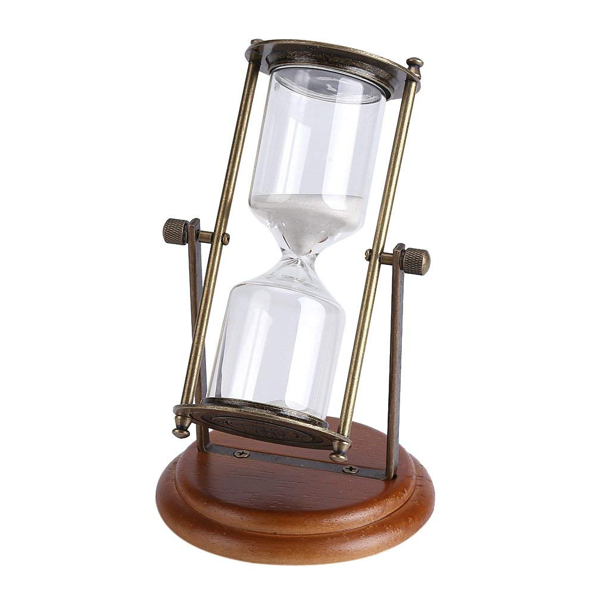{height=520px}

(Clessidra in vendita su Amazon)

---

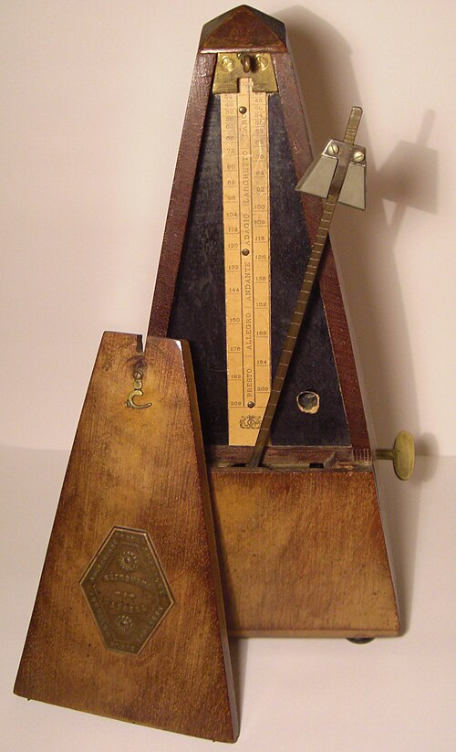{height=520px}

<https://en.wikipedia.org/wiki/Metronome>

---

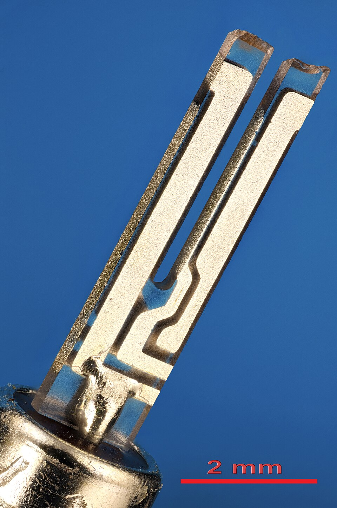{height=520px}

<https://en.wikipedia.org/wiki/Crystal_oscillator>

---

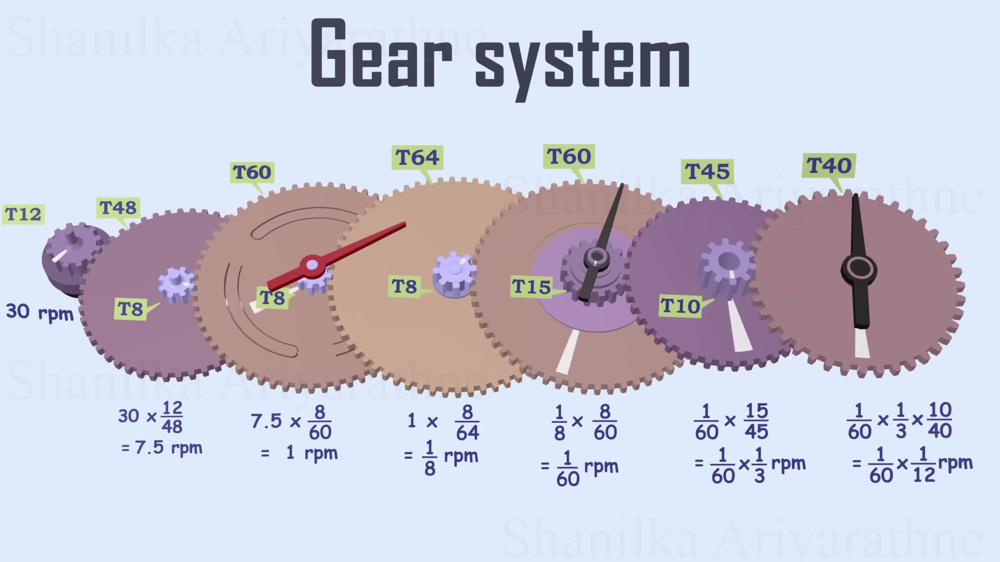{height=520px}

[How Does a Clock work ? | Crystal oscillator | Flip-Flop | Lavet type motor](https://www.youtube.com/watch?v=2SF5oGDUTrI) (YouTube)

# Punti in comune

-   Abbiamo visto alcuni metodi con cui misurare il tempo:

    -   Clessidre
    -   Metronomi
    -   Oscillatori al quarzo (usati in orologi da polso e nei cellulari)

-   C’è qualcosa di comune nel loro principio di funzionamento?

# Punti in comune

-   Queste sono le cose in comune:
    1.  C’è qualcosa che si muove (sabbia, braccio del metronomo, denti del diapason)
    2.  Gli strumenti più comodi da usare hanno un movimento che si ripete, in linea di principio per sempre
-   Il movimento è fondamentale: è solo tramite esso che ci si rende conto del passare del tempo!

# La velocità

# Chi è il più veloce?

-   Torniamo al caso della corsa tra Luca e Serena, ed andiamo un po’ oltre

-   Non ci basta vedere chi dei due sia più veloce, vogliamo anche misurare **quanto**

-   Come possiamo “quantificare” la velocità?

# Distanza e tempo

-   La velocità usa un’unità di misura **derivata**, perché è una lunghezza divisa per un tempo:

    \[
    v = \frac{\Delta x}{\Delta t}.
    \]

-   L’unità più comune sono i chilometri all’ora (km/h), che vengono misurati dai tachimetri sulle automobili

-   Nel SI però, la velocità si misura in metri al secondo (m/s)

# Definizione della velocità

-   Perché dividere la distanza percorsa per il tempo?

-   Non si potrebbe invece decidere di moltiplicare tra loro distanza e tempo?

-   Oppure sommarli?

-   Oppure…

::: notes

Prendere un po’ di tempo per far ragionare gli studenti, e sentire quali sono le loro idee.

In ogni caso, è imprescindibile sottolineare che non è possibile sommare distanza e tempo, perché si possono sommare solo quantità omogenee!

:::

# Esempio

-   Se percorro 10 metri in 4 secondi (caso A), la mia velocità è
    \[
    v_A = \frac{10\,\text{m}}{4\,\text{s}} = 2{,}5\,\text{m/s}.
    \]

-   Se percorro i medesimi 10 metri in 2 secondi (caso B), la mia velocità è
    \[
    v_B = \frac{10\,\text{m}}{2\,\text{s}} = 5{,}0\,\text{m/s}.
    \]

-   Mantenendo il tempo al **denominatore**, la velocità maggiore è attribuita effettivamente al caso più veloce (B)!

# Velocità media e istantanea

-   Ci sono due tipi di velocità: **media** ed **istantanea**

-   Entrambe le velocità si misurano in metri al secondo (o km/h), ma il loro significato è diverso

---

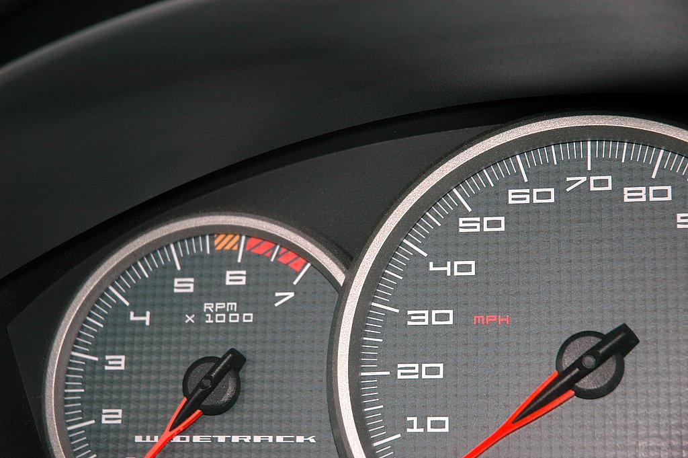{height=520px}

<https://en.wikipedia.org/wiki/Tachometer>

---

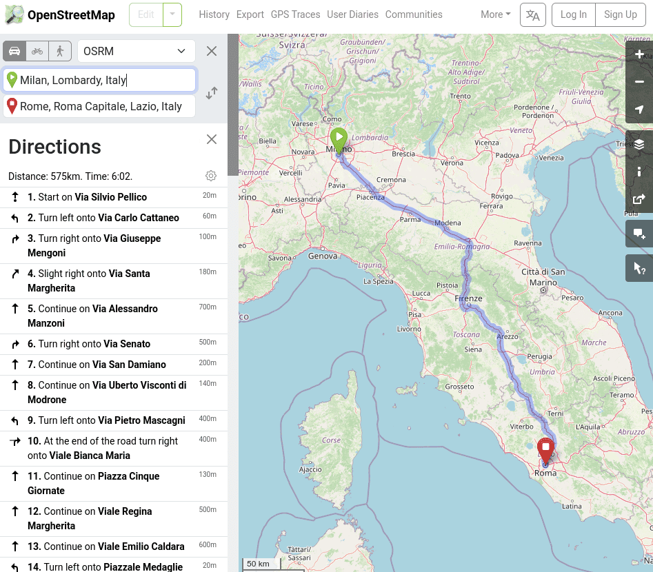{height=520px}

<https://www.openstreetmap.org>

::: notes

Far calcolare agli studenti la velocità media, prima in km/h e poi in m/s: è 95,3 km/h, pari a 26,5 m/s

:::

# Calcoli con unità di misura

# Calcoli con unità di misura

-   Quando diciamo che un’auto va a 90 km/h, stiamo usando due tipi di misure: una di *spazio* e una di *tempo*.
-   La velocità misurata in km/h non usa le unità del SI, che dovrebbero essere m/s
-   Convertire unità di misura basate sul tempo è complicato, perché [abbiamo visto](#time-units) che le sue unità sono complicate!
-   Vediamo ora alcune tecniche con cui convertire facilmente unità di misura

# Calcoli con unità di misura

-   Le unità di misura si semplificano proprio come i numeri:

    \[
    \frac{30\,\text{m}\cdot\text{kg}}{10\,\text{m}} =
    \frac{30\,\cancel{\text{m}}\cdot\text{kg}}{10\,\cancel{\text{m}}} =
    \frac{30\,\text{kg}}{10} = 3\,\text{kg}
    \]

-   Moltiplicate tra loro si combinano:

    \[
    2\,\text{m} \times 3\,\text{m} = 6\,\text{m}^2.
    \]

# Conversione di unità di misura

# Comprensione del metodo

-   A parte casi “patologici” come la temperatura (°C, °F, K), di solito per convertire un’unità di misura basta moltiplicare o dividere per qualche coefficiente

-   Sorprendentemente, molti studenti sbagliano le conversioni (persino studenti di fisica di anni avanzati!)

-   Per comprendere il senso dell’operazione, prendiamo il discorso alla larga

# La divisione

-   Il metodo che fornisco per capire come convertire tra unità di misura vuole essere molto intuitivo…

-   …ma richiede comunque di conoscere molto bene le quattro operazioni!

-   In particolare, occorre avere un’idea intuitiva del significato della divisione, che vada oltre il semplice conto meccanico.

# Usi pratici della divisione

-   Supponiamo di aver contratto con un nostro amico un debito di 12€

-   Abbiamo stabilito che restituiremo questo debito in rate settimanali di 2€ ciascuna

-   Quante rate dovremo pagare?

---

\[
\frac{12\,\text{euro}}{2\,\text{euro}} = \frac{12\,\cancel{\text{euro}}}{2\,\cancel{\text{euro}}} = 6\,\text{(numero di volte che devo pagare)}.
\]

---

Quante rate dovremmo pagare se ogni rata fosse 3€?

E quanto se ogni rata fosse 4€?

E se ogni rata fosse 6€?

---

Quante rate dovremmo pagare se una rata fosse 12€?

---

\[
\frac{12\,\text{euro}}{12\,\text{euro}} = \frac{12\,\cancel{\text{euro}}}{12\,\cancel{\text{euro}}} = 1\,\text{(numero di volte che devo pagare)}.
\]

# Euro e centesimi

-   Ovviamente 1€ = 100 centesimi

-   Di conseguenza, possiamo calcolare il numero di rate mescolando euro e centesimi:

    \[
    1 =
    \frac{12\,\text{euro}}{12\,\text{euro}} =
    \frac{1\,200\,\text{cent}}{12\,\text{euro}} =
    \frac{12\,\text{euro}}{1\,200\,\text{cent}} =
    \frac{1\,200\,\text{cent}}{1\,200\,\text{cent}}.
    \]

# Dagli euro al tempo

Quanto vale questo rapporto?

\[
\frac{60\,\text{s}}{60\,\text{s}} = ?
\]

# Dagli euro al tempo

E questo?

\[
\frac{1\,\text{min}}{60\,\text{s}} = ?
\]

# Proprietà del prodotto

-   Stiamo pazientemente avvicinandoci alla formula per la conversione di unità di misura

-   Ci serve però anche un’altra proprietà, stavolta legata al *prodotto*

-   (Avevamo infatti detto che nelle conversioni è importante sia la divisione che il prodotto!)

# Uso del prodotto

-   Si deve fare una colletta di beneficenza tra cinque (5) amici.

-   Ognuno dà 10€. Quanti soldi si sono raccolti in tutto?

# Uso del prodotto

\[
10\,\text{euro} \times 5 = 50\,\text{euro}.
\]

# Uso del prodotto

E se ci sono otto (8) amici, ciascuno dei quali dona 5€?

# Uso del prodotto

\[
5\,\text{euro} \times 8 = 40\,\text{euro}.
\]

# Uso del prodotto

Cosa succede se a donare i 5€ è una persona sola?

# Uso del prodotto

\[
5\,\text{euro} \times 1 = 5\,\text{euro}.
\]

# Riassunto

Riassumendo, abbiamo individuato queste proprietà, che ci serviranno tra un momento:

#.   Dividere una quantità per sé stessa è uguale ad 1, **anche se la quantità è espressa in unità diverse** (euro o centesimi, secondi o minuti)

#.   Moltiplicare una quantità per 1 lascia la quantità invariata

# Conversione di unità di misura

-   Il metodo più intuitivo per convertire da un’unità di misura ad un’altra è quello di moltiplicare la quantità per 1, scrivendo però questo 1 come un rapporto tra due espressioni che usano unità di misura diverse

-   Ad esempio, per convertire 660 secondi in minuti si fa così:

    \[
    \begin{aligned}
    660\,\text{s} &= 660\,\text{s} \times 1 = 660\,\text{s} \times \frac{1\,\text{min}}{60\,\text{s}} = 660\,\cancel{\text{s}} \times \frac{1\,\text{min}}{60\,\cancel{\text{s}}} = \\
    &= 660 \times \frac{1\,\text{min}}{60} =
    \frac{660}{60}\,\text{min} =
    11\,\text{min}.
    \end{aligned}
    \]

# Avvertenze

-   Occorre avere un po’ d’occhio per capire cosa mettere al numeratore e al denominatore della frazione che vale 1!

-   L’obbiettivo è quello di **semplificare** l’unità di misura che vogliamo convertire, e far apparire quella che ci interessa.

-   Se anziché moltiplicare per 1 min/60 s avessimo moltiplicato per 60 s/1 min, avremmo solo fatto un pasticcio:

    \[
    660\,\text{s} = 660\,\text{s} \times 1 = 660\,\text{s} \times \frac{60\,\text{s}}{1\,\text{min}} = 660 \times 60\,\frac{\text{s}^2}{\text{min}} = \ldots
    \]

# Caso generale

-   Abbiamo visto il “trucco” di moltiplicare per 1 nel caso in cui ci siano misure di tempo, perché queste sono complicate

-   Ma in realtà il trucco ha una validità generale, e funziona anche con altre misure

-   Potete provare ad applicarlo per convertire tonnellate (1000 kg) in grammi, o chilometri quadrati in metri quadrati

# Come usare i grafici

# Come usare i grafici

-   Nel mondo scientifico, si usano molto i grafici: essi consentono di rappresentare quantità numeriche altrimenti difficili da interpretare

-   Dovreste aver già visto nella scuola secondaria come si creano e si leggono i grafici

-   Facciamo però un esempio interattivo per rispolverare alcuni concetti importanti

---

<iframe src="iframes/trajectory.html" width="100%" height="700" style="border:1px solid #ccc; border-radius: 8px;"></iframe>

::: notes

Far camminare alcuni studenti avanti ed indietro con due velocità, e commentare il grafico

:::

# Moto e forze

-  Abbiamo fatto sinora uno studio **cinematico**: la cinematica è la scienza che studia quantitativamente il moto dei corpi
-  Tre tipi di moti importanti nella cinematica sono i seguenti:

   -   Moto rettilineo uniforme: un corpo si muove in linea retta, sempre alla stessa velocità
   -   Moto rettilineo uniformemente accelerato
   -   Moto armonico

-  Sappiamo già tutto sul primo; vediamo ora brevemente gli altri due

# Moto r. uniformemente accelerato

-   È il tipo di moto che segue un oggetto che cade verticalmente
-   La velocità aumenta, secondo dopo secondo, di 10 m/s (ossia 36 km/h):
    #.   Se si parte da fermi, dopo 1 s si cade a 10 m/s
    #.   Dopo un altro secondo, a 20 m/s
    #.   Dopo un altro secondo, a 30 m/s…
-   Il valore 10 m/s vale sulla Terra; per gli altri pianeti/satelliti è diverso (ad esempio, sulla Luna è 1,6 m/s, su Marte è 3,7 m/s).

# L’accelerazione

-   È la misura di quanto cambia la velocità col tempo:
    \[
    a = \frac{\Delta v}{\Delta t}
    \]

-   Nel caso della caduta di un corpo, ogni secondo ($\Delta t = 1\,\text{s}$) il corpo aumenta la sua velocità di $\Delta v = 10\,\text{m/s}$, quindi
    \[
    a = \frac{\Delta v}{\Delta t} = \frac{10\,\text{m/s}}{1\,\text{s}} = 10\,\text{m/s$^2$}.
    \]

-   Attenzione: “accelerazione” si scrive **con una elle**!

# Caduta sulla Luna

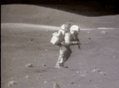

-   Come già accennato, sulla Luna l’accelerazione di gravità è appena 1,6  m/s².

-   Questo significa che i corpi impiegano più tempo che sulla Terra per cadere.

---

| Tempo | Velocità (🌍) | Velocità (🌕) | Posizione (🌍) | Posizione (🌕) |
|-------|--------------:|--------------:|---------------:|---------------:|
| 0 s   | 0 m/s         | 0 m/s         | 0 m            | 0 m            |
| 1 s   | 10 m/s        | 1,6 m/s       | 5 m            | 0,8 m          |
| 2 s   | 20 m/s        | 3,2 m/s       | 20 m           | 3,2 m          |
| 3 s   | 30 m/s        | 4,8 m/s       | 45 m           | 7,2 m          |
| 4 s   | 40 m/s        | 6,4 m/s       | 80 m           | 12,8 m         |

-   Capire la posizione non è semplice: occorre conoscere il calcolo integrale!
-   Se $g$ è l’accelerazione (10 m/s² oppure 1.6 m/s²), la formula è
    \[
    \text{Posizione} = \frac12 \times g \times t^2
    \]

# Moto armonico

-   È il tipico moto “avanti e indietro” di un metronomo, un diapason o un’altalena

-   Molto importante per l’acustica, come vedremo

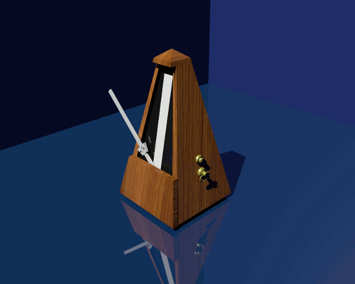{height=420px}

# Dalla cinematica alla dinamica

# Perché il moto?

-   Spostiamoci ora dalla cinematica alla **dinamica**, che studia il **motivo** per cui le cose si muovono

-   Nel corso della storia del pensiero umano, furono avanzate molte ipotesi per spiegare il moto. Alcuni esempi:

    -   [Secondo Aristotele](https://it.wikipedia.org/wiki/Fisica_aristotelica#Il_moto), le cose del mondo “sublunare” sono fatte di un miscuglio dei “quattro elementi” (terra, aria, acqua, fuoco), e tendono ad avvicinarsi a sostanze di natura simile: sassi, piume, fumo, bolle d’aria…

    -   [Secondo Buridano](https://it.wikipedia.org/wiki/Teoria_dell%27impeto) (ripreso da Oresme e Cartesio), gli oggetti si trasferiscono una sostanza, detta “impeto” (per cartesio: “quantità di moto”), che li fa muovere

# La dinamica Newtoniana

<table>
<tr>
<td style="vertical-align:middle;">
-   Nel XVIII secolo, sir Isaac Newton formulò una teoria della dinamica straordinariamente efficace
-   Lo stato naturale dei corpi è il **moto rettilineo uniforme**
-   Se un moto non è rettilineo uniforme, vuol dire che qualcosa sta agendo sul corpo: una **forza**
</td>
<td>
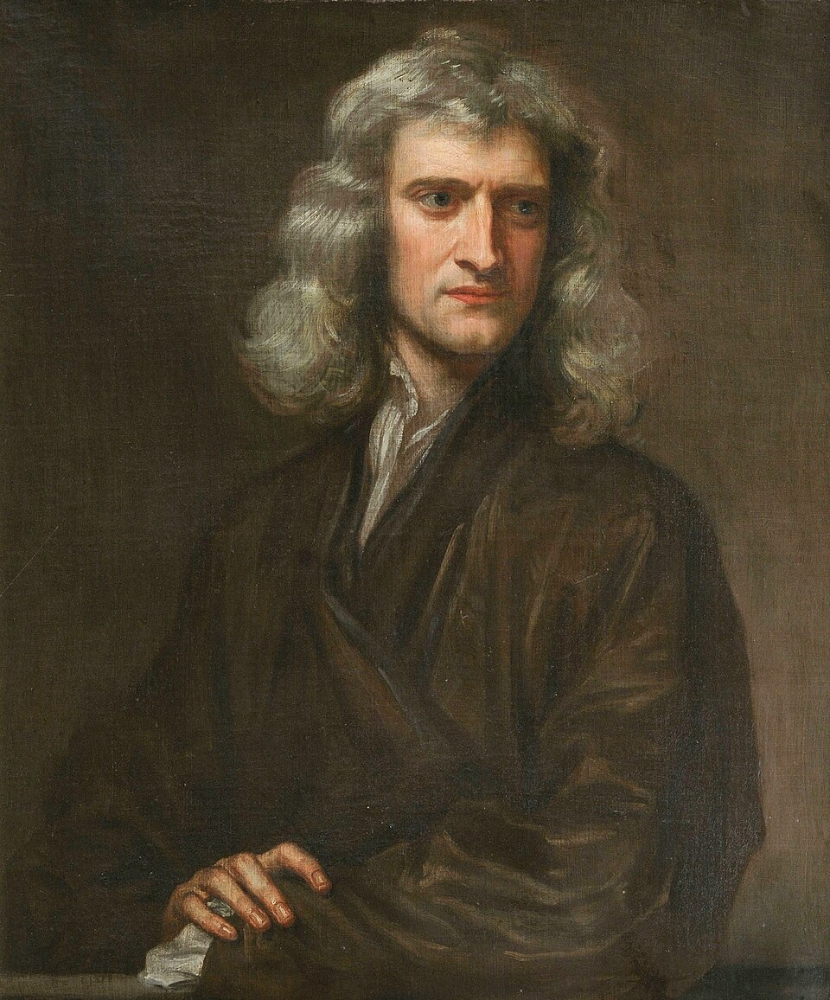
</tr>
</table>

# Principi di Newton

1. Lo stato naturale (imperturbato) dei corpi è il moto rettilineo uniforme
2. Un corpo sottoposto a forze si muove di moto accelerato (o decelerato), e l’accelerazione è proporzionale alla somma delle forze
3. Se un corpo A esercita una forza sul corpo B, il corpo B esercita una forza uguale e contraria sul corpo A

(Molto importante impararli tutti e tre!)

# Primo principio

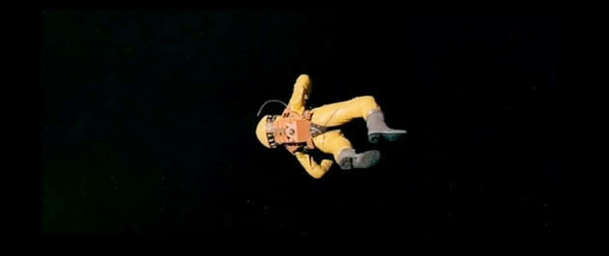{height=420px}

[*2001: a space odyssey*](https://www.imdb.com/title/tt0062622/) (S. Kubrick, 1968)

# Secondo principio

{height=320px}

-   In quest’immagine ([*Little miss Sunshine*](https://www.imdb.com/title/tt0449059/), Dayton & Faris, 2006) il furgoncino si muove perché qualcuno lo spinge

-   La forza impressa causa un’accelerazione sul furgoncino, che partiva da fermo ma ha aumentato la sua velocità

# Terzo principio

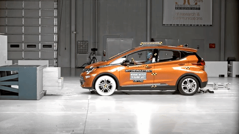{height=320px}

-   La macchina si ferma (= cambia la sua velocità) perché il muro esercita una forza contro di essa
-   Anche il muro si muove, perché si deforma

# Principio di azione/reazione

-   Il terzo principio di Newton è detto anche “di azione e reazione”:

    -   Se agisco con una forza su un corpo (“azione”)…

    -   …anche il corpo reagisce con una forza su di me (“reazione”)

-   È il motivo per cui quando do un pugno al muro mi faccio male!

# Discutiamo insieme

-   Perché se faccio rotolare una palla a terra, dopo un po’ si ferma?

-   Perché una piuma cade più lentamente di una palla da bowling? (Una volta data una risposta, guardate [questo video](https://www.youtube.com/watch?v=frZ9dN_ATew))

# L’inerzia

# Il concetto di “inerzia”

-   Se vi lanciassero addosso una palla e doveste fermarla con la mano, preferireste che fosse da ping-pong o da bowling?

-   Se il vostro mezzo si ferma in mezzo alla strada e dovete spingerlo fuori dalla carreggiata, è meglio che sia una Fiat 500 o un tir a pieno carico?

# Massa inerziale

-   La “massa” (si misura in chilogrammi, kg) è una quantità intrinseca dei corpi che dice quanto è difficile metterli in moto (o fermarli)

-   Maggiore è la massa, maggiore è la forza necessaria ad accelerarli

-   In effetti, la seconda legge di Newton dice che se la forza totale è $F$, un corpo di massa $m$ subirà un’accelerazione
    \[
    a = \frac{F}{m}
    \]

# Massa inerziale

\[
a = \frac{F}{m}
\]

-   Se la forza $F$ è molto grande, ma la massa del corpo è colossale, l’accelerazione sarà piccola. Esempio: una Ferrari lanciata a tutta velocità contro un grattacielo ha una grande forza, ma il grattacielo ha una massa enorme e quindi l’urto lo fa accelerare pochissimo
-   Se la forza $F$ è piccola, ma la massa del corpo è piccolissima, l’accelerazione sarà grande. Esempio: soffiare su dei granelli di polvere imprime una forza piccola (nessuno viene ferito da un soffio!), ma la polvere ha massa piccolissima, e l’accelerazione è quindi grande.

# Massa e peso

-   Nella vita quotidiana si tende a confondere la massa col peso.

-   Ma sono due concetti diversi: il primo è un’unità del SI, il secondo è la forza che fa cadere i corpi a terra. Quindi:

    -   La massa produce resistenza all’azione delle forze anche per un corpo nello spazio vuoto (l’astronauta di *2001: odissea nello spazio*)

    -   Il peso invece è la forza che fa accelerare verso il suolo. Esso esiste solo sulla Terra o sui pianeti, e cambia il suo valore (sulla Luna il peso è minore).

-   [Il peso ha una sua particolarità: è l’unica forza al mondo che non dipende dalla massa. Ma questo discorso ci porterebbe lontano…]

# Unità di misura

-   Se l’accelerazione si misura in m/s² e la massa in kg, allora
    \[
        \begin{split}
        a&= \frac{F}{m}\\
        m \times a&= F
        \end{split}
    \]
    e quindi la forza $F$ è il prodotto di m/s² e di kg

-   In onore di sir Isaac Newton, si definisce “Newton” la forza che accelera un corpo di 1 kg di 1 m/s²:
    \[
    1\,\text{N} = 1\,\text{kg$\cdot$m/s$^2$}
    \]

# Conclusioni

# Cosa sapere per l’esame

- Tempo e sue unità di misura
- Calcoli e conversioni di unità di misura
- Cinematica: velocità, velocità media e velocità istantanea
- Dinamica di Newton; le tre leggi
- Inerzia
- Differenza tra massa e peso

---
title: Fisica -- Lezione 2
subtitle: Conversioni, tempo, cinematica e dinamica
author: Maurizio Tomasi ([`maurizio.tomasi@unimi.it`](mailto:maurizio.tomasi@unimi.it))
date: Lunedì 13 ottobre 2025
...
