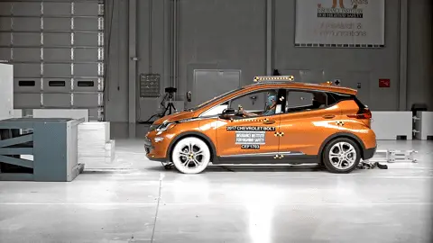
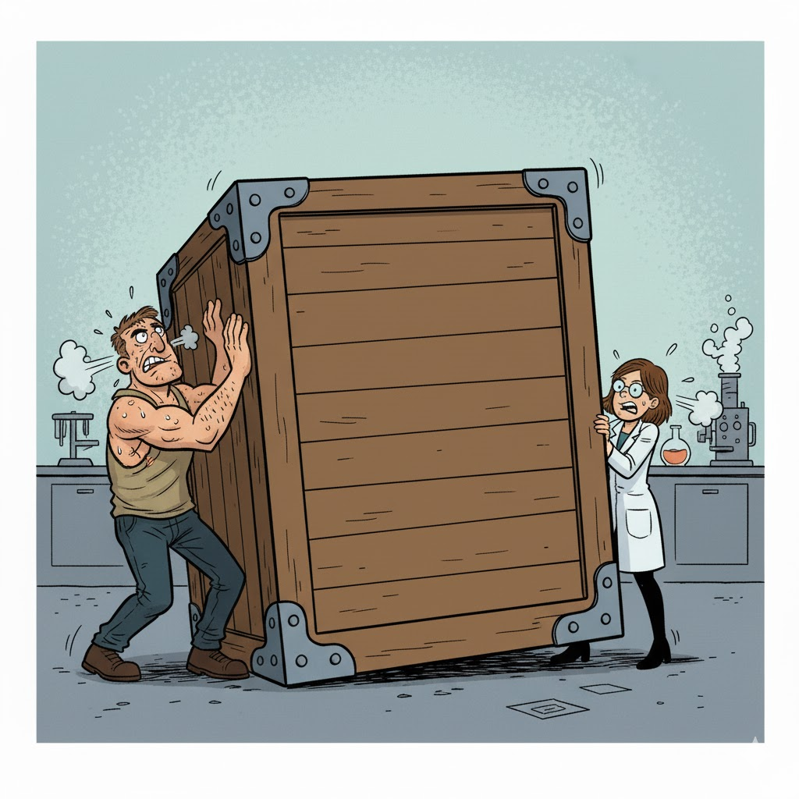
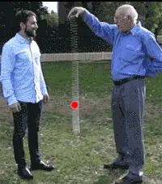
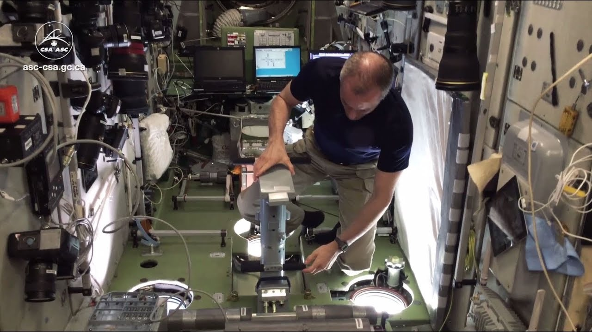
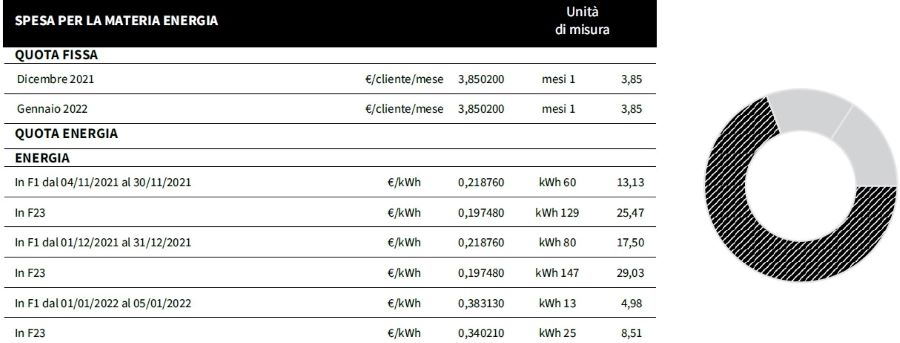

# Argomenti di oggi

-   Leggi di Newton
-   Periodicità in natura
-   Lavoro ed energia
-   Conservazione dell’energia

# Inquisitori accademici onorari

# Principi di Newton

1. Lo stato naturale (“imperturbato”) dei corpi è il moto rettilineo uniforme (incluso lo stato di quiete!)
2. Un corpo sottoposto a forze si muove di moto accelerato (o decelerato), e l’accelerazione è proporzionale alla somma delle forze
3. Se un corpo A esercita una forza sul corpo B, il corpo B esercita una forza uguale e contraria sul corpo A

(Molto importante impararli tutti e tre!)

# Primo principio

{height=420px}

[*2001: a space odyssey*](https://www.imdb.com/title/tt0062622/) (S. Kubrick, 1968)

# Secondo principio

{height=320px}

-   In quest’immagine ([*Little miss Sunshine*](https://www.imdb.com/title/tt0449059/), Dayton & Faris, 2006) il furgoncino si muove perché qualcuno lo spinge

-   La forza impressa causa un’accelerazione sul furgoncino, che partiva da fermo ma ha aumentato la sua velocità

# Terzo principio

{height=320px}

-   La macchina si ferma (= cambia la sua velocità) perché il muro esercita una forza contro di essa
-   Anche il muro si muove, perché si deforma

# Terzo principio

-   Il terzo principio di Newton è detto anche “di azione e reazione”:

    -   Se agisco con una forza su un corpo (“azione”)…

    -   …anche il corpo reagisce con una forza su di me (“reazione”)

-   È il motivo per cui quando do un pugno al muro mi faccio male!

# Discutiamo insieme

-   Perché se faccio rotolare una palla a terra, dopo un po’ si ferma?

-   Perché una piuma cade più lentamente di una palla da bowling? (Una volta data una risposta, guardate [questo video](https://www.youtube.com/watch?v=frZ9dN_ATew))

# Somma di forze

::: side-by-side

::: content

-   Il secondo principio dice che se più forze agiscono su uno stesso corpo, queste si **sommano**

-   Se quindi due forze agiscono in senso opposto e si bilanciano, l’accelerazione complessiva sarà nulla e il corpo non si sposta!

:::

::: media

:::
:::

# Statica

-   La “statica” è la parte della fisica che studia i corpi che stanno fermi

-   Per il secondo principio, i corpi che stanno fermi devono essere soggetti a forze che si annullano

-   Il caso di una mano che spinge il muro è un esempio di problema di statica

-   Un ingegnere edile deve essere esperto di statica!

# Caduta di una molla ([#1](https://www.youtube.com/shorts/k5s1cMNTmGs))

::: side-by-side

::: content

-   Lasciando penzolare una molla e facendola cadere, avviene un fenomeno interessante

-   La cima della molla cade verso terra con un’accelerazione **maggiore** di $g = 10\,\mathrm{m/s^2},$ ma il fondo della molla sembra stare sospeso a mezz’aria

-   Perché secondo voi capita questo?

:::

::: media

:::
:::

# Caduta di una molla ([#2](https://www.youtube.com/watch?v=eCMmmEEyOO0))

::: side-by-side

::: content

-   Il centro della molla cade seguendo la legge del moto rettilineo uniformemente accelerato

-   La cima della molla però ha due forze che la spingono in basso: la gravità e la forza elastica della molla

-   Anche il fondo della molla subisce le due forze (gravità ed elastica), ma sono di verso opposto e si bilanciano

:::

::: media

:::
:::

# L’inerzia

# Il concetto di “inerzia”

::: side-by-side

::: content
-   Se vi lanciassero addosso una palla e doveste fermarla con la mano, preferireste che fosse da ping-pong o da bowling?

-   Se il vostro mezzo si ferma in mezzo alla strada e dovete spingerlo fuori dalla carreggiata, è meglio che sia una Fiat 500 o un tir a pieno carico?
:::

::: media

:::
:::

# Massa inerziale

-   La “massa” (si misura in chilogrammi, kg) è una quantità intrinseca dei corpi che dice quanto è difficile metterli in moto (o fermarli)

-   Maggiore è la massa, maggiore è la forza necessaria ad accelerarli

-   In effetti, la seconda legge di Newton dice che se la forza totale è $F$, un corpo di massa $m$ subirà un’accelerazione
    \[
    a = \frac{F}{m}
    \]

# Massa inerziale

::: side-by-side

::: content
\[
a = \frac{F}{m}
\]

-   Se $F$ è grande ma $m$ è colossale, allora $a$ sarà piccola. Esempio: un rimorchiatore attaccato ad una nave merci a pieno carico.
-   Se $F$ è piccola ma $m$ è minuscola, allora $a$ sarà grande. Esempio: soffiare su dei granelli di polvere.
:::

::: media

{height=600px}

:::
:::

# Massa e peso

-   Nella vita quotidiana si tende a confondere la massa col peso.

-   Ma sono due concetti diversi: il primo è un’unità del SI, il secondo è la forza che fa cadere i corpi a terra. Quindi:

    -   La massa produce resistenza all’azione delle forze anche per un corpo nello spazio vuoto (l’astronauta di *2001: odissea nello spazio*)

    -   Il peso invece è la forza che fa accelerare verso il suolo. Esso esiste solo sulla Terra o sui pianeti, e cambia il suo valore (sulla Luna il peso è minore).

# Pesare gli astronauti?

{height=480px}

[How do astronauts weigh themselves in space?](https://www.youtube.com/watch?v=oU3pp_4n84U) (Agenzia Spaziale Canadese)

# Unità di misura

-   Se l’accelerazione si misura in m/s² e la massa in kg, allora
    \[
        \begin{split}
        a&= \frac{F}{m}\\
        m \times a&= F
        \end{split}
    \]
    e quindi la forza $F$ è il prodotto di m/s² e di kg

-   In onore di sir Isaac Newton, si definisce “Newton” la forza che accelera un corpo di 1 kg di 1 m/s²:
    \[
    1\,\text{N} = 1\,\text{kg$\cdot$m/s$^2$}
    \]

# Applicazione alla gravità

---

[Low Earth Orbit Visualization](https://platform.leolabs.space/visualizations/leo)

::: notes
Presentare il caso come se il moto fosse rettilineo uniforme, e sottolineare che i satelliti non usano carburante per tenersi in orbita (altrimenti dopo una giornata sarebbero a secco!).

Zoomare all’esterno per mostrare che in realtà il moto non è rettilineo uniforme, ma circolare!
:::

---

<iframe
    src="https://mgvez.github.io/jsorrery/"
    width="100%"
    height="640px"
    style="border:none;">
</iframe>

[jsOrrery — Javascript Solar System Simulator](https://mgvez.github.io/jsorrery/)

::: notes

Fai notare che tutti i pianeti orbitano su orbite circolari, e che l’inerzia viene bilanciata dalla gravità: se non ci fosse gravità, il moto sarebbe rettilineo verso lo spazio infinito, e se il pianeta non avesse inerzia (velocità nulla), il moto sarebbe rettilineo verso il sole.

:::

# Bilanciamento di forze

-   I pianeti viaggiano su orbite circolari anziché precipitare sul Sole perché posseggono **inerzia**, ossia la tendenza a viaggiare in linea retta
-   Tutti i corpi posseggono inerzia, che è legata alla loro massa: più ne hanno, più è difficile deviarli
-   Quando il Sistema Solare si è formato, i pianeti avevano una certa velocità iniziale: per questo non sono precipitati verso il Sole (e non precipiteranno!)

# Orbite periodiche

-   Il Sistema Solare si è formato cinque miliardi di anni fa (“cinque giga-anni”!), e i pianeti hanno (quasi) sempre orbitato nelle orbite che osserviamo oggi

-   Questa stabilità è espressione di una quantità che viene conservata: l'**energia**:

    #. Un corpo in moto possiede una certa quantità di **energia cinetica** $E_c$, che misura la sua inerzia
    #. Un pianeta “sente” l’attrazione gravitazionale del Sole, che è quantificata dall'**energia potenziale gravitazionale** $E_g$

-   I pianeti orbitano per miliardi di anni perché nessuna delle due energie prevale sull’altra

::: notes

Puoi usare come analogia i soldi: l’energia cinetica è lo stipendio che uno guadagna in un mese, mentre l’energia gravitazionale sono le spese mensili (affitto, cibo, etc.).

I pianeti stanno in equilibrio, nel senso che non spendono mai né più né meno di quanto guadagnano.

Nomina anche il fatto che la Natura preferisce la periodicità, e questo sarà importante anche nel caso delle onde sonore: se per i pianeti misuriamo la periodicità con il tempo di un’orbita (l’anno), per le onde sonore useremo la frequenza.
:::

---

<iframe src="iframes/newton-cannonball.html" width="100%" height="700" style="border:1px solid #ccc; border-radius: 8px;"></iframe>

# Dalle forze all’energia

# Dalle forze all’energia

::: side-by-side
::: content

-   Introduciamo ora due concetti molto importanti: il **lavoro** e l'**energia**

-   Il concetto di “lavoro” è diverso da quello del senso comune, ma è molto importante perché conduce al concetto di energia, che è **fondamentale**!

-   L’energia è qualcosa di molto rilevante nel contesto quotidiano… e anche politico: ci sono state guerre esplose per questioni energetiche!

:::

::: media

:::
:::

# Lavoro in fisica

-   Abbiamo visto che una forza produce un’accelerazione, e può portare un corpo a muoversi

-   Il lavoro $L$ è il **prodotto della forza applicata $F$ e dello spostamento** $\Delta x$:

    \[
    L = F \times \Delta x
    \]

    Ma, attenzione! Lo spostamento dev’essere nella stessa direzione della forza!

-   Il lavoro serve per rappresentare quanto è stata “utile” una forza: questo ovviamente nell’ipotesi che lo scopo per cui si usa una forza sia quello di muovere i corpi!

# Lavoro in fisica e nell’uso comune

-   Si potrebbe pensare che il lavoro misuri la “fatica”: se sposto una cassa pesante per 10 metri, fatico più che a spostarla per 5 metri

-   Però bisogna fare attenzione: il lavoro tiene conto dello **spostamento effettivo** $\Delta x$ di un corpo, e questo spostamento dev’essere nella direzione giusta!

-   Se la cassa e pesantissima e, pure spingendola, non si muove, io fatico molto ma **non compio alcun lavoro**: $L = F \times \Delta x = F \times 0 = 0$. Ugualmente, se spingo in avanti ma il corpo si muove a destra, il lavoro che compio è comunque nullo. (Se si spostasse indietro, $L$ sarebbe negativo!)

# Definizione di lavoro

\[
L = F \times \Delta x
\]

-   Il lavoro $L$ è il prodotto della forza $F$ per lo spostamento $\Delta x$
-   Più una forza sposta un corpo lungo la “propria” direzione, maggiore è $L$
-   Si può compiere un lavoro $L$ significativo in vari modi:
    1. Applico una forza $F$ grande
    2. Applico la forza $F$ a lungo, in modo che il corpo si sposti molto (grande $\Delta x$)
    3. Metto insieme le due cose, in modo che siano grandi sia $F$ che $\Delta x$

# Unità di misura

-   L’unità di misura SI del lavoro è il Joule:

    \[
    1\,\text{J} = 1\,\text{N} \times 1\,\text{m}.
    \]

-   Sono però molto usate anche queste due unità:

    1.  La *caloria* (cal): 1 cal = 4,184 J

    2.  Il chilowattora (kWh): 1 kWh = 3.600.000 J = 3.6 MJ

---

---

# Lavoro di un piatto di riso?!?

-   Abbiamo detto che il lavoro è il valore di una forza moltiplicato per il suo spostamento
-   Ma cosa c’entrano le forze e gli spostamenti con un piatto a base di riso?
-   O con la corrente che ci arriva in casa con cui teniamo accesa la luce?

# Lavoro ed energia

-   È possibile associare ai corpi una quantità chiamata **energia**

-   Essa descrive lo stato in cui si trova un corpo in un certo istante

-   Si misura con la stessa unità del lavoro, perché se si calcola l’energia all’inizio e alla fine di uno spostamento, si scopre che **il lavoro compiuto da tutte le forze è uguale a una variazione dell’energia associata a quella forza**

# Esempio: corpo che cade

-   Consideriamo un corpo di 1 kg che cade da un’altezza di 1 m.

-   Esso cade a causa della forza di gravità; il corpo cade lungo la verticale, quindi la forza compie lavoro:

    \[
    L = F \times \Delta x = m g \times 1\,\text{m} = 1\,\text{kg}\times 10\,\mathrm{m/s^2} \times 1\,\text{m} = 10\,\text{J}.
    \]

-   Si può dimostrare che alla forza di gravità è associata una “energia gravitazionale”, che diminuisce esattamente della quantità 10 J.

# Lavoro ed energia

-   L’energia può essere vista come **la capacità di un corpo di compiere lavoro**: l’energia gravitazionale è ciò che rende possibile lo spostamento di un corpo che cade

-   Oltre all’energia gravitazionale ci sono altri tipi, e tutti sono associati a qualche tipo di forza

-   Vediamo i più importanti

# Energia cinetica

::: side-by-side
::: content

-   È l’energia che ha un corpo per il fatto stesso di muoversi:
    \[
    E_c = \frac12 m v^2.
    \]

-   Se un corpo in movimento ne urta uno fermo, quest’ultimo si muove: è stato compiuto lavoro.

-   **Attenzione**: un corpo che si muove di moto rettilineo uniforme non compie lavoro!

:::

::: media

:::
:::

# Esempio

-   Un uomo di massa 80 kg parte da fermo e si muove a 1 m/s
-   La sua energia cinetica iniziale è
    \[
    E_c^{(i)} = 0\,\text{J}
    \]
-   Quella finale è
    \[
    E_c^{(f)} = \frac12 \times 80\,\text{kg}\times (1\,\text{m/s})^2 = 40\,\text{J}
    \]
-   Di conseguenza, la forza di gravità ha compiuto un lavoro uguale a 40 J.

# Conclusioni

# Cosa sapere per l’esame

-   Leggi di Newton, inerzia, differenza tra massa e peso
-   Lavoro ed energia
-   Unità di misura del lavoro e dell’energia

---
title: Fisica -- Lezione 3
subtitle: Dinamica, lavoro ed energia
author: Maurizio Tomasi ([`maurizio.tomasi@unimi.it`](mailto:maurizio.tomasi@unimi.it))
date: Lunedì 20 ottobre 2025
...
