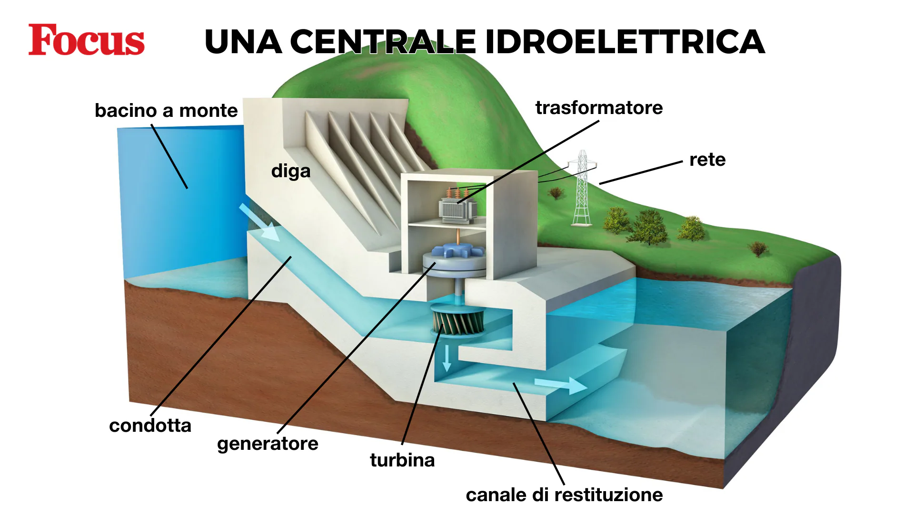

# Introduzione all’argomento di oggi

-   Perché un’altalena parte da sola dopo una spinta e poi torna indietro? Cosa la fa oscillare?
-   Perché un metronomo o un orologo a pendolo, a differenza di un’altalena, continuano ad oscillare così a lungo?

# Inquisitori accademici onorari

# Riassunto della lezione precedente

# Le leggi di Newton

-   Prima legge: inerzia
-   Seconda legge: somma di forze ed accelerazione risultante
-   Terza legge: azione e reazione

# Dalle forze all’energia

::: side-by-side
::: content

-   Introduciamo oggi due concetti molto importanti: il **lavoro** e l'**energia**

-   Il concetto di “lavoro” è diverso da quello del senso comune, ma è molto importante perché conduce al concetto di energia, che è **fondamentale**!

-   L’energia è qualcosa di molto rilevante nel contesto quotidiano… e anche politico: ci sono state guerre esplose per questioni energetiche!

:::

::: media

:::
:::

# Lavoro in fisica

-   Abbiamo visto che una forza produce un’accelerazione, e può portare un corpo a muoversi

-   Il lavoro $L$ è il **prodotto della forza applicata $F$ e dello spostamento** $\Delta x$:

    \[
    L = F \times \Delta x
    \]

-   Quindi, più forza applico, maggiore è il lavoro, e lo stesso vale se il corpo si sposta per un tragitto più lungo

# Lavoro in fisica e nell’uso comune

-   Si potrebbe pensare che il lavoro misuri la “fatica”: se sposto una cassa pesante per 10 metri, fatico più che a spostarla per 5 metri

-   Però bisogna fare attenzione: il lavoro tiene conto dello **spostamento effettivo** $\Delta x$ di un corpo!

-   Se la cassa e pesantissima e, pure spingendola, non si muove, io fatico molto ma **non compio alcun lavoro**: $L = F \times \Delta x = F \times 0 = 0$.

# Definizione di lavoro

\[
L = F \times \Delta x
\]

-   Il lavoro $L$ è il prodotto della forza $F$ per lo spostamento $\Delta x$
-   Più una forza sposta un corpo, più lavoro ha compiuto
-   Si può compiere un lavoro $L$ significativo in vari modi:
    1. Applico una forza $F$ grande
    2. Applico la forza $F$ a lungo, in modo che il corpo si sposti molto (grande $\Delta x$)
    3. Metto insieme le due cose, in modo che siano grandi sia $F$ che $\Delta x$

# Unità di misura

-   L’unità di misura SI del lavoro è il Joule:

    \[
    1\,\text{J} = 1\,\text{N} \times 1\,\text{m}.
    \]

-   Sono però molto usate anche queste due unità:

    1.  La *caloria* (cal): 1 cal = 4,184 J

    2.  Il chilowattora (kWh): 1 kWh = 3.600.000 J (più di tre milioni di Joule)

---

---

# Lavoro di un piatto di riso?!?

-   Abbiamo detto che il lavoro è il valore di una forza moltiplicato per il suo spostamento
-   Ma cosa c’entrano le forze e gli spostamenti con un piatto a base di riso?
-   O con la corrente che ci arriva in casa con cui teniamo accesa la luce?

# Lavoro ed energia

-   È possibile associare ai corpi una quantità chiamata **energia**

-   Essa descrive lo stato in cui si trova un corpo in un certo istante

-   Si misura con la stessa unità del lavoro, perché se si calcola l’energia all’inizio e alla fine di uno spostamento, si scopre che **il lavoro compiuto è uguale alla differenza dell’energia**

-   [Attenzione: chi ha studiato fisica alle superiori si ricorderà che le cose sono un po’ più complicate di così. Per il momento ignoriamo queste complicazioni]

# Lavoro ed energia

-   L’energia può essere vista come **la capacità di un corpo di compiere lavoro**

-   Ci sono vari tipi di energia, e tutti sono associati a qualche tipo di forza

-   Vediamone alcuni

# Energia cinetica

::: side-by-side
::: content

-   È l’energia che ha un corpo per il fatto stesso di muoversi

-   Se un corpo in movimento ne urta uno fermo, quest’ultimo si muove: è stato compiuto lavoro.

-   **Attenzione**: un corpo che si muove di moto rettilineo uniforme non compie però lavoro! (Se viaggia a velocità costante, la forza è nulla per il primo principio)

:::

::: media

:::
:::

# Energia potenziale gravitazionale

::: side-by-side
::: content

-   La forza di gravità sposta i corpi verso il basso

-   Se un corpo sta in alto, ha quindi **energia potenziale gravitazionale**, perché può cadere

-   Durante la caduta, la forza di gravità compie lavoro

:::

::: media
{height=400px}
:::
:::

# Energia elastica

::: side-by-side
::: content

-   Una molla compressa ha la capacità di espandersi
-   La molla ha quindi la capacità di compiere lavoro

:::

::: media

:::
:::

# Calore

::: side-by-side
::: content

-   Tutti i corpi sono formati da atomi che vibrano continuamente

-   Più un corpo è caldo, maggiormente gli atomi vibrano

-   Le vibrazioni sono causate da forze atomiche, e producono quindi lavoro

-   Ad un corpo è associata quindi una certa **energia calorica**: ecco perché l’energia si misura anche in **calorie**!

:::

::: media

:::
:::

# Energia chimica

::: side-by-side

::: content

-   Le molecole che formano i corpi sono legate tra loro da forze elettromagnetiche
-   Queste forze agiscono più o meno come molle: impediscono che le molecole si allontanino o si avvicinino troppo
-   In una reazione chimica, i legami (le “molle”) si rompono, oppure se ne formano di nuovi
-   Le molecole sono libere di muoversi, oppure vengono “catturate” da molle e si fermano

:::

::: media

:::
:::

# Energia elettrica

::: side-by-side

::: content

-   Le cariche elettriche si attraggono e si respingono tra loro
-   Il loro moto fa compiere lavoro alle forze elettromagnetiche
-   È una forma di energia molto conveniente!

:::

::: media

:::
:::

# Analogia

::: side-by-side

::: content

-   Si può pensare all’energia come al denaro; però non si può creare né distruggere, e non si svaluta mai

-   Come il denaro può essere convertito in varie forme (contanti, somma in banca, lingotti d’oro…), così anche l’energia si può convertire

-   Il “bilancio” dell’energia **è sempre perfetto**: se scompaiono $x$ Joule di energia da una parte, devono sempre comparirne esattamente $x$ da un’altra.

:::

::: media

:::
:::

# Esempi

# Ciclista in collina

::: side-by-side

::: content

Consideriamo questi elementi:

-   Muscoli
-   Rotazione dei pedali
-   Rotazione delle ruote
-   Spostamento del ciclista
-   Variazioni di quota
-   Attrito con la strada

:::

::: media
{height=400px}
:::
:::

# Preparare il caffè

::: side-by-side

::: content

Consideriamo questi elementi:

-   Energia del gas
-   Calore nell’acqua
-   Vapore che spinge l’acqua
-   Calore del caffè
-   Calore nello stomaco
-   Energia chimica del caffè

:::

::: media
{height=450px}
:::
:::

# Ascoltare musica

::: side-by-side

::: content

Consideriamo questi elementi:

-   Energia elettrica
-   Vibrazione delle membrane degli altoparlanti
-   Onde sonore nell’aria
-   Vibrazione del timpano nell’orecchio
-   Impulsi nervosi

:::

::: media

:::
:::

# Frenata di un’auto

::: side-by-side

::: content

Consideriamo questi elementi:

-   Energia cinetica dell’auto
-   Azione del piede sul pedale
-   Ganasce dei freni
-   Calore nei freni e nell’aria
-   Presenza di una dinamo (freni rigenerativi)
:::

::: media
{height=450px}
:::
:::

# Diga idroelettrica

::: side-by-side

::: content

Consideriamo questi elementi:

-   Caduta dell’acqua
-   Rotazione della turbina
-   Produzione di energia elettrica
:::

::: media

:::
:::

# Impianto fotovoltaico

::: side-by-side

::: content

Consideriamo questi elementi:

-   Luce solare
-   Elettricità
-   Moto del cestello della lavatrice
-   Calore nel forno
-   Luce delle lampadine
:::

::: media

:::
:::

# Energia e potenza

# Il concetto di “potenza”

-   L’energia è fondamentale per quasi tutti i processi fisici e biologici

-   È però anche importante la **velocità** con cui l’energia viene consumata

-   La **potenza** $P$ è il rapporto tra una quantità di energia $E$ e il tempo necessario a produrla (o consumarla):

    \[
    P = \frac{E}{\Delta t}
    \]

# Unità di misura

::: side-by-side

::: content

-   La potenza è una energia sul tempo, quindi la sua unità naturale è il Joule sul secondo. Questo è il Watt, che si abbrevia con **W**:

    \[
    1\,\mathrm{W} = \frac{1\,\mathrm{J}}{1\,\mathrm{s}}.
    \]

-   Il Watt è un’unità di misura molto comune!

:::

::: media

:::
:::

# Il Kilowattora

::: side-by-side

::: content
-   Dal Watt deriva una curiosa unità di misura dell’energia: il **Kilowattora** (kWh)

-   Esso è l’energia che si può estrarre da una potenza di 1 kW (un chilowatt) in un’ora di tempo:

    \[
    1\,\mathrm{kW} = 1\,\mathrm{kW} \times 3,600\,\mathrm{s} = 3,600,000\,\mathrm{W}

-   I fornitori di energia come ENI, Enel, Sorgenia, etc., riportano l’energia consumata in bolletta usando i kWh.
:::

::: media

:::
:::

# Conclusioni

# Materiale per l’esame

- Lavoro ed energia
- Potenza
- Unità di misura del lavoro e dell’energia
- Tutti gli esempi visti in classe

---
title: Fisica -- Lezione 3
subtitle: Lavoro ed energia
author: Maurizio Tomasi ([`maurizio.tomasi@unimi.it`](mailto:maurizio.tomasi@unimi.it))
date: Lunedì 20 ottobre 2025
...
