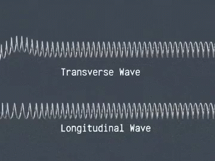

# Introduzione all’argomento di oggi

# Inquisitori accademici onorari

# Oscillazioni

-   Nelle scorse lezioni avevamo visto cos’è un’oscillazione

-   Avevamo preso come esempio un pendolo, ed avevamo definito il **periodo** e la **frequenza** di oscillazione

-   Oggi ci spostiamo dalle semplici oscillazioni alle onde, che è il cuore di questo corso!

# Le onde

-   Un’onda è una perturbazione che si propaga nello spazio, trasportando energia ma non materia

-   La propagazione avviene trasferendo energia lungo una certa direzione

-   Quest’energia può essere di varia natura: termica, elastica, elettromagnetica…

# Esempi

-   Le “onde” del mare sono un tipo di onda (abbastanza complesso!)

-   La luce è un’onda elettromagnetica

-   Il suono è un’onda di pressione

-   I terremoti sono causati da onde sismiche

# Tipi di onde

-   Le onde si suddividono in due tipi:

    #.   Onde trasversali

    #.   Onde longitudinali

-   A noi interessano le onde sonore, che sono **sempre** longitudinali. Ma è bene sapere che esistono anche le onde trasversali!

-   Alcune proprietà delle onde valgono infatti solo per un tipo e non per l’altro, ed è bene non confonderle

---

Notate che in nessuno dei due casi gli anelli della molla si muovono: passata l’onda, restano nella posizione iniziale!

---

Di che tipo sono le onde del mare?

# Onde sismiche

-   Le onde sismiche possono essere di entrambi i tipi, perché la crosta terrestre si comporta in modo simile ad una molla

# Onde sonore

-   Le onde sonore sono solo di tipo **longitudinale**, perché sono onde di pressione

-   Per capire il loro funzionamento, dobbiamo quindi introdurre prima il concetto di “pressione”

# La pressione

-   Nel linguaggio comune, per “pressione” si intende una forza applicata ad una superficie…

-   …e, incredibilmente, in fisica è lo stesso!

-   La pressione di una forza su una superficie è definita come il rapporto

    \[
    P = \frac{F}{s},
    \]

    e si misura in N/m² ovviamente. A questa unità è dato il nome di “Pascal”, dal nome del grande [filosofo, matematico, teologo e inventore francese](https://it.wikipedia.org/wiki/Blaise_Pascal).

---

# Onde sonore

-   Oggi inizieremo ad affrontare le onde sonore, che sono appunto un tipo di onda: un’**onda longitudinale di pressione** che si propaga nello spazio

-   Per chiarire il significato dell’espressione “onda longitudinale di pressione”, dobbiamo però spiegare alcuni concetti:

    #.  Cos’è una “onda”?
    #.  Che significa che è “longitudinale”?
    #.  Cos’è la “pressione”?

# Onde trasversali

-   Un’onda trasversale è un tipo di 

# Simulatore

Fai un simulatore che accende e spegne puntini sullo schermo mostrando la propagazione del segnale

# Rumore e suono

Rumore e suono: Si definisce il suono come un'oscillazione che si propaga e lo si distingue dal rumore, introducendo il concetto di regolarità e periodicità del segnale.

# Suoni complessi e scomposizione in frequenze

Suoni complessi e introduzione (qualitativa) alla scomposizione in frequenze: Si introduce l'idea che la maggior parte dei suoni non è "pura" ma è la somma di tante oscillazioni semplici (armoniche).

# Timbro

Il timbro: Si spiega il timbro come la "carta d'identità" di un suono, determinata proprio dal numero e dall'intensità delle armoniche presenti.

# Conclusioni

# Cosa sapere per l’esame

---
title: Fisica -- Lezione 5
subtitle: Pressione, onde sonore, timbro
author: Maurizio Tomasi ([`maurizio.tomasi@unimi.it`](mailto:maurizio.tomasi@unimi.it))
date: Martedì 3 novembre 2025
...
