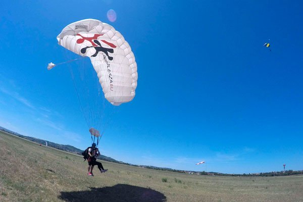
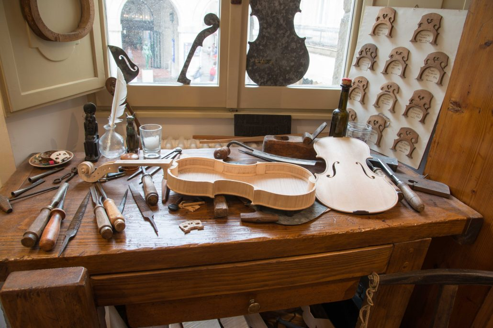

# Introduzione all’argomento di oggi

-   Vedremo i tipi più importanti di moti oscillatori
-   Introdurremo il concetto di “onda”
-   Spiegheremo in cosa consiste la pressione, che è fondamentale per comprendere le onde sonore

# Inquisitori accademici onorari

# Tipi di moti oscillatori

# Oscillazioni libere

::: side-by-side

::: content

-   Le “oscillazioni libere” sono tutte quelle oscillazioni originate da una forza che, dopo aver dato un impulso iniziale, cessa di operare
-   In seguito a quell’impulso, l’oscillazione continua grazie alla sola forza elastica
-   Il moto di un pendolo o di una molla è solo in prima approssimazione libero

:::

::: media

:::
:::

# Oscillazioni smorzate

-   Nella realtà, ci sono sempre altre forze in gioco che fermano le oscillazioni: un’altalena, se non spinta periodicamente, si ferma!

-   È quindi impossibile avere un’oscillazione libera **perpetua**

-   Quali sono queste forze aggiuntive che impediscono alle oscillazioni di continuare?

# Arresto di un’altalena

::: side-by-side

::: content

-   Le forze che arrestano un’altalena sono le seguenti:

    -   L’attrito dell’aria in cui è immersa l’altalena

    -   Il non perfetto scorrimento delle sospensioni (catene o corde) intorno ai perni

-   Queste forze convertono l’energia cinetica e potenziale dell’oscillazione in **calore**, che si disperde sia nell’aria che nelle sospensioni

:::

::: media

:::
:::

# Forze viscose

-   L’attrito dell’aria è una cosiddetta **forza viscosa**
-   Le forze viscose intervengono quando un corpo si muove, mentre sono nulle se il corpo è fermo
-   In altre parole, più velocemente un corpo si muove, più intense sono le forze viscose, secondo la formula

    \[
    F = - c v,
    \]

    dove il segno meno indica che la forza si oppone sempre alla velocità, e $c$ è un coefficiente che dipende sia dalla viscosità del fluido che dalle dimensioni del corpo.

# Forze viscose

-   Il coefficiente $c$ ha queste unità di misura:

    \[
    c = \frac{F}{v} \quad \Rightarrow \quad \left[c\right] = \mathrm{kg/s}.
    \]

-   Più è grande $c$, più resistenza oppone il fluido in cui si muove il corpo: il miele offre più resistenza dell’acqua!

# Corpi in caduta nell’aria

::: side-by-side

::: content

-   Un corpo in caduta aumenta la sua velocità di 10 m/s ogni secondo che passa. Ma la forza viscosa dell’aria arresta dopo un certo tempo l’accelerazione, e la velocità diventa costante

-   Grazie all’aria, la velocità delle gocce di pioggia non supera gli 8 m/s: senza di essa sarebbero come una palla da bowling lasciata cadere da un’altezza di 1 m!

-   I paracadute hanno un grande coefficiente $c$, che permette di tenere bassa la velocità di discesa

:::

::: media

:::
:::

# Smorzamento critico

::: side-by-side

::: content
-   Se le forze che si oppongono all’oscillazione sono intense, il corpo potrebbe non oscillare proprio!

-   Quello che succede è che la molla torna alla posizione di riposo, e non la oltrepassa: si ferma e da lì non si muove più

-   Questo è desiderabile in certi casi: ad esempio, gli ammortizzatori delle auto realizzano uno smorzamento critico per evitare che le sospensioni dell’auto oscillino troppo dopo una buca
:::

::: media

:::
:::

# Smorzamento critico

-   Si può calcolare (ma è complicato!) quanto deve valere $c$ per avere uno smorzamento critico; il risultato è

    \[
    c_\text{crit} = 2\sqrt{k m},
    \]

    dove $k$ è la costante della molla e $m$ è la massa del corpo attaccato alla molla.

-   Se $c$ è maggiore di questo valore critico, non si hanno oscillazioni

-   Siccome $c$ dipende dalle dimensioni e dalla forma del corpo, può essere che alcuni corpi oscillino ed altri no

---

<iframe src="iframes/damped-oscillator.html" width="100%" height="700" style="border:1px solid #ccc; border-radius: 8px;"></iframe>

# Risonanza

# Risonanza

-   Di solito, se si mette in moto un sistema oscillante, si desidera che l’oscillazione continui! (Non è il caso delle sospensioni delle auto…)

-   Senza un meccanismo che impedisca lo smorzamento dell’oscillazione, un orologio o un metronomo sarebbero ben poco utili!

-   Per poter vincere le forze viscose e di attrito (che “degradano” l’energia), è necessario fornire periodicamente energia:

    -   Tramite una molla (metronomo, orologio a molla)

    -   Tramite una batteria (orologio al quarzo)

---

<iframe src="iframes/resonant-system.html" width="100%" height="700" style="border:1px solid #ccc; border-radius: 8px;"></iframe>

---

# Ampiezza infinita?

-   Il programma precedente potrebbe dare l’illusione che in una risonanza l’ampiezza tenda sempre all’infinito

-   Nella realtà i fenomeni viscosi spesso pongono un limite massimo all’ampiezza raggiungibile

-   Per capire come si comporta un oscillatore in risonanza, bisogna tenere conto di questi fattori:

    -   L’intensità della forzante, che tende a far aumentare l’ampiezza

    -   L’intensità delle forze viscose, che tende a limitare le oscillazioni

# Esempi di risonanza

# Spinta di un’altalena

::: side-by-side

::: content

-   Per compensare l’attrito dell’aria e le catene non ideali, bisogna continuare a spingere un bambino sull’altalena

-   Il fatto che venga naturale spingere ad ogni oscillazione completa corrisponde a quanto abbiamo visto: la forza deve essere sincrona col periodo di oscillazione!

:::

::: media

:::
:::

# Casse armoniche

::: side-by-side

::: content

-   Una cassa armonica inizia ad oscillare quando la corda ad essa collegata oscilla

-   Questo è un fenomeno di risonanza, perché la cassa armonica vibra alla stessa frequenza della corda

-   Vedremo meglio nelle prossime lezioni il comportamento degli strumenti musicali

:::

::: media

:::
:::

# Edifici antisismici

-   Nessun edificio è perfettamente rigido: tutti, se sollecitati, vibrano

-   Un po’ come un diapason, ogni edificio ha la sua frequenza caratteristica (più l’edificio è alto, minore è la sua frequenza caratteristica)

-   Questo significa che se un terremoto fa vibrare l’edificio alla frequenza “sbagliata”, potrebbe generarsi una risonanza… con conseguenze mortali!

-   È questo il motivo per cui anche edifici particolarmente robusti possono essere distrutti da un’onda sismica

# Edifici antisismici

::: side-by-side

::: content

-   In un edificio antisismico, si inseriscono degli *isolatori sismici*

-   Si tratta di elementi inseriti nelle fondamenta, che **aumentano** il periodo di oscillazione in modo che sia maggiore delle frequenze tipiche delle onde sismiche

-   Il risultato è che non è possibile instaurare una risonanza, perché durante un terremoto il suolo vibra troppo rapidamente perché l’edificio lo avverta

:::

::: media

:::
:::

# Conclusioni

# Cosa sapere per l’esame

-   Tutti gli esempi sull’energia visti in classe
-   Potenza
-   Forze elastiche e oscillatori semplici
-   Periodo e frequenza, valori tipici delle oscillazioni viste in classe
-   Oscillazioni libere e smorzate
-   Risonanza
-   Esempi in musica, natura e tecnologia

# Oscillazioni

-   Nelle scorse lezioni avevamo visto cos’è un’oscillazione

-   Avevamo preso come esempio un pendolo, ed avevamo definito il **periodo** e la **frequenza** di oscillazione

-   Oggi ci spostiamo dalle semplici oscillazioni alle onde, che è il cuore di questo corso!

# Le onde

-   Un’onda è una perturbazione che si propaga nello spazio, trasportando energia ma non materia

-   La propagazione avviene trasferendo energia lungo una certa direzione

-   Quest’energia può essere di varia natura: termica, elastica, elettromagnetica…

# Esempi

-   Le “onde” del mare sono un tipo di onda (abbastanza complesso!)

-   La luce è un’onda elettromagnetica

-   Il suono è un’onda di pressione

-   I terremoti sono causati da onde sismiche

# Tipi di onde

-   Le onde si suddividono in due tipi:

    #.   Onde trasversali

    #.   Onde longitudinali

-   A noi interessano le onde sonore, che sono **sempre** longitudinali. Ma è bene sapere che esistono anche le onde trasversali!

-   Alcune proprietà delle onde valgono infatti solo per un tipo e non per l’altro, ed è bene non confonderle

---

Notate che in nessuno dei due casi gli anelli della molla si muovono: passata l’onda, restano nella posizione iniziale!

---

Di che tipo sono le onde del mare?

# Onde sismiche

-   Le onde sismiche possono essere di entrambi i tipi, perché la crosta terrestre si comporta in modo simile ad una molla

# Onde sonore

-   Le onde sonore sono solo di tipo **longitudinale**, perché sono onde di pressione

-   Per capire il loro funzionamento, dobbiamo quindi introdurre prima il concetto di “pressione”

# La pressione

-   Nel linguaggio comune, per “pressione” si intende una forza applicata ad una superficie…

-   …e, incredibilmente, in fisica è lo stesso!

-   La pressione di una forza su una superficie è definita come il rapporto

    \[
    P = \frac{F}{s},
    \]

    e si misura in N/m² ovviamente. A questa unità è dato il nome di “Pascal”, dal nome del grande [filosofo, matematico, teologo e inventore francese](https://it.wikipedia.org/wiki/Blaise_Pascal).

---

# Onde sonore

-   Oggi inizieremo ad affrontare le onde sonore, che sono appunto un tipo di onda: un’**onda longitudinale di pressione** che si propaga nello spazio

-   Per chiarire il significato dell’espressione “onda longitudinale di pressione”, dobbiamo però spiegare alcuni concetti:

    #.  Cos’è una “onda”?
    #.  Che significa che è “longitudinale”?
    #.  Cos’è la “pressione”?

# Onde trasversali

-   Un’onda trasversale è un tipo di 

# Simulatore

Fai un simulatore che accende e spegne puntini sullo schermo mostrando la propagazione del segnale

# Rumore e suono

Rumore e suono: Si definisce il suono come un'oscillazione che si propaga e lo si distingue dal rumore, introducendo il concetto di regolarità e periodicità del segnale.

# Suoni complessi e scomposizione in frequenze

Suoni complessi e introduzione (qualitativa) alla scomposizione in frequenze: Si introduce l'idea che la maggior parte dei suoni non è "pura" ma è la somma di tante oscillazioni semplici (armoniche).

# Timbro

Il timbro: Si spiega il timbro come la "carta d'identità" di un suono, determinata proprio dal numero e dall'intensità delle armoniche presenti.

# Conclusioni

# Cosa sapere per l’esame

-   Oscillazioni libere e smorzate
-   Risonanza
-   Esempi in musica, natura e tecnologia
-   Onde
-   Pressione

---
title: Fisica -- Lezione 5
subtitle: Tipi di oscillazioni, onde
author: Maurizio Tomasi ([`maurizio.tomasi@unimi.it`](mailto:maurizio.tomasi@unimi.it))
date: Martedì 3 novembre 2025
...
