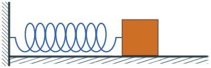
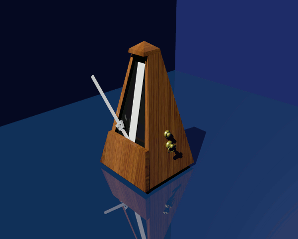
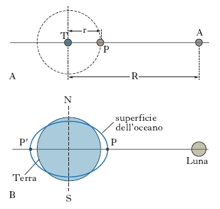
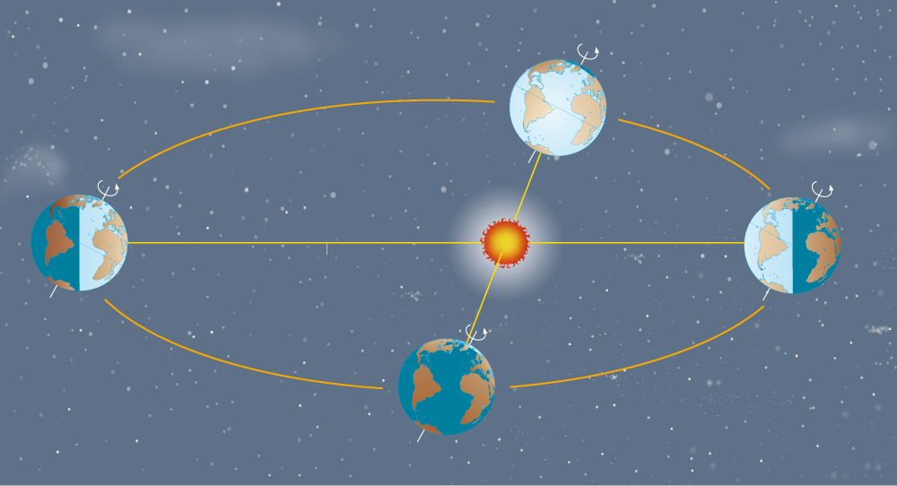
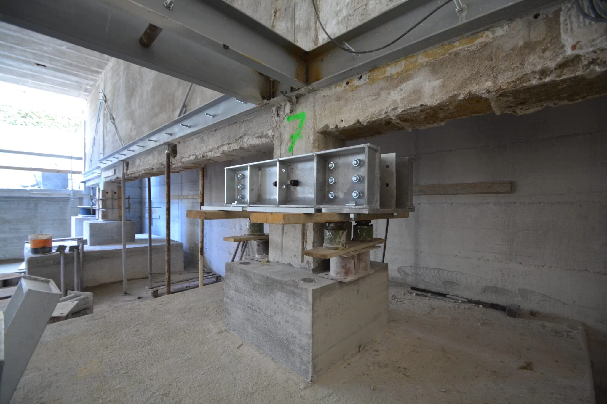
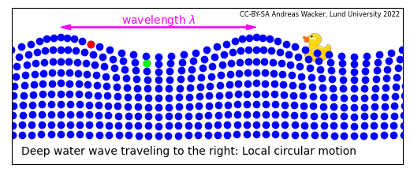

# Introduzione all’argomento di oggi

-   Studieremo i moti oscillatori e ne vedremo i tipi più importanti
-   Introdurremo i concetti di “periodo” e di “frequenza”
-   Introdurremo il concetto di “onda”

# Inquisitori accademici onorari

# Oscillazioni

# Cos’è un’oscillazione?

-   Un’oscillazione è un movimento periodico di un corpo che si sposta tra due posizioni estreme
-   Semplificando, è un moto “avanti e indietro” che si ripete
-   Alcuni esempi:
    -   Altalena
    -   Pendolo di un orologio
    -   Corda di una chitarra

# Oscillazioni e forze

::: side-by-side

::: content

-   Evidentemente le oscillazioni sono possibili solo se è in gioco qualche forza!
-   Perché un corpo torni indietro, è infatti necessario che una forza lo faccia decelerare fino a fermarlo, per poi farlo tornare indietro
-   Le forze adatte allo scopo sono molte:

    -   Elastiche (molla)
    -   Gravitazionale (altalena, pendolo)
    -   Etc.

:::

::: media

:::
:::

# Forze elastiche

-   Le forze elastiche sono ovviamente quelle associate all’energia elastica $E_e$ che avevamo visto [nella scorsa lezione](tomasi-lezione-03.html#energia-elastica)

-   Quando un corpo elastico viene deformato da una forza esterna, esso cerca di riportarsi alla forma originaria

-   Esempi:

    -   Elastici da cucina

    -   Molle degli orologi

    -   Strumenti musicali a corda (violino, chitarra, arpa, pianoforte…)

# Forze elastiche

::: side-by-side

::: content

-   Una forza elastica:
    -   Richiama verso **sinistra** quando il corpo è deformato verso destra
    -   Richiama verso **destra** quando il corpo è deformato verso sinistra
-   Ovviamente potete sostituire a destra/sinistra anche alto/basso, avanti/indietro… Il concetto resta sempre lo stesso

:::

::: media

:::
:::

# Energia elastica

-   In termini di energia:
    -   Quando si allunga/comprime una molla, si accumula energia elastica
    -   Rilasciandola, l’energia elastica si converte in energia cinetica
    -   Nel caso ideale, l’energia elastica e cinetica continuano a convertirsi tra loro, mantenendo la somma uguale

---

<iframe src="iframes/ideal-oscillator.html" width="100%" height="700" style="border:1px solid #ccc; border-radius: 8px;"></iframe>

# Il pendolo

::: side-by-side

::: content
-   Un pendolo agisce grazie alla forza di gravità…
-   …ma l’asta del pendolo impedisce alla gravità di far cadere a terra la sua massa terminale
-   La combinazione dell’azione di gravità ed asta porta ad una forza complessiva che è qualitativamente uguale ad una forza elastica
-   Certi testi parlano proprio di “energia elastica”, ma è energia potenziale gravitazionale
:::

::: media

{height=480px}

:::
:::

# Periodo e frequenza

-   Il tempo necessario perché un pendolo faccia un’oscillazione completa è detto **periodo**, e di solito si indica con $T$
-   Viene molto usata anche la quantità inversa, la **frequenza** $\nu$:

    \[
    \nu = \frac1{T} \quad \Rightarrow \quad T = \frac1\nu.
    \]

-   Nel SI, il periodo si misura in secondi e la frequenza in s⁻¹. L’unità s⁻¹ viene indicata anche con il simbolo Hz (“Hertz”)

-   **Trucco pratico**: Un numero in Hertz dice quante oscillazioni si compiono in un secondo.

# Esempi di periodi e frequenze

# Il diapason {#diapason}

::: side-by-side

::: content

-   Il diapason è uno strumento che si usa per accordare gli strumenti musicali

-   È fatto da una forcella metallica, dimensionata in modo da oscillare 440 volte al secondo

-   La frequenza di oscillazione è quindi 440 Hz, e il periodo è

    \[
    T = \frac1{\nu} = \frac1{440\,\text{Hz}} \approx 0{,}0023\,\text{s} = 2{,}3\,\text{ms}.
    \]

:::

::: media

:::
:::

# L’orologio a pendolo

-   Un diapason oscilla sempre a 440 Hz: non può oscillare ad un’altra frequenza!

-   Già Galileo Galilei scoprì che questo è vero anche per un pendolo: **a patto di non fargli fare movimenti troppo ampi**, il suo periodo resta sempre lo stesso

-   Galileo stabilì che l’unico mezzo per variare il periodo di un pendolo è accorciare o allungare la corda

-   (No, aumentare o diminuire la massa non cambia il periodo!)

-   È questo che rende possibile l’esistenza degli orologi a pendolo

---

<iframe src="iframes/simple-pendulum.html" width="100%" height="700" style="border:1px solid #ccc; border-radius: 8px;"></iframe>

# Il metronomo

::: side-by-side

::: content

-   A differenza del diapason e dei pendoli, la frequenza del metronomo è aggiustabile mediante un cursore mobile

-   Se siete curiosi, [questo video](https://www.youtube.com/watch?v=M8wBNKHN9Cs) spiega il suo funzionamento

-   I numeri del metronomo non indicano gli Hertz, ma i “battiti al minuto”

-   Per un *Allegro vivace* potreste scegliere 120 battiti al minuto, che corrisponde a $T = 0{,}5\,\text{s}$ e $\nu = 2\,\text{Hz}$.

:::

::: media

:::
:::

# Il pianoforte

::: side-by-side

::: content

-   Il pianoforte copre circa sette ottave: la corda più grave (La₀) oscilla a 27 Hz, quella più acuta (Do₈) a 4.190 Hz!

-   Ad ogni ottava la frequenza raddoppia:

    | Nota | Frequenza (Hz) |
    |------|---------------:|
    | La₀  |           27,5 |
    | La₁  |           55,0 |
    | La₂  |          110,0 |

:::

::: media

:::
:::

# Il cuore umano

::: side-by-side

::: content

-   Il battito cardiaco a riposo è di circa 60 pulsazioni al minuto

-   Il periodo è quindi $T = 1\,\text{s}$, e la frequenza è $\nu = 1\,\text{Hz}$

-   Per curiosità, il battito a riposo di un colibrì è di 600 pulsazioni al minuto, quindi $T = 0{,}1\,\text{s}$ e $\nu = 10\,\text{Hz}$.

:::

::: media

:::
:::

# Terremoti

::: side-by-side

::: content

-   Il periodo di oscillazione di un’onda sismica è molto variabile

-   Nell’immagine a fianco ([terremoti del 2010–2011 a Christcurch, in Nuova Zelanda](https://it.wikipedia.org/wiki/Terremoto_di_Christchurch_del_2011)) si può stimare che il periodo dell’onda fosse inferiore al secondo, quindi $1\,\text{Hz} < \nu < 10\,\text{Hz}$.

:::

::: media

:::
:::

# Maree

::: side-by-side

::: content

-   Causate dall’attrazione gravitazionale della Luna
-   Due rigonfiamenti contemporanei (sotto la Luna e all’altra estremità)
-   I rigonfiamenti sono sempre allineati con la Luna, ma la Terra ruota
-   $T = 12\,\text{h} = 43,2\,\text{ks}$, $\nu = 23{,}1\,\mathrm{\mu Hz}$

:::

::: media

:::
:::

# Giorno/notte

::: side-by-side

::: content

-   La **rotazione** della Terra attorno al suo asse determina l’alternanza notte/dì

-   Il periodo è ovviamente di 24 ore, ossia $T = 86{,}4\,\text{ks}$, e $\nu = 11{,}6\,\mathrm{\mu Hz}$

:::

::: media

:::
:::

# Anno solare

::: side-by-side

::: content

-   Il moto della Terra attorno al sole è detto **rivoluzione**, e richiede circa 365 giorni

-   (In realtà ci vogliono un po’ più di 365 giorni: ecco perché esistono gli anni bisestili!)

-   $T = 365\,\text{d} = 31{,}5\,\text{Ms}$, $\nu = 31{,}7\,\text{nHz}$

:::

::: media

:::
:::

# Giostra

Provate a stimare il periodo e la frequenza di questa giostra:

<video width="960" height="540" controls>
  <source src="media/giostra.mp4" type="video/mp4">
Your browser does not support the video tag.
</video>

Originale su [YouTube](https://youtu.be/zTyqUf3E2xk?si=OAZtpeEWosCZvc_k)

# Tipi di moti oscillatori

# Oscillazioni libere

::: side-by-side

::: content

-   Le “oscillazioni libere” sono tutte quelle oscillazioni originate da una forza che, dopo aver dato un impulso iniziale, cessa di operare
-   In seguito a quell’impulso, l’oscillazione continua grazie alla sola forza elastica
-   Il moto di un pendolo o di una molla è solo in prima approssimazione libero

:::

::: media

:::
:::

# Oscillazioni smorzate

-   Nella realtà, ci sono sempre altre forze in gioco che fermano le oscillazioni: un’altalena, se non spinta periodicamente, si ferma!

-   È quindi impossibile avere un’oscillazione libera **perpetua**

-   Quali sono queste forze aggiuntive che impediscono alle oscillazioni di continuare?

# Arresto di un’altalena

::: side-by-side

::: content

-   Le forze che arrestano un’altalena sono le seguenti:

    -   L’attrito dell’aria in cui è immersa l’altalena

    -   Il non perfetto scorrimento delle sospensioni (catene o corde) intorno ai perni

-   Queste forze convertono l’energia cinetica e potenziale dell’oscillazione in **calore**, che si disperde sia nell’aria che nelle sospensioni

:::

::: media

:::
:::

# Forze viscose

-   L’attrito dell’aria è una cosiddetta **forza viscosa**
-   Le forze viscose intervengono quando un corpo si muove, mentre sono nulle se il corpo è fermo
-   In altre parole, più velocemente un corpo si muove, più intense sono le forze viscose, secondo la formula

    \[
    F = - c v,
    \]

    dove il segno meno indica che la forza si oppone sempre alla velocità, e $c$ è un coefficiente che dipende dalla viscosità del fluido, dalle dimensioni del corpo e dalla sua forma.

# Forze viscose

-   Il coefficiente $c$ ha queste unità di misura:

    \[
    c = \frac{F}{v} \quad \Rightarrow \quad \left[c\right] = \mathrm{kg/s}.
    \]

-   Più è grande $c$, più resistenza oppone il fluido in cui si muove il corpo: il miele offre più resistenza dell’acqua!

# Corpi in caduta nell’aria

::: side-by-side

::: content

-   Un corpo in caduta aumenta la sua velocità di 10 m/s ogni secondo che passa. Ma la forza viscosa dell’aria arresta dopo un certo tempo l’accelerazione, e la velocità diventa costante

-   Grazie all’aria, la velocità delle gocce di pioggia non supera gli 8 m/s: senza di essa sarebbero come una palla da bowling lasciata cadere da un’altezza di 1 m!

-   I paracadute hanno un grande coefficiente $c$, che permette di tenere bassa la velocità di discesa

:::

::: media

:::
:::

# Oscillazioni smorzate

-   Un oscillatore che subisce una forza viscosa rallenta progressivamente il suo moto

-   Se non intervengono forze, l’oscillazione è destinata ad interrompersi dopo un certo tempo

-   Un esempio è una molla che oscilla in un fluido: potete pensare all’aria, ma è più efficace se pensate alla molla immersa sott’acqua

# Smorzamento critico

::: side-by-side

::: content
-   Se le forze che si oppongono all’oscillazione sono intense, il corpo potrebbe non oscillare proprio!

-   Quello che succede è che la molla torna alla posizione di riposo, e non la oltrepassa: si ferma e da lì non si muove più

-   Questo è desiderabile in certi casi: ad esempio, gli ammortizzatori delle auto realizzano uno smorzamento critico per evitare che le sospensioni dell’auto oscillino troppo dopo una buca
:::

::: media

:::
:::

# Smorzamento critico

-   Si può calcolare (ma è complicato!) quanto deve valere $c$ per avere uno smorzamento critico; il risultato è

    \[
    c_\text{crit} = 2\sqrt{k m},
    \]

    dove $k$ è la costante della molla e $m$ è la massa del corpo attaccato alla molla.

-   Se $c$ è maggiore di questo valore critico, non si hanno oscillazioni

---

<iframe src="iframes/damped-oscillator.html" width="100%" height="700" style="border:1px solid #ccc; border-radius: 8px;"></iframe>

# Risonanza

# Risonanza

-   Di solito, se si mette in moto un sistema oscillante, si desidera che l’oscillazione continui! (Non è il caso delle sospensioni delle auto…)

-   Senza un meccanismo che impedisca lo smorzamento dell’oscillazione, un orologio o un metronomo sarebbero ben poco utili!

-   Per poter vincere le forze viscose e di attrito (che “degradano” l’energia), è necessario fornire periodicamente energia:

    -   Tramite una molla (metronomo, orologio a molla)

    -   Tramite una batteria (orologio al quarzo)

---

<iframe src="iframes/resonant-system.html" width="100%" height="700" style="border:1px solid #ccc; border-radius: 8px;"></iframe>

---

# Ampiezza infinita?

-   Se la viscosità è sotto una certa soglia, ad ogni periodo di oscillazione l’ampiezza aumenta, potenzialmente fino all’infinito (se non si rompe prima la molla…)

-   Per capire come si comporta un oscillatore in risonanza, bisogna quindi tenere conto di questi fattori:

    -   L’intensità della forzante, che tende a far **aumentare** l’ampiezza

    -   L’intensità delle forze viscose, che tende a **ridurre** l’ampiezza

# Esempi di risonanza

# Spinta di un’altalena

::: side-by-side

::: content

-   Per compensare l’attrito dell’aria e le catene non ideali, bisogna continuare a spingere un bambino sull’altalena

-   Il fatto che venga naturale spingere ad ogni oscillazione completa corrisponde a quanto abbiamo visto: la forza deve essere sincrona col periodo di oscillazione!

:::

::: media

:::
:::

# Casse armoniche

::: side-by-side

::: content

-   Una cassa armonica inizia ad oscillare quando la corda ad essa collegata oscilla

-   Questo è un fenomeno di risonanza, perché la cassa armonica vibra alla stessa frequenza della corda

-   Vedremo meglio nelle prossime lezioni il comportamento degli strumenti musicali

:::

::: media

:::
:::

# Edifici antisismici

-   Nessun edificio è perfettamente rigido: tutti, se sollecitati, vibrano

-   Un po’ come un diapason, ogni edificio ha la sua frequenza caratteristica (più l’edificio è alto, minore è la sua frequenza caratteristica)

-   Questo significa che se un terremoto fa vibrare l’edificio alla frequenza “sbagliata”, potrebbe generarsi una risonanza… con conseguenze mortali!

-   È questo il motivo per cui anche edifici particolarmente robusti possono essere distrutti da un’onda sismica

# Edifici antisismici

::: side-by-side

::: content

-   In un edificio antisismico, si inseriscono degli *isolatori sismici*

-   Si tratta di elementi inseriti nelle fondamenta, che **aumentano** il periodo di oscillazione in modo che sia maggiore delle frequenze tipiche delle onde sismiche

-   Il risultato è che non è possibile instaurare una risonanza, perché durante un terremoto il suolo vibra troppo rapidamente perché l’edificio lo avverta

:::

::: media

:::
:::

# Le onde

# Le onde

-   Un’onda è una perturbazione che si propaga nello spazio, trasportando energia ma non materia

-   La propagazione avviene trasferendo energia lungo una certa direzione

-   Quest’energia può essere di varia natura: termica, elastica, elettromagnetica…

# Esempi

-   Le “onde” del mare sono un tipo di onda (abbastanza complesso!)

-   La luce è un’onda elettromagnetica

-   Il suono è un’onda di pressione

-   I terremoti sono causati da onde sismiche

# Tipi di onde

-   Le onde si suddividono in due tipi:

    #.   Onde trasversali

    #.   Onde longitudinali

-   A noi interessano le onde sonore, che sono **sempre** longitudinali. Ma è bene sapere che esistono anche le onde trasversali!

-   Alcune proprietà delle onde valgono infatti solo per un tipo e non per l’altro, ed è bene non confonderle

---

Notate che in nessuno dei due casi gli anelli della molla si muovono: passata l’onda, restano nella posizione iniziale!

# Onde sismiche

Le onde sismiche possono essere sia longitudinali che trasversali, perché la crosta terrestre si comporta in modo simile ad una molla

{height=480px}

# Onde del mare

Di che tipo sono?

::: notes
Sono sia trasversali che longitudinali, ovviamente!
:::

# Onde sonore

-   Le onde sonore sono solo di tipo **longitudinale**

-   Il motivo per cui non possono essere trasversali ha a che fare con la loro natura: sono onde di **pressione**

-   Per capire il loro funzionamento, dobbiamo quindi introdurre prima il concetto di “pressione”, che sarà uno degli argomenti della prossima lezione

# Conclusioni

# Cosa sapere per l’esame

-   Periodo e frequenza, valori tipici delle oscillazioni viste in classe
-   Oscillazioni libere e smorzate
-   Risonanza
-   Esempi in musica, natura e tecnologia
-   Onde

---
title: Fisica -- Lezione 5
subtitle: Tipi di oscillazioni, onde
author: Maurizio Tomasi ([`maurizio.tomasi@unimi.it`](mailto:maurizio.tomasi@unimi.it))
date: Martedì 3 novembre 2025
...
