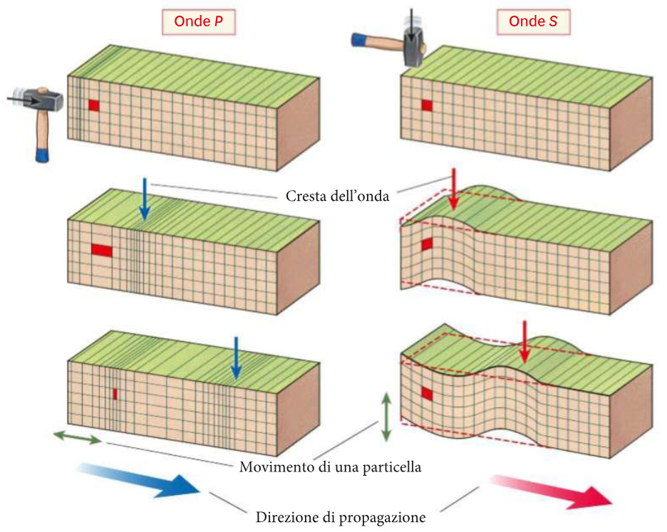
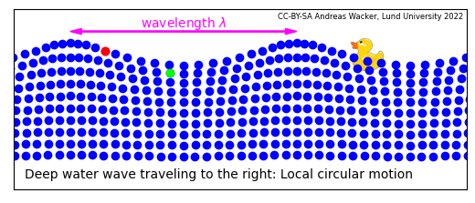
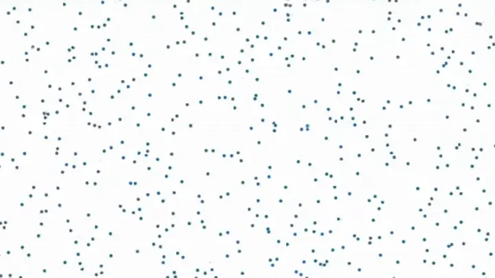
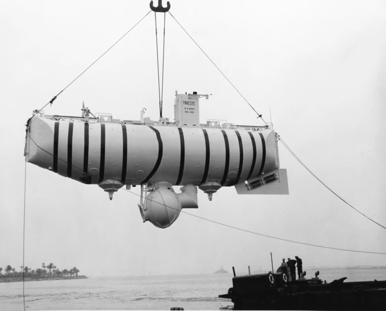

# Inquisitori accademici onorari

# Introduzione all’argomento di oggi

-   Come prima cosa, ultimeremo la trattazione della risonanza studiando alcuni semplici esempi

-   Siccome le onde sonore nell’aria si propagano come onde di **pressione**, dovremo introdurre innanzitutto questo concetto…

-   …e poi, finalmente, introdurremo il concetto di “onda” e in particolare di “onda sonora”!

# Esempi di risonanza (conclusione della lezione precedente)

# Spinta di un’altalena

::: side-by-side

::: content

-   Per compensare l’attrito dell’aria e le catene non ideali, bisogna continuare a spingere un bambino sull’altalena

-   Il fatto che venga naturale spingere ad ogni oscillazione completa corrisponde a quanto abbiamo visto: la forza deve essere sincrona col periodo di oscillazione!

:::

::: media

:::
:::

# Casse armoniche

::: side-by-side

::: content

-   Una cassa armonica inizia ad oscillare quando la corda ad essa collegata oscilla

-   Questo è un fenomeno di risonanza, perché la cassa armonica vibra alla stessa frequenza della corda

-   Vedremo meglio nelle prossime lezioni il comportamento degli strumenti musicali

:::

::: media

:::
:::

# Edifici antisismici

-   Nessun edificio è perfettamente rigido: tutti, se sollecitati, vibrano

-   Un po’ come un diapason, ogni edificio ha la sua frequenza caratteristica (più l’edificio è alto, minore è la sua frequenza caratteristica)

-   Questo significa che se un terremoto fa vibrare l’edificio alla frequenza “sbagliata”, potrebbe generarsi una risonanza… con conseguenze mortali!

-   È questo il motivo per cui anche edifici particolarmente robusti possono essere distrutti da un’onda sismica

# Edifici antisismici

::: side-by-side

::: content

-   In un edificio antisismico, si inseriscono degli *isolatori sismici*

-   Si tratta di elementi inseriti nelle fondamenta, che **aumentano** il periodo di oscillazione in modo che sia maggiore delle frequenze tipiche delle onde sismiche

-   Il risultato è che non è possibile instaurare una risonanza, perché durante un terremoto il suolo vibra troppo rapidamente perché l’edificio lo avverta

:::

::: media

:::
:::

# Le onde

# Le onde

-   Un’onda è una perturbazione che si propaga nello spazio, trasportando energia ma non materia

-   La propagazione avviene trasferendo energia lungo una certa direzione

-   Quest’energia può essere di varia natura: termica, elastica, elettromagnetica…

# Esempi

-   Le “onde” del mare sono un tipo di onda (abbastanza complesso!)

-   La luce è un’onda elettromagnetica

-   Il suono è un’onda di pressione

-   I terremoti sono causati da onde sismiche

# Tipi di onde

-   Le onde si suddividono in due tipi:

    #.   Onde trasversali

    #.   Onde longitudinali

-   A noi interessano le onde sonore, che sono **sempre** longitudinali. Ma è bene sapere che esistono anche le onde trasversali!

-   Alcune proprietà delle onde valgono infatti solo per un tipo e non per l’altro, ed è bene non confonderle

---

Notate che in nessuno dei due casi gli anelli della molla si muovono: passata l’onda, restano nella posizione iniziale!

# Onde sismiche

Le onde sismiche possono essere sia longitudinali che trasversali, perché la crosta terrestre si comporta in modo simile ad una molla

{height=480px}

# Onde del mare

Di che tipo sono le onde in superficie?

::: notes
Sono sia trasversali che longitudinali, ovviamente!
:::

# Onde sonore

-   Le onde sonore sono solo di tipo **longitudinale**

-   Il motivo per cui non possono essere trasversali ha a che fare con la loro natura: sono onde di **pressione**

-   Per capire il loro funzionamento, dobbiamo quindi introdurre prima il concetto di “pressione”

# La pressione

# La pressione

-   Nel linguaggio comune, per “pressione” si intende una forza applicata ad una superficie…

-   …e, incredibilmente, è proprio il significato dato in fisica!

-   La pressione di una forza su una superficie è definita come il rapporto

    \[
    P = \frac{F}{s},
    \]

    e si misura in N/m² ovviamente. A questa unità è dato il nome di “Pascal”, dal nome del grande [filosofo, matematico, teologo e inventore francese](https://it.wikipedia.org/wiki/Blaise_Pascal).

# Esempi

-   Quando sto in piedi in una stanza, esercito una pressione: se $m = 80\,\text{kg}$ e la superficie dei piedi è di $2 \times 200\,\mathrm{cm^2} = 0{,}04\,\mathrm{m^2}$, si ha
    \[
    P = \frac{m g}{S} = \frac{80\,\text{kg}\times 10\,\mathrm{m/s^2}}{0{,}02\,\mathrm{m^2} + 0{,}02\,\mathrm{m^2}} = 20.000\,\text{Pa} = 20\,\text{kPa}
    \]

-   Il mio computer ha una massa di circa 2 kg e una superficie di circa $800\,\mathrm{cm^2} = 0{,}08\,\mathrm{m^2}$. La pressione esercitata sul tavolo è
    \[
    P = \frac{m g}{S} = \frac{2\,\text{kg}\times 10\,\mathrm{m/s^2}}{0{,}08\,\mathrm{m^2}} = 250\,\text{Pa}.
    \]

# Unità di misura

-   L’unità del SI è il Pascal, che però è un valore molto piccolo per misurare la pressione dell’aria

-   Un’altra unità di misura molto usata è l’atmosfera, che è la pressione media dell’aria al livello del mare:

    \[
    1\,\text{atm} = 101.325\,\text{Pa}.
    \]

# Significato

-   La pressione è importante quando si applica una forza su una superficie: premendo su un panetto di burro con un coltello di taglio o di piatto, a parità di forza l’effetto è molto diverso!

-   La differenza tra il coltello di taglio e di piatto è l’area di contatto: usando il coltello di taglio, la superficie è minore e la forza è più concentrata, aumentandone l’effetto.

-   Quando si applica una forza a una superficie anziché ad un punto, è più utile usare il concetto di “pressione” che di “forza”

# Il letto di chiodi

::: side-by-side

::: content

-   Al [MuSe](https://www.muse.it/) di Trento potete fare l’esperienza di un letto di chiodi!

-   Non si avverte dolore perché il proprio peso (la forza $F$) è sostenuto da circa 1000 chiodi. Quindi la pressione è
    \[
    P = \frac{m g}{1000 \times S_\text{chiodo}} = \frac1{1000}\,\frac{mg}{S_\text{chiodo}} = \frac{mg / 1000}{S_\text{chiodo}}
    \]

    È come se foste sostenuti da un solo chiodo, ma pesaste 1000 volte meno!
:::

::: media

:::
:::

# Ciaspole da neve

::: side-by-side

::: content

-   Per camminare sulla neve si usano le ciaspole

-   Queste distribuiscono il proprio peso (la forza $F$) su una superficie di contatto $S$ più ampia, diminuendo quindi la pressione

-   Se la superficie di una ciaspola è tre volte quella del piede, è come se si pesasse un terzo del proprio peso

:::

::: media

:::
:::

---

[{height=720px}](https://medium.com/@Rememberer0/stock-removal-knife-making-an-overview-f4eeeeacd2e3)

---

[{height=720px}](https://www.solidrenner.com/i-tacchi-sono-i-peggiori-nemici-del-parquet/)

# Pressione di un gas

::: side-by-side

::: content

-   Si sente spesso parlare di “pressione atmosferica”, che è ciò che misurano i barometri casalinghi. Questa dice quanto l’aria “schiaccia” gli oggetti che sono immersi in essa

-   Attenzione però: non è un effetto dovuto alla gravità, o meglio, non è **solo** dovuto alla gravità

-   L’aria infatti esercita una pressione anche orizzontalmente (sui muri), e persino sui soffitti!

:::

::: media

:::
:::

# Molecole d’aria

::: side-by-side

::: content

-   L’aria è fatta da molecole che si muovono e si scontrano continuamente

-   La velocità media dipende dalla molecola (ossigeno, azoto…) e dalla temperatura, ma l’ordine di grandezza è 1000 m/s

-   Essendo molto poco massive, il loro urto non ci fa male. Ma proprio perché sono moltissime (25 miliardi di miliardi ogni cm³!), la somma di tutti questi minuscoli urti genera una pressione misurabile

:::

::: media

:::
:::

# Pressione dell’aria

::: side-by-side

::: content

-   La gravità cerca di far cadere le molecole

-   Ma esse non cadono come gocce di pioggia, perché vengono bombardate e sostenute dagli urti con le compagne sottostanti. L’aria “galleggia” su se stessa grazie a questi urti

-   Questo crea un enorme “materasso” di molecole, che si comprimono l’una sull’altra. A livello del mare, siamo sotto il peso dell’intera colonna e la pressione è massima (101325 Pa, circa 100 kPa).

:::

::: media

:::
:::

# La pressione su di noi

-   Ma quindi la pressione dell’aria ci sta schiacciando anche in questo momento?

-   **CERTO!** In ogni istante l’aria preme su di noi come un peso di 15–20 tonnellate! (Supponete una superficie della pelle di 1,5–2 m²)

-   Ma il nostro corpo è adattato all’aria, ed esercita dall’interno una pressione verso l’esterno che bilancia quella dell’aria

-   Qualcuno ricorda la [scena finale](https://youtu.be/RkCgZ6yMNx8?si=KnQxzXrQ8oo3cXsq) di [Total Recall](https://www.imdb.com/title/tt0100802/) (Verhoeven, 1990)?

-   Tutti gli organismi viventi hanno meccanismi di regolazione della pressione adatti all’ambiente in cui vivono

# Le profondità del mare

::: side-by-side

::: content

-   Anche l’acqua ed altri fluidi esercitano una pressione, e come nel caso dell’aria essa aumenta con la profondità

-   Sul fondo della Fossa delle Marianne (11 km di profondità) la pressione è 1.086 atm.

-   Il [batiscafo Trieste](https://it.wikipedia.org/wiki/Trieste_%28batiscafo%29), progettato da [A. Piccard](https://it.wikipedia.org/wiki/Auguste_Piccard) e pilotato da [J. Piccard](https://it.wikipedia.org/wiki/Jacques_Piccard) (figlio) e [Don Walsh](https://it.wikipedia.org/wiki/Don_Walsh), fu il primo a raggiungere il fondo nel 1952

:::

::: media

:::
:::

# Vita a 6.600 m di profondità

<iframe width="784" height="441" src="https://www.youtube.com/embed/g9DOHpLS19E?si=u3G73JE5GyB54Djv" title="YouTube video player" frameborder="0" allow="accelerometer; autoplay; clipboard-write; encrypted-media; gyroscope; picture-in-picture; web-share" referrerpolicy="strict-origin-when-cross-origin" allowfullscreen></iframe>

La pressione è circa 660 atm.

# *Psychrolutes marcidus*

# Pressione ed onde

::: side-by-side

::: content

-   Quando un corpo si muove in un fluido, genera una perturbazione: spostandosi, urta e spinge le particelle, addensandole ed aumentando la pressione

-   Le particelle spingono via le vicine trasferendo energia cinetica, ma lasciano alle spalle una zona meno fitta, dove la pressione è minore

-   Questa compressione/rarefazione si ripete a catena: ogni particella urta la vicina, trasferendo l’energia cinetica in avanti

:::

::: media

:::
:::

# Densità e pressione

::: side-by-side

::: content

-   Si vede nell’animazione a lato che l’onda appare come una specie di banda nera che si propaga

-   Il motivo per cui appare la banda è che quando la pressione aumenta, aumenta anche la densità (numero di particelle in un dato volume)

-   Un’elevata pressione corrisponde a molti urti: ed ovviamente, gli urti sono più numerosi dove è più facile trovare particelle!

:::

::: media

:::
:::

# Simulazione

-   Facciamo un gioco! Scegliamo una fila di banchi abbastanza popolata, e con le persone sedute una vicina all’altra

-   Chi è ad un’estremità tocchi il braccio della persona vicina, la quale farà lo stesso con quella dopo

-   Dopo aver provato una volta, la persona in cima alla fila ora dia tocchi regolari. Verifichiamo che la persona all’altro capo riceva impulsi con lo stesso periodo (frequenza)

# Onde sonore

# Analogia col suono

Il gioco che abbiamo fatto presenta analogie con la propagazione sonora:

-   Gli “impulsi” della prima persona si propagano nella stanza, anche se nessuna persona ha cambiato il suo posto.

-   Si tratta di un’onda longitudinale: tutto il movimento avviene lungo la fila, senza coinvolgere quella davanti o dietro

-   Ciascun impulso non si propaga istantaneamente, ma richiede qualche tempo per raggiungere l’altra estremità della fila

-   Se le persone sedessero più separate tra loro (minore densità), ci vorrebbe di più perché un impulso si trasferisca da un capo all’altro della fila (ognuno dovrebbe sporgersi, o addirittura alzarsi momentaneamente dal suo posto)

# Suoni attraverso i muri

::: side-by-side

::: content

-   Quando sentiamo i vicini nell’appartamento accanto, avvengono tre propagazioni:

    #.  Il suono si propaga nell’aria della stanza accanto fino al muro divisorio
    #.  Il muro vibra a causa delle variazioni di pressione dell’aria
    #.  Le vibrazioni del muro mettono in moto l’aria nella nostra stanza

-   In questo viaggio, il suono è un’onda di pressione solo mentre viaggia nell’aria

:::

::: media

{width=480px}

:::
:::

# Onde sonore

Possiamo quindi dare una definizione delle onde sonore:

-   Un’onda sonora è un’onda meccanica che si propaga in un mezzo

-   Quando il suono si propaga in un fluido come l’aria o l’acqua, esso è un’onda di pressione

-   Quando il suono si propaga in un solido come il muro, esso è una vibrazione causata da forze elastiche

-   In entrambi i casi, si tratta di un’onda longitudinale

# Conclusioni

# Cosa sapere per l’esame

-   Esempi di risonanza
-   Definizione di pressione
-   Pressione dei gas e dei fluidi
-   Onde di pressione

---
title: Fisica -- Lezione 6
subtitle: Pressione, onde sonore, sovrapposizione e interferenza
author: Maurizio Tomasi ([`maurizio.tomasi@unimi.it`](mailto:maurizio.tomasi@unimi.it))
date: Martedì 11 novembre 2025
...
