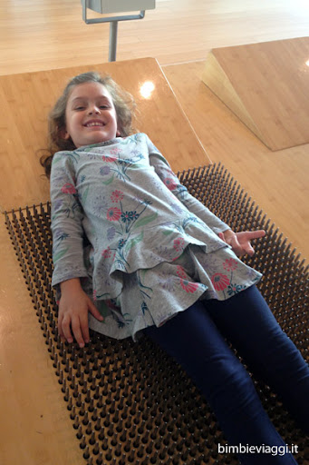
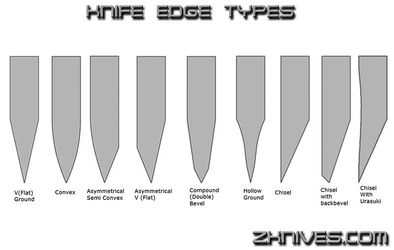
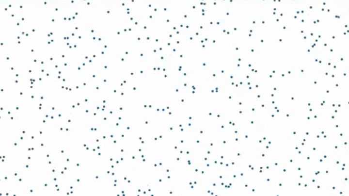
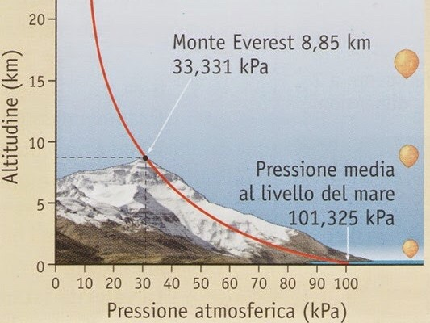
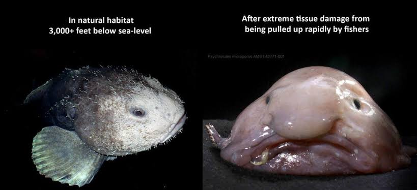
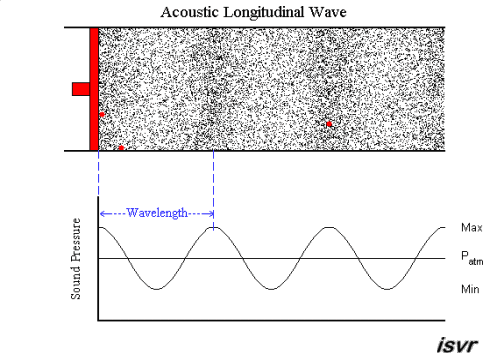
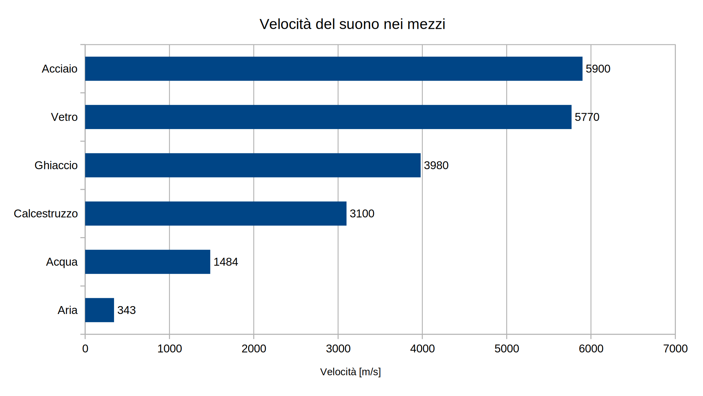
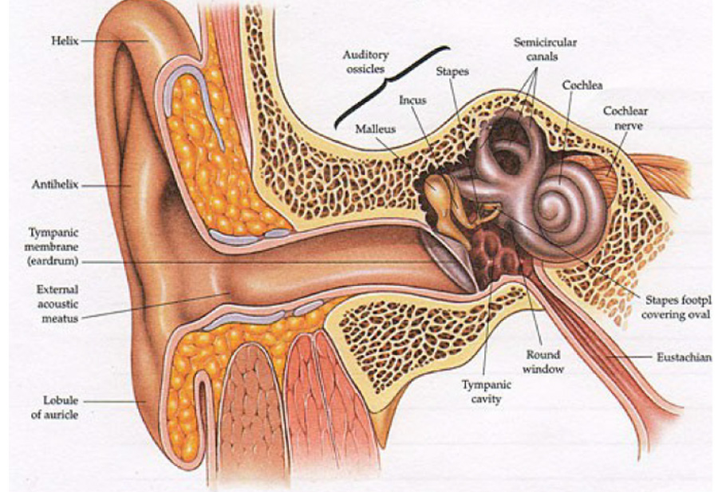
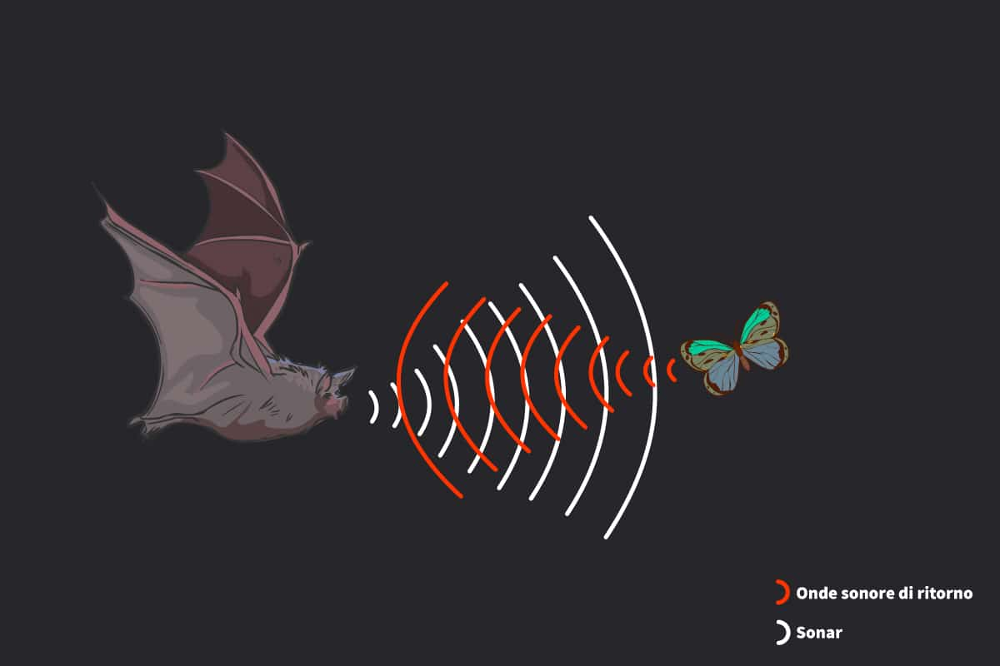

# Inquisitori accademici onorari

# Introduzione all’argomento di oggi

-   Nella scorsa lezione abbiamo introdotto il concetto di “onda”, e abbiamo anticipato che le onde sonore sono onde di pressione. Oggi spiegheremo quindi in cosa consiste la pressione

-   Faremo un “gioco” molto semplice, che ci permetterà di introdurre alcune proprietà delle onde sonore

-   Introdurremo poi le onde sonore, e inizieremo a studiare il tipo più semplice: l’onda sinusoidale

# La pressione

# La pressione

-   Nel linguaggio comune, per “pressione” si intende una forza applicata ad una superficie…

-   …e, incredibilmente, è proprio il significato dato in fisica!

-   La pressione di una forza su una superficie è definita come il rapporto

    \[
    P = \frac{F}{s},
    \]

    e si misura in N/m² ovviamente. A questa unità è dato il nome di “Pascal”, dal nome del grande [filosofo, matematico, teologo e inventore francese](https://it.wikipedia.org/wiki/Blaise_Pascal).

# Esempi

-   Quando sto in piedi in una stanza, esercito una pressione: se $m = 80\,\text{kg}$ e la superficie dei piedi è di $2 \times 200\,\mathrm{cm^2} = 0{,}04\,\mathrm{m^2}$, si ha
    \[
    P = \frac{m g}{S} = \frac{80\,\text{kg}\times 10\,\mathrm{m/s^2}}{0{,}02\,\mathrm{m^2} + 0{,}02\,\mathrm{m^2}} = 20.000\,\text{Pa} = 20\,\text{kPa}
    \]

-   Il mio computer ha una massa di circa 2 kg e una superficie di circa $800\,\mathrm{cm^2} = 0{,}08\,\mathrm{m^2}$. La pressione esercitata sul tavolo è
    \[
    P = \frac{m g}{S} = \frac{2\,\text{kg}\times 10\,\mathrm{m/s^2}}{0{,}08\,\mathrm{m^2}} = 250\,\text{Pa}.
    \]

# Unità di misura

-   L’unità del SI è il Pascal, che però è un valore molto piccolo per misurare la pressione dell’aria

-   Un’altra unità di misura molto usata è l’atmosfera, che è la pressione media dell’aria al livello del mare:

    \[
    1\,\text{atm} = 101.325\,\text{Pa}.
    \]

# Significato

-   La pressione è importante quando si applica una forza su una superficie: premendo su un panetto di burro con un coltello di taglio o di piatto, a parità di forza l’effetto è molto diverso!

-   La differenza tra il coltello di taglio e di piatto è l’area di contatto: usando il coltello di taglio, la superficie è minore e la forza è più concentrata, aumentandone l’effetto.

-   Quando si applica una forza a una superficie anziché ad un punto, è più utile usare il concetto di “pressione” che di “forza”

# Il letto di chiodi

::: side-by-side

::: content

-   Al [MuSe](https://www.muse.it/) di Trento potete fare l’esperienza di un letto di chiodi!

-   Non si avverte dolore perché il proprio peso (la forza $F$) è sostenuto da circa 1000 chiodi. Quindi la pressione è
    \[
    P = \frac{m g}{1000 \times S_\text{chiodo}} = \frac1{1000}\,\frac{mg}{S_\text{chiodo}} = \frac{mg / 1000}{S_\text{chiodo}}
    \]

    È come se foste sostenuti da un solo chiodo, ma pesaste 1000 volte meno!
:::

::: media

:::
:::

# Ciaspole da neve

::: side-by-side

::: content

-   Per camminare sulla neve si usano le ciaspole

-   Queste distribuiscono il proprio peso (la forza $F$) su una superficie di contatto $S$ più ampia, diminuendo quindi la pressione

-   Se la superficie di una ciaspola è tre volte quella del piede, è come se si pesasse un terzo del proprio peso

:::

::: media

:::
:::

---

[{height=720px}](https://medium.com/@Rememberer0/stock-removal-knife-making-an-overview-f4eeeeacd2e3)

---

[{height=720px}](https://www.solidrenner.com/i-tacchi-sono-i-peggiori-nemici-del-parquet/)

# Pressione di un gas

::: side-by-side

::: content

-   Si sente spesso parlare di “pressione atmosferica”, che è ciò che misurano i barometri casalinghi. Questa dice quanto l’aria “schiaccia” gli oggetti che sono immersi in essa

-   Attenzione però: non è un effetto dovuto alla gravità, o meglio, non è **solo** dovuto alla gravità

-   L’aria infatti esercita una pressione anche orizzontalmente (sui muri), e persino sui soffitti!

:::

::: media

:::
:::

# Molecole d’aria

::: side-by-side

::: content

-   L’aria è fatta da molecole che si muovono e si scontrano continuamente

-   La velocità media dipende dalla molecola (ossigeno, azoto…) e dalla temperatura, ma l’ordine di grandezza è 1000 m/s

-   Essendo molto poco massive, il loro urto non ci fa male. Ma proprio perché sono moltissime (25 miliardi di miliardi ogni cm³!), la somma di tutti questi minuscoli urti genera una pressione misurabile

:::

::: media

:::
:::

# Pressione dell’aria

::: side-by-side

::: content

-   La gravità cerca di far cadere le molecole

-   Ma esse non cadono come gocce di pioggia, perché vengono bombardate e sostenute dagli urti con le compagne sottostanti. L’aria “galleggia” su se stessa grazie a questi urti

-   Questo crea un enorme “materasso” di molecole, che si comprimono l’una sull’altra. A livello del mare, siamo sotto il peso dell’intera colonna e la pressione è massima (101325 Pa, circa 100 kPa).

:::

::: media

:::
:::

# La pressione su di noi

-   Ma quindi la pressione dell’aria ci sta schiacciando anche in questo momento?

-   **CERTO!** In ogni istante l’aria preme su di noi come un peso di 15–20 tonnellate! (Supponete una superficie della pelle di 1,5–2 m²)

-   Ma il nostro corpo è adattato all’aria, ed esercita dall’interno una pressione verso l’esterno che bilancia quella dell’aria

-   Qualcuno ricorda la [scena finale](https://youtu.be/RkCgZ6yMNx8?si=KnQxzXrQ8oo3cXsq) di [Total Recall](https://www.imdb.com/title/tt0100802/) (Verhoeven, 1990)?

-   Tutti gli organismi viventi hanno meccanismi di regolazione della pressione adatti all’ambiente in cui vivono

# Le profondità del mare

::: side-by-side

::: content

-   Anche l’acqua ed altri fluidi esercitano una pressione, e come nel caso dell’aria essa aumenta con la profondità

-   Sul fondo della Fossa delle Marianne (11 km di profondità) la pressione è 1.086 atm.

-   Il [batiscafo Trieste](https://it.wikipedia.org/wiki/Trieste_%28batiscafo%29), progettato da [A. Piccard](https://it.wikipedia.org/wiki/Auguste_Piccard) e pilotato da [J. Piccard](https://it.wikipedia.org/wiki/Jacques_Piccard) (figlio) e [Don Walsh](https://it.wikipedia.org/wiki/Don_Walsh), fu il primo a raggiungere il fondo nel 1952

:::

::: media

:::
:::

# Vita a 6.600 m di profondità

<iframe width="784" height="441" src="https://www.youtube.com/embed/g9DOHpLS19E?si=u3G73JE5GyB54Djv" title="YouTube video player" frameborder="0" allow="accelerometer; autoplay; clipboard-write; encrypted-media; gyroscope; picture-in-picture; web-share" referrerpolicy="strict-origin-when-cross-origin" allowfullscreen></iframe>

La pressione è circa 660 atm.

# *Psychrolutes marcidus*

# Pressione ed onde

::: side-by-side

::: content

-   Quando un corpo si muove in un fluido, genera una perturbazione: spostandosi, urta e spinge le particelle, addensandole ed aumentando la pressione

-   Le particelle spingono via le vicine trasferendo energia cinetica, ma lasciano alle spalle una zona meno fitta, dove la pressione è minore

-   Questa compressione/rarefazione si ripete a catena: ogni particella urta la vicina, trasferendo l’energia cinetica in avanti

:::

::: media

:::
:::

# Densità e pressione

::: side-by-side

::: content

-   Si vede nell’animazione a lato che l’onda appare come una specie di banda nera che si propaga

-   Il motivo per cui appare la banda è che quando la pressione aumenta, aumenta anche la densità (numero di particelle in un dato volume)

-   Un’elevata pressione corrisponde a molti urti: ed ovviamente, gli urti sono più numerosi dove è più facile trovare particelle!

:::

::: media

:::
:::

# Simulazione

-   Facciamo un gioco! Scegliamo una fila di banchi abbastanza popolata, e con le persone sedute una vicina all’altra

-   Chi è ad un’estremità tocchi il braccio della persona vicina, la quale farà lo stesso con quella dopo

-   Dopo aver provato una volta, la persona in cima alla fila ora dia tocchi regolari. Verifichiamo che la persona all’altro capo riceva impulsi con lo stesso periodo (frequenza)

# Onde sonore

# Analogia col suono

Il gioco che abbiamo fatto presenta analogie con la propagazione sonora:

-   Gli “impulsi” della prima persona si propagano nella stanza, anche se nessuna persona ha cambiato il suo posto.

-   Si tratta di un’onda longitudinale: tutto il movimento avviene lungo la fila, senza coinvolgere quella davanti o dietro

-   Ciascun impulso non si propaga istantaneamente, ma richiede qualche tempo per raggiungere l’altra estremità della fila

-   Se le persone sedessero più separate tra loro (minore densità), ci vorrebbe di più perché un impulso si trasferisca da un capo all’altro della fila (ognuno dovrebbe sporgersi, o addirittura alzarsi momentaneamente dal suo posto)

# Suoni attraverso i muri

::: side-by-side

::: content

-   Quando sentiamo i vicini nell’appartamento accanto, avvengono tre propagazioni:

    #.  Il suono si propaga nell’aria della stanza accanto fino al muro divisorio
    #.  Il muro vibra a causa delle variazioni di pressione dell’aria
    #.  Le vibrazioni del muro mettono in moto l’aria nella nostra stanza

-   In questo viaggio, il suono è un’onda di pressione solo mentre viaggia nell’aria

:::

::: media

{width=480px}

:::
:::

# Onde sonore

Possiamo quindi dare una definizione delle onde sonore:

-   Un’onda sonora è un’onda meccanica che si propaga in un mezzo

-   Quando il suono si propaga in un fluido come l’aria o l’acqua, esso è un’onda di pressione

-   Quando il suono si propaga in un solido come il muro, esso è una vibrazione causata da forze elastiche

-   In entrambi i casi, si tratta di un’onda longitudinale

# Proprietà di un’onda sonora

-   Se il fattore che scatena l’onda è un impulso periodico, il **periodo** si conserva durante la propagazione (e quindi anche la **frequenza**)

-   L’**ampiezza** dell’onda, ossia la sua intensità, si riduce man mano che l’onda si propaga. Vedremo meglio l’intensità in seguito, perché è un argomento complesso

-   La **velocità di propagazione** con cui l’onda si propaga dipende dal tipo di mezzo: in generale, più un corpo è denso e rigido, maggiore è la velocità del suono

---

{height=560px}

# Eruzione di un vulcano

<iframe width="784" height="441" src="https://www.youtube.com/embed/BUREX8aFbMs?si=b1tpdO6co2sNYG1v" title="YouTube video player" frameborder="0" allow="accelerometer; autoplay; clipboard-write; encrypted-media; gyroscope; picture-in-picture; web-share" referrerpolicy="strict-origin-when-cross-origin" allowfullscreen></iframe>

# Esempi

-   Un suono basso a 20 Hz ha una lunghezza d’onda uguale a
    \[
    \lambda = \frac{343\,\text{m/s}}{20\,\text{s}^{-1}} \approx 17\,\text{m}
    \]

-   Il suono di un diapason a 440 Hz ha una lunghezza d’onda uguale a
    \[
    \lambda = \frac{343\,\text{m/s}}{440\,\text{s}^{-1}} \approx 78\,\text{cm}
    \]

# Suono e rumore

# Suono e rumore

-   Nella vita quotidiana, usiamo spesso le parole “suono” e “rumore” per parlare di fenomeni acustici

-   Ma sappiamo qual è la differenza tra i due? In particolare, stiamo parlando di un fenomeno fisico oggettivo, o della **sensazione** che un certo fenomeno fisico (quale?) ci provoca?

# Rumore e suono

-   La differenza tra suono e rumore è la seguente:

    -   Il **suono** è la sensazione di un’onda sonora regolare, che possiede una sua periodicità

    -   Il **rumore** è l’esatto opposto: è la sensazione di un’onda sonora priva di periodicità

-   Per rappresentare il suono che raggiunge un punto dello spazio (dove ad esempio c’è un microfono), si usa spesso un grafico che mostra la variazione temporale della pressione/oscillazione meccanica

-   Vediamo subito la differenza con un esempio interattivo, che avremo modo di riprendere in seguito

---

<iframe src="iframes/sound-example.html" width="100%" height="580px" style="border:1px solid #ccc; border-radius: 8px;"></iframe>

# Onde sinusoidali {#sinusoidal-waves}

# Onde sinusoidali

-   Il modo più semplice per affrontare lo studio delle onde sonore è di partire dal tipo più semplice, ossia un suono. Inizieremo col suono più regolare possibile: l’**onda sinusoidale**, che abbiamo appena visto nell’esempio interattivo

-   Matematicamente, un’onda sinusoidale si scrive così:

    \[
    \text{onda} = A \sin (2\pi\nu t + \phi),
    \]

    dove $t$ misura il tempo. La scritta $\sin$ rappresenta la funzione matematica “seno”, che è usata in trigonometria per caratterizzare gli angoli.

# Onde sinusoidali

-   La funzione “seno” è molto interessante ma abbastanza complessa da studiare.

-   Dell’equazione

    \[
    \text{onda} = A \sin (2\pi\nu t + \phi),
    \]

    a noi interesseranno questi parametri:

    #.   La sua ampiezza (quanto la pressione varia), indicata solitamente con $A$
    #.   La sua frequenza (quanto rapidamente oscilla), indicata con $\nu$ o con $f$
    #.   La sua fase (a che istante l’onda raggiunge il suo massimo), indicata con $\phi$

# Unità di misura

-   L’ampiezza $A$ è misurata in Pascal se l’onda rappresenta una pressione, in metri se è un’oscillazione di un mezzo (ad es. un muro), o in kg/m³ se è una densità
-   La frequenza, come sappiamo, si misura in Hertz (Hz)
-   La fase è indicata con un valore in gradi, da 0° (nessuno sfasamento) a 360° (un’intera oscillazione), e siccome si comporta come un angolo, di solito si rappresenta in gradi

---

<iframe src="iframes/sinusoid.html" width="100%" height="760" style="border:1px solid #ccc; border-radius: 8px;"></iframe>

# Percezione della frequenza

# Percezione della frequenza

-   Un esempio di suono (ossia, di onda periodica regolare) è la nota emessa da uno strumento, ad esempio un violino

-   L’essere umano è in grado di percepire suoni la cui frequenza sta nell’intervallo

    \[
    20\,\text{Hz} < \nu < 20\,\text{kHz},
    \]

    ma i valori cambiano con l’età: invecchiando, la frequenza udibile più elevata decresce fino a raggiungere valori intorno a 15\,\text{kHz} e anche meno.

# Perché questi limiti?

::: side-by-side

::: content

-   Ad alte frequenze, il timpano e gli ossicini collegati (martello, incudine, staffa) hanno un’inerzia che gli impedisce di oscillare così rapidamente.
-   Ma anche se potessero oscillare a qualsiasi frequenza, la membrana basilare e le cellule ciliate all’interno della coclea non riuscirebbero comunque a tradurre il segnale meccanico in un impulso nervoso chiaro
-   A basse frequenze, il nostro orecchio non ha una struttura efficiente per tradurre vibrazioni molto lente in segnali neuronali

:::

::: media

:::
:::
# Lunghezza d’onda

::: side-by-side

::: content

-   La lunghezza d’onda, che si indica con la lettera λ (“lambda”), rappresenta la distanza fisica tra un picco di pressione e il successivo

-   Essendo una distanza, λ si misura in metri

-   Si può trovare facilmente λ dalla relazione

    \[
    v_\text{suono} = \lambda \times \nu \quad\Rightarrow\quad \lambda = \frac{v_\text{suono}}{\nu}.
    \]

-   Onde a 20 Hz hanno $\lambda \approx 17\,\text{m}$: sotto i 20 Hz, diventano troppo grandi per il nostro orecchio!

:::

::: media

:::
:::

# Curve isofoniche

-   Il cervello umano non percepisce tutte le frequenze con la stessa sensibilità

-   Le cosiddette [curve isofoniche](https://it.wikipedia.org/wiki/Diagramma_di_uguale_intensit%C3%A0_sonora) rappresentano l’intensità percepita in funzione della frequenza e dell’intensità

-    Esse sono state ricavando facendo sentire un suono ad una frequenza di riferimento alternato ad un altro suono e aumentando o diminuendo il volume del secondo finché non fosse stato intenso quanto il primo, e si è registrata l’ampiezza effettiva. Si è poi ripetuto variando l’intensità del suono di riferimento

# Curve isofoniche

::: side-by-side

::: content
- Asse x: frequenza del suono in Hz.
- Asse y: Ampiezza dell’onda di pressione.
- Le varie curve indicano diverse intensità dell’onda di riferimento, dalla soglia di udibilità alla soglia del dolore.

:::

::: media

{height=620px}

:::
:::

# Ultrasuoni

::: side-by-side

::: content
-   I suoni con una frequenza superiore a 20 kHz sono detti **ultrasuoni**, e non sono udibili dall’uomo.

-   Sono però percepibili da alcuni animali:

    -   I cani, per cui esistono fischietti agli ultrasuoni
    -   I pipistrelli, che usano l’eco degli ultrasuoni per orientarsi (vedremo meglio l’eco in futuro)
:::

::: media

:::
:::

# Conclusioni

# Cosa sapere per l’esame

-   Definizione di pressione
-   Pressione dei gas e dei fluidi
-   Onde di pressione
-   Onde sinusoidali

---
title: Fisica -- Lezione 6
subtitle: Pressione, onde sonore, sovrapposizione e interferenza
author: Maurizio Tomasi ([`maurizio.tomasi@unimi.it`](mailto:maurizio.tomasi@unimi.it))
date: Martedì 11 novembre 2025
...
