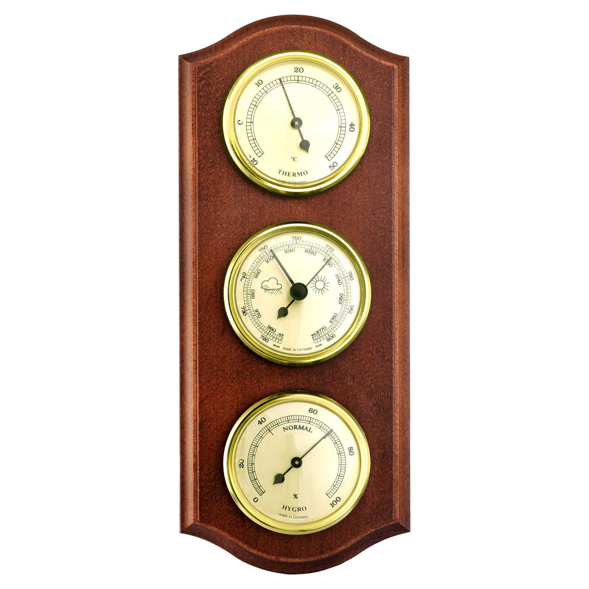

# Inquisitori accademici onorari

# Introduzione all’argomento di oggi

-   Nella scorsa lezione abbiamo introdotto il concetto di “onda”, e abbiamo anticipato che le onde sonore sono onde di pressione. Oggi spiegheremo quindi in cosa consiste la pressione

-   Faremo un “gioco” molto semplice, che ci permetterà di introdurre alcune proprietà delle onde sonore

-   Introdurremo poi le onde sonore, e spiegheremo il principio di sovrapposizione e l’interferenza

# La pressione

# La pressione

-   Nel linguaggio comune, per “pressione” si intende una forza applicata ad una superficie…

-   …e, incredibilmente, è proprio il significato dato in fisica!

-   La pressione di una forza su una superficie è definita come il rapporto

    \[
    P = \frac{F}{s},
    \]

    e si misura in N/m² ovviamente. A questa unità è dato il nome di “Pascal”, dal nome del grande [filosofo, matematico, teologo e inventore francese](https://it.wikipedia.org/wiki/Blaise_Pascal).

# Esempi

-   Quando sto in piedi in una stanza, esercito una pressione: se $m = 80\,\text{kg}$ e la superficie dei piedi è di $2 \times 200\,\mathrm{cm^2} = 0{,}04\,\mathrm{m^2}$, si ha
    \[
    P = \frac{m g}{S} = \frac{80\,\text{kg}\times 10\,\mathrm{m/s^2}}{0{,}02\,\mathrm{m^2} + 0{,}02\,\mathrm{m^2}} = 20.000\,\text{Pa} = 20\,\text{kPa}
    \]

-   Il mio computer ha una massa di circa 2 kg e una superficie di circa $800\,\mathrm{cm^2} = 0{,}08\,\mathrm{m^2}$. La pressione esercitata sul tavolo è
    \[
    P = \frac{m g}{S} = \frac{2\,\text{kg}\times 10\,\mathrm{m/s^2}}{0{,}08\,\mathrm{m^2}} = 250\,\text{Pa}.
    \]

# Unità di misura

-   L’unità del SI è il Pascal, che però è un valore molto piccolo

-   Un’altra unità di misura molto usata è l’atmosfera, che corrisponde a 101.325 Pa, ossia la pressione media dell’aria al livello del mare:

    \[
    1\,\text{atm} = 101.325\,\text{Pa}.
    \]

-   Un’altra unità di misura usata in passato (ma oggi quasi abbandonata) sono i “millimetri di mercurio”: essi fanno riferimento al famoso [esperimento di Torricelli (1608–1647)](https://it.wikipedia.org/wiki/Tubo_di_Torricelli), e si indicano con mmHg. Vale che
    \[
    760\,\text{mmHg} = 1\,\text{atm} = 101.325\,\text{Pa}.
    \]

# Significato

-   Si divide la forza $F$ per una superficie $S$ quando questa forza è applicata più o meno uniformemente su $S$

-   Vedremo negli esempi successivi vari casi di forze che si “scaricano” su una superficie estesa anziché in un punto

-   In tali casi, è più corretto usare le pressioni anziché le forze per dare una spiegazione fisica del fenomeno

# Il letto di chiodi

::: side-by-side

::: content

-   Al [MuSe](https://www.muse.it/) di Trento potete fare l’esperienza di un letto di chiodi!

-   Non si avverte dolore perché si è sostenuti da circa 1000 chiodi, quindi la pressione è
    \[
    P = \frac{m g}{1000 \times S_\text{chiodo}} = \frac1{1000}\,\frac{mg}{S_\text{chiodo}} = \frac{mg / 1000}{S_\text{chiodo}}
    \]
:::

::: media

:::
:::

# Ciaspole da neve

::: side-by-side

::: content

-   Per camminare sulla neve si usano le ciaspole

-   Queste aumentano la superficie di contatto con la neve, diminuendo la pressione

-   Se la superficie di una ciaspola è tre volte quella del piede, è come se si pesasse un terzo del proprio peso

:::

::: media

:::
:::

---

[{height=720px}](https://medium.com/@Rememberer0/stock-removal-knife-making-an-overview-f4eeeeacd2e3)

---

[{height=720px}](https://www.solidrenner.com/i-tacchi-sono-i-peggiori-nemici-del-parquet/)

# Pressione di un gas

::: side-by-side

::: content

-   Si sente spesso parlare di “pressione atmosferica”, che è ciò che misurano i barometri casalinghi. Questa dice quanto l’aria “schiaccia” gli oggetti che sono immersi in essa

-   Attenzione però: non è un effetto dovuto alla gravità, o meglio, non è **solo** dovuto alla gravità

-   L’aria infatti esercita una pressione anche sui muri, e persino *sotto* la cattedra!

:::

::: media

:::
:::

# Molecole d’aria

::: side-by-side

::: content

-   L’aria è fatta da molecole che si muovono e si scontrano continuamente

-   La velocità media dipende dalla molecola (ossigeno, azoto…) e dalla temperatura, ma l’ordine di grandezza è 1000 m/s

-   Essendo molto poco massive, il loro urto non ci fa male, ma genera comunque una pressione misurabile, perché sono moltissime (25 miliardi di miliardi ogni cm³!)

:::

::: media

:::
:::

# Pressione dell’aria

::: side-by-side

::: content

-   Il moto delle particelle d’aria è causato dalla forza gravitazionale, che tenderebbe a far cadere le particelle più in quota verso il basso: queste però urtano le particelle sotto di loro, trasferendogli energia cinetica

-   La pressione maggiore dell’aria si avverte al livello del mare, dove è mediamente

    \[
    P = 101.325\,\text{Pa} \approx 100\,\text{kPa}
    \]

-   Quindi, salendo di quota la pressione diminuisce

:::

::: media

:::
:::

# La pressione su di noi

-   Ma quindi la pressione dell’aria ci sta schiacciando anche in questo momento?

-   **CERTO!** Ma il nostro corpo è adattato all’aria, ed esercita dall’interno una pressione verso l’esterno che bilancia quella dell’aria

-   Qualcuno ricorda la [scena finale](https://youtu.be/RkCgZ6yMNx8?si=KnQxzXrQ8oo3cXsq) di [Total Recall](https://www.imdb.com/title/tt0100802/) (Verhoeven, 1990)?

-   Tutti gli organismi viventi hanno meccanismi di regolazione della pressione adatti all’ambiente in cui vivono

# Le profondità del mare

::: side-by-side

::: content

-   Anche l’acqua ed altri fluidi esercitano una pressione, e come nel caso dell’aria essa aumenta con la profondità

-   Sul fondo della Fossa delle Marianne (11 km di profondità) la pressione è 1.086 atm.

-   Il [batiscafo Trieste](https://it.wikipedia.org/wiki/Trieste_%28batiscafo%29), progettato da [A. Piccard](https://it.wikipedia.org/wiki/Auguste_Piccard) e pilotato da [J. Piccard](https://it.wikipedia.org/wiki/Jacques_Piccard) (figlio) e [Don Walsh](https://it.wikipedia.org/wiki/Don_Walsh), fu il primo a raggiungere il fondo nel 1952

:::

::: media

:::
:::

# Vita a 6.600 m di profondità

<iframe width="784" height="441" src="https://www.youtube.com/embed/g9DOHpLS19E?si=u3G73JE5GyB54Djv" title="YouTube video player" frameborder="0" allow="accelerometer; autoplay; clipboard-write; encrypted-media; gyroscope; picture-in-picture; web-share" referrerpolicy="strict-origin-when-cross-origin" allowfullscreen></iframe>

La pressione è circa 660 atm.

# *Psychrolutes marcidus*

# Pressione ed onde

::: side-by-side

::: content

-   Quando un corpo si muove in un fluido, genera onde di pressione

-   Il corpo, spostandosi, urta le particelle di fluido, che vengono accelerate

-   Le particelle accelerate urtano le loro vicine, trasferendo a loro l’energia cinetica

-   Questo processo si ripete facendo propagare una “onda di pressione”

:::

::: media

:::
:::

# Densità e pressione

::: side-by-side

::: content

-   Si vede nell’animazione a lato che l’onda appare come una specie di banda nera che si propaga

-   Il motivo per cui appare la banda è che quando la pressione aumenta, aumenta anche la densità (numero di particelle in un dato volume)

-   Un’elevata pressione corrisponde a molti urti: ed ovviamente, gli urti sono più numerosi dove è più facile trovare particelle!

:::

::: media

:::
:::

# Simulazione

-   Facciamo un gioco! Scegliamo una fila di banchi abbastanza popolata, e con le persone sedute una vicina all’altra

-   Chi è ad un’estremità tocchi il braccio della persona vicina, la quale farà lo stesso con quella dopo

-   Dopo aver provato una volta, la persona in cima alla fila ora dia tocchi regolari. Verifichiamo che la persona all’altro capo riceva impulsi con lo stesso periodo (frequenza)

# Onde sonore

# Analogia col suono

Il gioco che abbiamo fatto presenta analogie con la propagazione sonora:

-   Gli “impulsi” della prima persona si propagano nella stanza, anche se nessuna persona ha cambiato il suo posto.

-   Si tratta di un’onda longitudinale: tutto il movimento avviene lungo la fila, senza coinvolgere quella davanti o dietro

-   Ciascun impulso non si propaga istantaneamente, ma richiede qualche tempo per raggiungere l’altra estremità della fila

-   Se le persone sedessero più separate tra loro (minore densità), ci vorrebbe di più perché un impulso si trasferisca da un capo all’altro della fila (ognuno dovrebbe sporgersi, o addirittura alzarsi momentaneamente dal suo posto)

# Suoni attraverso i muri

::: side-by-side

::: content

-   Quando sentiamo i vicini nell’appartamento accanto, avvengono tre propagazioni:

    #.  Il suono si propaga nell’aria della stanza accanto fino al muro divisorio
    #.  Il muro vibra a causa delle variazioni di pressione dell’aria
    #.  Le vibrazioni del muro mettono in moto l’aria nella nostra stanza

-   In questo viaggio, il suono è un’onda di pressione solo mentre viaggia nell’aria

:::

::: media

{width=480px}

:::
:::

# Onde sonore

Possiamo quindi dare una definizione delle onde sonore:

-   Un’onda sonora è un’onda meccanica che si propaga in un mezzo

-   Quando il suono si propaga in un fluido come l’aria o l’acqua, esso è un’onda di pressione

-   Quando il suono si propaga in un solido come il muro, esso è una vibrazione causata da forze elastiche

-   In entrambi i casi, si tratta di un’onda longitudinale

# Proprietà di un’onda sonora

-   Se il fattore che scatena l’onda è un impulso periodico, il periodo si conserva durante la propagazione

-   L’ampiezza dell’onda, ossia la sua intensità, si riduce man mano che l’onda si propaga. Vedremo meglio l’intensità in seguito, perché è un argomento complesso

-   La velocità con cui l’onda si propaga dipende dal tipo di mezzo: in generale, più un corpo è denso e rigido, maggiore è la velocità del suono

---

{height=560px}

# Eruzione di un vulcano

<iframe width="784" height="441" src="https://www.youtube.com/embed/BUREX8aFbMs?si=b1tpdO6co2sNYG1v" title="YouTube video player" frameborder="0" allow="accelerometer; autoplay; clipboard-write; encrypted-media; gyroscope; picture-in-picture; web-share" referrerpolicy="strict-origin-when-cross-origin" allowfullscreen></iframe>

# Rumore e suono

-   Introduciamo ora il concetto di “suono” e “rumore”

    -   Il **suono** è un’onda sonora regolare, che possiede una sua periodicità

    -   Il **rumore** è l’esatto opposto: è un’onda sonora priva di periodicità

-   Per rappresentare il suono che raggiunge un punto dello spazio (dove ad esempio c’è un microfono), si usa spesso un grafico che mostra la variazione temporale della pressione/oscillazione meccanica

# Esempio di suono

-   Un’oscillazione regolare ha un andamento “sinusoidale”

    

    {height=320px}
    

-   Un suono è caratterizzato dalla frequenza, che è un valore in Hz (numero di oscillazioni che avvengono in un secondo), e dall’ampiezza

# Esempio di rumore

-   Il rumore invece non mostra alcuna regolarità, come abbiamo già detto:

    

    {height=320px}
    

-   Anche un rumore può essere caratterizzato numericamente, ma in modo più complesso. Il parametro più intuitivo è l’ampiezza

# Simulazione di suoni e rumori

<iframe src="iframes/sound-example.html" width="100%" height="580px" style="border:1px solid #ccc; border-radius: 8px;"></iframe>

# Sovrapposizione e interferenza

# Sovrapposizione e interferenza

-   Abbiamo sempre parlato sinora di **una** onda sonora che si propaga. Ma nella realtà siamo sempre circondati da molti suoni!

-   Quando due onde si incontrano in un punto dello spazio, vale il principio di **sovrapposizione**: se alle onde non è associata “troppa energia”, i loro effetti si sommano

-   Questo è il **principio di sovrapposizione**, e vale non solo per le onde sonore

---

<video controls width="1080">
  <source src="media/veritasium-double-slit-experiment.mp4" type="video/mp4" />
  Your browser does not support the video tag.
</video>

<small>[The original double slit experiment](https://www.youtube.com/watch?v=Iuv6hY6zsd0)</small>

# Interferenza

-   La sovrapposizione è un **principio**: dice che due onde che si incontrano nel medesimo punto producono un’onda risultante data dalla somma delle due

-   L’**interferenza** è il risultato della sovrapposizione di più onde. Esso dà origine a fenomeni molto interessanti, perché a volte l’interferenza causa un *rinforzo* delle onde, ma altre volte può annullare il loro effetto!

-   Per fare un’analogia: suono due tasti del pianoforte e sento un accordo consonante o dissonante. Il fatto di suonarli è dato dalla sovrapposizione, la consonanza o dissonanza che percepisco è dato dall’interferenza.

---

<iframe src="iframes/interference.html" width="100%" height="700" style="border:1px solid #ccc; border-radius: 8px;"></iframe>

# Battimenti

I battimenti: Si presentano come un esempio udibile di interferenza, spiegando come la sovrapposizione di due frequenze vicine crei una fluttuazione periodica del volume. Questo è un ottimo punto per fare esempi pratici, come l'accordatura di due strumenti musicali.

# Onde stazionarie

Si mostra un altro caso particolare e fondamentale di interferenza, quello delle onde stazionarie, cruciale per capire il funzionamento degli strumenti musicali.

# Conclusioni

# Cosa sapere per l’esame

-   Pressione

---
title: Fisica -- Lezione 6
subtitle: Pressione, sovrapposizione e interferenza, onde stazionarie
author: Maurizio Tomasi ([`maurizio.tomasi@unimi.it`](mailto:maurizio.tomasi@unimi.it))
date: Martedì 11 novembre 2025
...
