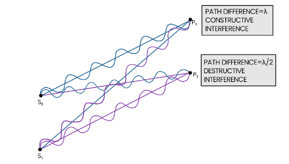
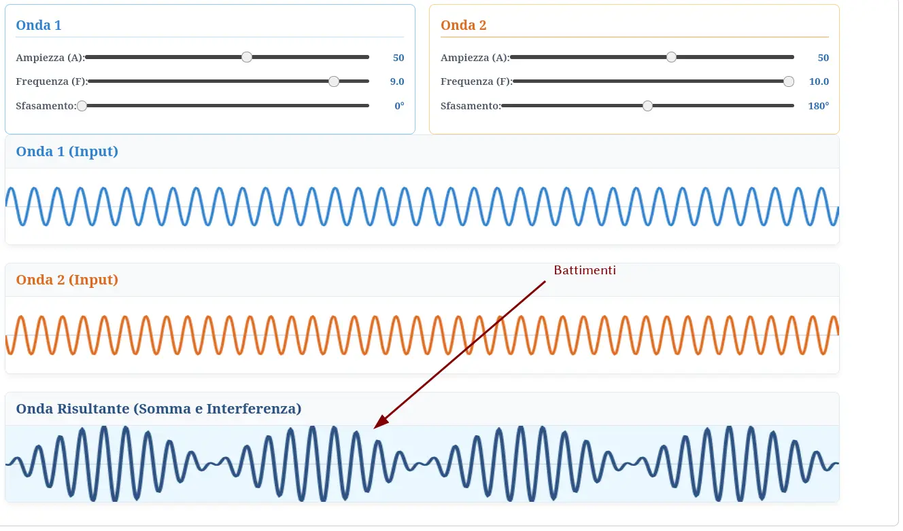

# Donazioni di sangue

[Slides](slide_statale_donare_il_sangue.pdf)

# Introduzione all’argomento di oggi

-   Useremo potenze e logaritmi per definire il “decibel”, con cui si misura l’intensità del suono

-   Introdurremo i concetti di “sovrapposizione” ed “interferenza”

# Avete fatto gli esercizi?

{height=560px}

# Proprietà delle potenze

-   La settimana scorsa avevamo visto queste due proprietà delle potenze:

    \[
    10^n \times 10^m = 10^{n + m},\qquad \frac{10^n}{10^m} = 10^{n - m},
    \]

    che valgono anche se $n$ e $m$ sono numeri negativi o con la virgola

-   Abbiamo anche visto che è sempre possibile scrivere un numero positivo $n$ come potenza di 10, se si usa come esponente il numero

    \[
    \log_{10} n
    \]

# Legge di Weber-Fechner

-   Siamo finalmente pronti per tornare alla legge di Weber-Fechner, che avevamo visto nella scorsa lezione:

    \[
    p = k \log_{10} S + C
    \]

    dove $p$ è la “percezione” che avvertono i miei sensi ed $S$ misura ciò che stimola i miei sensi, ossia nel caso del suono la sua intensità $I$

-   La legge suggerisce che anche in presenza di numeri molto grandi per $S$, il valore di $P$ non cresce molto: questo proprio per le proprietà del logaritmo che abbiamo visto!

# Esempio di Weber

-   L’esempio della legge di Weber che avevamo visto era il seguente:

    -   Aggiungere 100 g ad un carico di 10 kg dà una percezione minima, quasi inavvertibile
    -   Ma aggiungere 100 g ad un carico di 200 g è invece chiaramente avvertibile!

-   Vediamo come questo si traduce nella formula di Weber-Fechner

# Primo caso

-   A un carico di 10 kg sommo 100 g. I due stimoli sono

    \[
    \begin{aligned}
    S_1 &= 10\,\text{kg},\\
    S_2 &= 10\,\text{kg} + 0{,}1\,\text{kg} = 10{,}1\,\text{kg}.
    \end{aligned}
    \]

-   Le mie due percezioni, supponendo che $k = 1$ e $C = 0$, sono
    \[
    \begin{aligned}
    p_1 &= \log_{10} 10 = 1,\\
    p_2 &= \log_{10} 10{,}1 \approx 1{,}004.
    \end{aligned}
    \]

    Le due percezioni differiscono dello 0,4%.

# Secondo caso

-   Adesso devo invece sommare 100 g a un carico di 100 g. Gli stimoli sono

    \[
    \begin{aligned}
    S_1 &= 0{,}1\,\text{kg},\\
    S_2 &= 0{,}1\,\text{kg} + 0{,}1\,\text{kg} = 0{,}2\,\text{kg}.
    \end{aligned}
    \]

-   Le percezioni sono
    \[
    \begin{aligned}
    p_1 &= \log_{10} 0{,}1 = -1,\\
    p_2 &= \log_{10} 0{,}2 \approx -0{,}70.
    \end{aligned}
    \]

-   In questo caso, le percezioni differiscono del 30%!

# I decibel

-   Per misurare gli stimoli, si usa il “decibel”, indicato con “dB”. Questa è un’unità **logaritmica**: per convertire dalle unità del SI non si deve moltiplicare o dividere per un fattore, ma **applicare un logaritmo in base 10**

-   Nel caso di un’onda sonora, se la sua intensità espressa in W/m² è $I$, il suo valore $L$ in decibel è

    \[
    L = 10\log_{10} \frac{I}{I_0},
    \]

    dove $I_0$ è un valore di riferimento. (Per le onde sonore, di solito si usa la soglia dell’udibilità, ossia la minima intensità percepibile).

# I decibel

-   Il motivo per cui i decibel richiedono di applicare un logaritmo è che in questo modo l’unità di misura dà immediatamente una misura della **sensazione**, nell’ipotesi in cui sia valida la legge di Weber-Fechner

-   In altre parole, un suono di 30 dB risulta doppiamente intenso rispetto allo stesso suono con intensità di 15 dB.

-   (Ricordate invece che misurando l’intensità in W/m² eravamo arrivati a [strane conclusioni](tomasi-lezione-07.html#esempio-intensita-percepita), vero?)

# Soglia di udibilità

-   Nella definizione di decibel compare il rapporto tra $I$ ed un’intensità di riferimento:

    \[
    L = 10\log_{10} \frac{I}{I_0},
    \]

    dove $I_0$ è l’intensità associata alla soglia di udibilità (il più debole rumore che si possa percepire).

-   La soglia di udibilità è convenzionalmente fissata a

    \[
    I_0 = 10^{-12}\,\mathrm{W/m^2},
    \]

    anche se il valore effettivo varia da persona a persona, e anche dalla frequenza del suono (vedi le slide sulle [curve isofoniche](tomasi-lezione-07.html#curve-isofoniche)).

# Significato di $I_0$

-   L’uso di $I_0$ nella formula dei decibel serve a “normalizzare” la misura: il valore in decibel della soglia di udibilità è

    \[
    L_0 = 10\log_{10}\frac{I_0}{I_0} = 10\log_{10}1 = 0\,\text{dB}.
    \]

-   Siccome qualsiasi altro suono avrà un’intensità maggiore di $I_0$, ciò vuol dire che l’intensità in decibel sarà **sempre positiva**

# Soglia del dolore

-   All’opposto della soglia di udibilità c’è la soglia del dolore, che è anch’esso un valore convenzionale, fissato a

    \[
    I_\text{pain} = 1\,\mathrm{W/m^2}.
    \]

-   Il valore in decibel corrispondente è

    \[
    \begin{aligned}
    L_\text{pain} &= 10\log_{10}\frac{I_\text{pain}}{I_0} = 10\log_{10}\frac{1\,\mathrm{W/m^2}}{10^{-12}\,\mathrm{W/m^2}} = 10\log_{10}10^{12} =\\
    &= 120\,\text{dB}.
    \end{aligned}
    \]

# Il fattore 10

-   L’unità di misura non si chiama “bel” ma “*deci*bel” perché davanti al logaritmo compare il fattore 10

-   Questo significa che i decibel non “misurano il numero di cifre” come un semplice logaritmo! Se un’intensità è 1000 volte maggiore della soglia di udibilità $I_0$, allora

    \[
    L = 10\log_{10}\frac{1000 I_0}{I_0} = 10\log_{10} 1000 = 10 \times 3 = 30\,\text{dB}.
    \]

-   30 dB indicano un’intensità in W/m² che è 1000 volte maggiore, 40 dB un’intensità 10.000 volte maggiore, 50 dB 100.000 volte maggiore, etc.

# Variabilità dei decibel

-   I valori della soglia dell’udibilità ($10^{-12}\,\mathrm{W/m^2}$) e del dolore ($1\,\mathrm{W/m^2}$) dovrebbero farvi apprezzare i decibel

-   Se infatti non esistessero i decibel, potreste imbattervi in misure di intensità dove un numero misurato potrebbe essere ad esempio

    \[
    0{,}000\,000\,000\,165\,12\,\mathrm{W/m^2}.
    \]

-   Ma il numero, espresso in decibel, è (fate la prova con una calcolatrice)

    \[
    22{,}2\,\text{dB}
    \]

    Le intensità in decibel non superano mai il centinaio o poco più

# Numeri da ricordare

In questa slide e nella seguente elenco una serie di numeri da ricordare. [Se usate Anki](tomasi-lezione-01.html#flash-cards), vi suggerisco di creare delle flash cards.

| Impulso sonoro                  | Intensità |
|---------------------------------|----------:|
| Soglia dell’udibilità           |      0 dB |
| Sussurro                        |     30 dB |
| Voce normale                    |     60 dB |
| Cabina di aereo durante il volo |     80 dB |
| Soglia del dolore               |    120 dB |

# Numeri da ricordare

Questi numeri invece sono relativi a **differenze** tra due intensità $L_1$ e $L_2$ espresse in dB, e sono ugualmente da ricordare:

| Differenza $L_1 - L_2$ in dB | Rapporto tra potenze $I_1/I_2$ (W/m²) |
|-----------------------------:|--------------------------------------:|
|                         3 dB |                                    ×2 |
|                        10 dB |                                   ×10 |
|                        20 dB |                                  ×100 |
|                        30 dB |                                 ×1000 |

# Legge dell’inverso del quadrato

# Inverso del quadrato

-   Ricordate la legge dell’[inverso del quadrato](tomasi-lezione-07.html#legge-inverso-quadrato)? Essa dice che ad una distanza $r_2$, il suono ha un’intensità rispetto a $r_1$ uguale a

    \[
    I_2 = I_1\times\frac{r_1^2}{r_2^2}.
    \]

-   La formula vale se si usano le unità del SI per le intensità e le distanze, ma riscritta in decibel diventa più semplice:

    \[
    L_2 = 10\log_{10}\frac{I_2}{I_0} = 10\log_{10}\left(\frac{I_1}{I_0}\times\frac{r_1^2}{r_2^2}\right).
    \]

# Inverso del quadrato

-   La quantità

    \[
    10\log_{10}\left(\frac{I_1}{I_0}\times\frac{r_1^2}{r_2^2}\right)
    \]

    può essere semplificata usando le proprietà dei logaritmi:

    \[
    10\log_{10}\left(\frac{I_1}{I_0}\times\frac{r_1^2}{r_2^2}\right) =
    10\log_{10}\frac{I_1}{I_0} + 10\log_{10}\frac{r_1^2}{r_2^2} =
    L_1 + 10\log_{10}\frac{r_1^2}{r_2^2}
    \]

-   Notiamo che è comparso il valore in decibel $L_1$ dell’intensità $I_1$

# Inverso del quadrato

-   La divisione di due quadrati è il quadrato della divisione, e il logaritmo di un quadrato si semplifica:

    \[
    \begin{aligned}
    \log_{10}\frac{r_1^2}{r_2^2} &= \log_{10}\left(\frac{r_1}{r_2}\right)^2 =
    \log_{10}\left[\left(\frac{r_1}{r_2}\right)\times\left(\frac{r_1}{r_2}\right)\right] =\\
    &= \log_{10}\frac{r_1}{r_2} + \log_{10}\frac{r_1}{r_2} =
    2\log_{10}\frac{r_1}{r_2}
    \end{aligned}
    \]

-   Tra l’altro, abbiamo dimostrato che $\log_{10} n^2 = 2\times \log_{10} n$: il logaritmo trasforma le potenze in prodotti! (Anche frazionarie…)

# Inverso del quadrato

-   Abbiamo dunque ottenuto il risultato

    \[
    L_2 = L_1 + 20\log_{10}\frac{r_1}{r_2}
    \]

-   Questo è notevolmente più semplice della formula espressa nel SI:
    \[
    I_2 = I_1\times\frac{r_1^2}{r_2^2}.
    \]

    perché ha trasformato il prodotto di quantità con molte cifre in una somma di due quantità piccole, e ha fatto sparire il calcolo di due quadrati.

# Esempio

-   Ricordate l’[esempio del professore che parla in classe](tomasi-lezione-07.html#esempio-intensita-percepita)? Avevamo visto che triplicando la distanza, l’intensità si riduceva di un fattore 9

-   Vediamo ora che se $L_1$ è l’intensità in decibel che raggiunge chi è seduto più vicino, allora chi è seduto a una distanza tre volte maggiore percepisce un’intensità pari a

    \[
    L_2 = L_1 + 20\log_{10}\frac{r_1}{r_2} = L_1 + 20\log_{10}\frac13 = L_1 + (-9{,}5\,\text{dB})
    \]

-   Triplicando la distanza, si “perdono” circa 10 dB di intensità.

# Numeri da ricordare

-   Abbiamo visto che se si aumenta la distanza di un fattore 3, l’intensità diminuisce di quasi 10 dB (i W/m² sono 9 volte minori)

-   Se la distanza **raddoppia**, l’intensità diminuisce di **6 dB**

-   Se la distanza **decuplica**, l’intensità diminuisce di **20 dB** (i W/m² sono 100 volte minori)

-   Se la distanza **centuplica**, l’intensità diminuisce di **40 dB** (i W/m² sono 10.000 volte minori)

-   I tre numeri in grassetto sono da imparare a memoria: come prima, vi suggerisco di creare delle flash cards.

# Sovrapposizione e interferenza

# Sovrapposizione e interferenza

-   Abbiamo sempre parlato sinora di **una** onda sonora che si propaga. Ma nella realtà siamo sempre circondati da molti suoni!

-   Quando due onde si incontrano in un punto dello spazio, vale il principio di **sovrapposizione**: se alle onde non è associata “troppa energia”, i loro effetti si sommano

-   Questo è il **principio di sovrapposizione**, e non vale solo per le onde sonore!

---

<video controls width="1080">
  <source src="media/veritasium-double-slit-experiment.mp4" type="video/mp4" />
  Your browser does not support the video tag.
</video>

<small>[The original double slit experiment](https://www.youtube.com/watch?v=Iuv6hY6zsd0)</small>

# Interferenza

-   La sovrapposizione è un **principio**: dice che due onde che si incontrano nel medesimo punto producono un’onda risultante data dalla somma delle due

-   L’**interferenza** è il risultato della sovrapposizione di più onde. Esso dà origine a fenomeni molto interessanti, perché a volte l’interferenza causa un *rinforzo* delle onde, ma altre volte può annullare il loro effetto!

-   Per fare un’analogia: suono tre tasti del pianoforte e sento un accordo consonante o dissonante. Il fatto che ci arrivi il suono insieme è dato dalla sovrapposizione, la consonanza/dissonanza dall’interferenza.

# Tipi di interferenza

-   Ci sono vari modi in cui si manifesta l’interferenza tra due onde:

    -   Se i massimi ed i minimi di pressione avvengono sempre contemporaneamente (“onde in fase”), si ha **interferenza costruttiva**: il suono è rinforzato

    -   Se invece i massimi di pressione dell’una avvengono in coincidenza con i minimi dell’altra e viceversa, l’effetto è una **interferenza distruttiva**, in cui il suono è attenuato

    -   Se le due onde non hanno la stessa $\nu$, l’interferenza è alternatamente costruttiva e distruttiva, e si hanno i **battimenti**: l’intensità “pulsa”

-   Tutti questi effetti si possono vedere nell’applicazione della slide successiva

---

<iframe src="iframes/interference.html" width="100%" height="760"></iframe>

# Interferenza distruttiva

::: side-by-side

::: content

-   Le cuffie a cancellazione del rumore hanno un microfono che riceve il suono ambientale e lo riproduce indirizzandolo all’orecchio, ma con uno sfasamento di mezza lunghezza d’onda
-   Nell’orecchio entra quindi il suono ambientale, più ciò che produce la cuffia, ossia la musica e il suono ambientale “sfasato”:
    \[
    \begin{aligned}
    \text{Risultato} &= \cancel{\textcolor{#269342}{\text{Ambiente}}} + \textcolor{#932642}{\text{Musica}} - \cancel{\textcolor{#932642}{\text{Ambiente}}} = \\
    &= \textcolor{#932642}{\text{Musica}}
    \end{aligned}
    \]

:::

::: media

{width=320px}

:::
:::

# Lunghezza d’onda

::: side-by-side

::: content

-   La **lunghezza d’onda**, che si indica con la lettera λ (“lambda”), rappresenta la distanza fisica tra un picco di pressione e il successivo (la “semilunghezza” è la metà della lunghezza d’onda)

-   Essendo una distanza, λ si misura in metri

-   Si può trovare λ dalla relazione (intuitiva: provate a pensarci!)

    \[
    v_\text{suono} = \lambda \times \nu \quad\Rightarrow\quad \lambda = \frac{v_\text{suono}}{\nu}.
    \]

:::

::: media

:::
:::

# Esempi

-   Un suono basso a 20 Hz ha una lunghezza d’onda uguale a
    \[
    \lambda = \frac{343\,\text{m/s}}{20\,\text{s}^{-1}} \approx 17\,\text{m}
    \]

-   Il suono di un diapason a 440 Hz ha una lunghezza d’onda uguale a
    \[
    \lambda = \frac{343\,\text{m/s}}{440\,\text{s}^{-1}} \approx 78\,\text{cm}
    \]

# Interferenza e λ

::: side-by-side

::: content

-   Se riproduco il medesimo suono da due altoparlanti che sono a una distanza diversa dal mio orecchio, si avrà interferenza

-   Se la distanza del più lontano è maggiore di un numero intero di lunghezze d’onda λ (2λ, 3λ, 4λ, 5λ…), l’interferenza sarà costruttiva

-   Ma se è invece maggiore di un numero dispari di semi-lunghezze d’onda λ (λ/2, 3λ/2, 5λ/2, 7λ/2…), l’interferenza sarà distruttiva

:::

::: media

:::
:::

# Battimenti

{height=600px}

# Battimenti

-   I battimenti sono un tipo di interferenza in cui le due onde non hanno la stessa frequenza; l’interferenza continua quindi ad alternarsi tra costruttiva e distruttiva

-   L’effetto è quello di un’onda la cui intensità cambia da un minimo ad un massimo, con una frequenza data da

    \[
    \nu_\text{battimento} = \left|\nu_1 - \nu_2\right|.
    \]

-   Sono molto utili per accordare tra loro strumenti: se si sentono battimenti quando suonano la stessa nota, non sono accordati!

# Eco e riverbero

# L’eco

-   Un’onda che raggiunge un corpo rigido come un muro può venire riflessa, tornando indietro

-   L’eco è il suono riflesso che torna all’orecchio dell’ascoltatore, con un ritardo sufficiente per essere percepito come un suono separato

-   È come vedere la propria immagine riflessa in uno specchio: il suono è un’onda proprio come la luce, ed entrambe vengono riflesse dalle superfici

# Il riverbero

-   Il riverbero è un fenomeno simile all’eco, ma è causato da molteplici riflessioni che raggiungono l’orecchio rapidamente, sovrapponendosi e fondendosi col suono originale

-   È il fenomeno che fa percepire il suono dell’organo in una cattedrale come ricco e “prolungato”, grazie a innumerevoli riflessioni che si sommano.

---

<iframe width="840" height="472" src="https://www.youtube.com/embed/erXG9vnN-GI?si=Whg0iHD1I22ZhYCO" title="YouTube video player" frameborder="0" allow="accelerometer; autoplay; clipboard-write; encrypted-media; gyroscope; picture-in-picture; web-share" referrerpolicy="strict-origin-when-cross-origin" allowfullscreen></iframe>

Toccata e fuga in re minore BWV 565 di J. S. Bach, suonata da Liene Andreta Kalnciema nella cattedrale di Riga (Lituania).

---

La [cattedrale di Riga](https://en.wikipedia.org/wiki/Riga_Cathedral) occupa circa 8000 m², e l’organo è uno dei più grandi d’Europa, con un’altezza di 25 metri e 6768 canne.

# Conclusioni

# Cosa sapere per l’esame

-   Legge di Weber-Fechner

-   Definizione di decibel

-   Legge dell’inverso del quadrato espressa in decibel (senza dimostrazione)

-   Sovrapposizione e interferenza, lunghezza d’onda, battimenti

---
title: Fisica -- Lezione 8
subtitle: Decibel, sovrapposizione e interferenza
author: Maurizio Tomasi ([`maurizio.tomasi@unimi.it`](mailto:maurizio.tomasi@unimi.it))
date: Martedì 25 novembre 2025
...
