# Introduzione all’argomento

-   Cosa determina il timbro della voce o di uno strumento?

-   Cos’è l’analisi di Fourier?

-   Come funzionano i filtri?

# Il timbro

# Timbro del suono

-   Abbiamo visto l’interferenza tra due onde sonore, ma ovviamente si può sovrapporre qualsiasi numero di onde!

-   Il motivo per cui due strumenti diversi come un violino e un flauto suonino “diversi” anche quando la nota è la stessa è dovuta proprio al diverso modo con cui le tante onde prodotte dallo strumento si combinano

-   Il “colore” di un suono è detto **timbro**, e dipende dal fatto che gli strumenti non emettono mai semplici onde sinusoidali, ma sovrapposizioni di onde

---

<iframe src="iframes/timbre.html" width="720px" height="760px"></iframe>

# Espressione matematica

-   Dal punto di vista matematico, il suono emesso dall’applicazione nella pagina precedente si può scrivere una somma di tre sinusoidi

    \[
    \begin{aligned}
    P(t) = &A_1 \sin(2\pi\nu_1 t + \varphi_1) +\\
    &A_2 \sin(2\pi\nu_2 t + \varphi_2) +\\
    &A_3 \sin(2\pi\nu_3 t + \varphi_3)
    \end{aligned}
    \]

-   In un generico caso della vita reale, anziché tre sinusoidi se ne avranno molte di più, ciascuna caratterizzata dalla sua ampiezza $A$, frequenza $\nu$ e fase $\varphi$

# Perché tante frequenze?

::: side-by-side

::: content

-   Il motivo per cui la voce o uno strumento musicale emettono più di una frequenza ha a che fare con il processo fisico che emette l’onda.

-   L’effettiva frequenza di vibrazione di una corda dipende dalla sua tensione (variabile attraverso le chiavi e i piroli, per il violino in foto) e dal materiale di cui è fatta

:::

::: media

:::
:::

# Onde stazionarie

::: side-by-side

::: content

-   Se la corda ha gli estremi fissi, come una chitarra o un violino, si parla di **onde stazionarie**

-   Sono dette stazionarie perché l’energia non si propaga, ma resta “intrappolata” nella lunghezza dell’onda

-   Fisicamente, è un’onda che si propaga in una direzione sovrapposta alla sua onda riflessa (da uno dei due estremi della corda), che viaggia nell’altra direzione.
:::

::: media

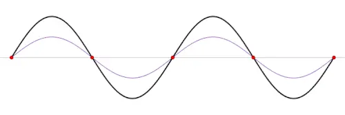

:::
:::

# Nodi e ventri

::: side-by-side

::: content

-   Data una certa frequenza di oscillazione (o lunghezza d’onda), ci sono alcuni punti della corda che non vibrano mai: questi sono detti **nodi** (perché i nodi “tengono ferme” le corde!)
-   I punti in cui c’è l’oscillazione massima sono detti **ventri**

:::

::: media

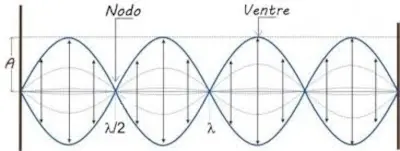

:::
:::

# Figure di Chladni

-   [Ernst Chladni](https://en.wikipedia.org/wiki/Ernst_Chladni) (1756–1827) è stato un fisico/musicista, tra i fondatori della moderna acustica

-   Egli mostrò che in una superficie elastica fatta vibrare (es., la pelle di un tamburo) si osservano delle linee in corrispondenza dei nodi di vibrazione: mise della polvere scura sulla pelle tesa che, percuotendo il tamburo, tendeva a disporsi lungo i nodi

-   Potete vederne alcuni esempi sul sito [Javalab](https://javalab.org/en/standing_waves_on_a_drum_surface_en/).

# Gli strumenti a corda

-   La lunghezza d’onda λ, [come sappiamo](tomasi-lezione-08.html#wavelength), dipende dalla frequenza e dalla velocità di propagazione dell’onda attraverso la corda secondo la formula
    \[
    v_\text{onda} = \lambda \times \nu.
    \]

-   Ma in un qualsiasi strumento a corda come il violino o il pianoforte infatti, la corda non può vibrare con qualsiasi lunghezza d’onda, perché gli estremi sono fissi!

-   La lunghezza $L$ della corda determina quindi la lunghezza d’onda $\lambda$, e la forza di tensione determina la velocità dell’onda $_\text{onda}$ e quindi la frequenza $\nu$ della nota che sentiremo.

# Suono di una corda

::: side-by-side

::: content

-   Quando il musicista sollecita la corda, produce una somma di oscillazioni con $\lambda$ disposte nella cosiddetta **serie armonica**

-   Essa è definita a partire dalla lunghezza d’onda fondamentale, $\lambda_0 = 2L$ con $L$ lunghezza della corda (e quindi della “pancia”), e via via dividendo $\lambda_0$ per un numero intero.

-   Le “armoniche” sono le frequenze corrispondenti alle $\lambda$: $\nu$, $2\nu$, $3\nu$, etc.

:::

::: media

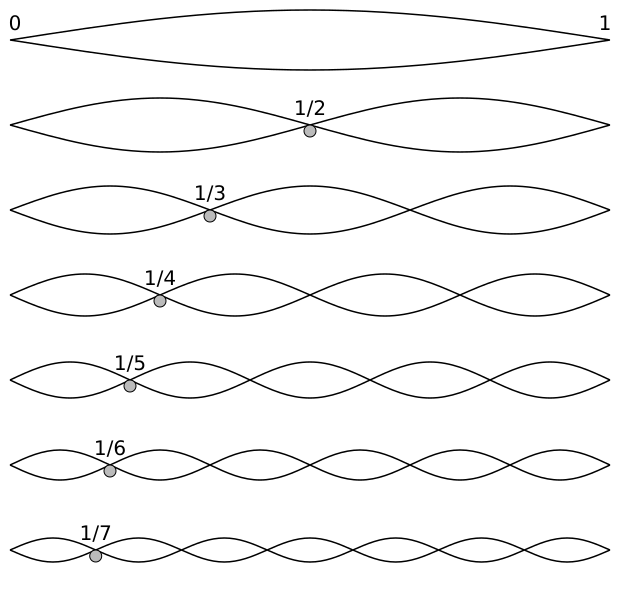

:::
:::

# Serie armonica

Ogni nota ha la sua serie armonica. Questa è nel caso di un do:

| Lunghezza d’onda | Frequenza | Altezza del suono |
|------------------|----------:|-------------------|
| λ₀               |        ν₀ | Do                |
| λ₀/2             |       2ν₀ | Do'               |
| λ₀/3             |       3ν₀ | Sol'              |
| λ₀/4             |       4ν₀ | Do''              |
| λ₀/5             |       5ν₀ | Mi''              |

# E per gli strumenti ad aria?

::: side-by-side

::: content

-   Nel caso degli strumenti ad aria, come il flauto o l’organo, abbiamo un tubo con due estremità, più complesso di una corda

-   Un’estremità **chiusa** impedisce (per attrito) alle particelle di gas di vibrare, ed è quindi un **nodo** di spostamento

-   Presso l’estremità **aperta**, le particelle sono libere di muoversi al massimo: è un **ventre** di spostamento. Ma, proprio perché sono libere, la compressione è minima: è un nodo di pressione.

:::

::: media

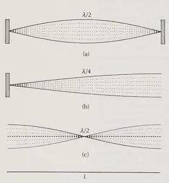

:::
:::

# Strumenti ad aria

-   Uno strumento ad aria con le due estremità aperte (come il flauto) può produrre tutte le note della serie armonica (1, 2, 3, 4…)

-   Uno strumento ad aria con un’estremità chiusa ed una aperta (come il clarinetto, che usa un’[ancia](https://it.wikipedia.org/wiki/Ancia)) può produrre solo le armoniche dispari (1, 3, 5...). Questo è ciò che dà al clarinetto quel suono così particolare e “nasale” rispetto al flauto.

# Esempio di caso chiuso-aperto

<video controls loop>
    <source src="media/standing-longitudinal-waves.mp4" type="video/mp4">
</video>

<small>[Longitudinal wave using slinky coil](https://www.youtube.com/watch?v=fMJrtheQfZw)</small>

# Strumenti ad aria

-   Le onde stazionarie nelle corde e nei tubi sono le uniche **stabili** e prolungate nel tempo. Ma, come abbiamo visto, si possono produrre solo se la loro $\lambda$ soddisfa la relazione specifica per il loro tipo: questo determina principalmente il timbro dello strumento

-   Sono però possibili anche onde che non soddisfano queste relazioni: esse però sono **effimere**, nel senso che disperdono rapidamente la loro energia scomparendo presto

-   Queste onde costituiscono il cosiddetto “transitorio d’attacco”, ossia quel breve istante iniziale (il "ta" della tromba o lo sfregamento dell'archetto) che ci permette di riconoscere lo strumento. (Senza di esso, il suono di un violino o di un flauto sarebbe più difficile da distinguere!)

# Scomposizione di Fourier

# Scomposizione di Fourier

::: side-by-side

::: content

-   Abbiamo visto che la sovrapposizione di un suono fondamentale e di armoniche fornisce il “timbro” di quel suono

-   Un matematico francese, [Jean-Baptiste Joseph Fourier](https://it.wikipedia.org/wiki/Jean_Baptiste_Joseph_Fourier) (1768–1830), dimostrò una proprietà fondamentale delle onde, non solo sonore: ogni fenomeno periodico può essere scomposto nella somma di oscillazioni sinusoidali

:::

::: media

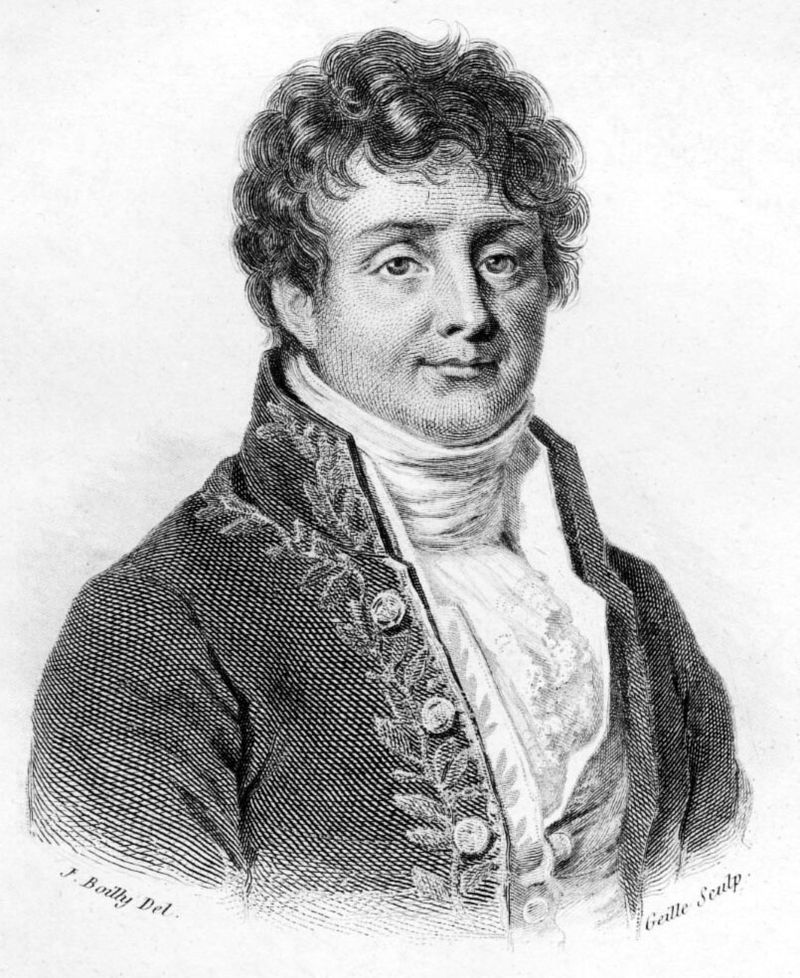

:::
:::

# Trasformata di Fourier

-   La “trasformata di Fourier” è un’operazione matematica che consente, data la misurazione dell’ampiezza di pressione di un’onda sonora, di decomporre quest’onda in una somma di onde sinusoidali

-   Dal punto di vista pratico, il risultato del calcolo di una trasformata di Fourier è la stima dei valori delle ampiezze, frequenze e fasi nella formula
    \[
    \begin{aligned}
    P(t) = &\textcolor{#a08}{A_1} \sin(2\pi\textcolor{#a08}{\nu_1} t + \textcolor{#a08}{\varphi_1}) +\\
    &\textcolor{#a08}{A_2} \sin(2\pi\textcolor{#a08}{\nu_2} t + \textcolor{#a08}{\varphi_2}) +\\
    &\ldots
    \end{aligned}
    \]

# Trasformate di Fourier con Audacity

-   È possibile calcolare la trasformata di Fourier usando il programma *open source* Audacity, scaricabile dal link [www.audacityteam.org](https://www.audacityteam.org/)

-   Vediamo ora un esempio interattivo

# Esempio con Audacity

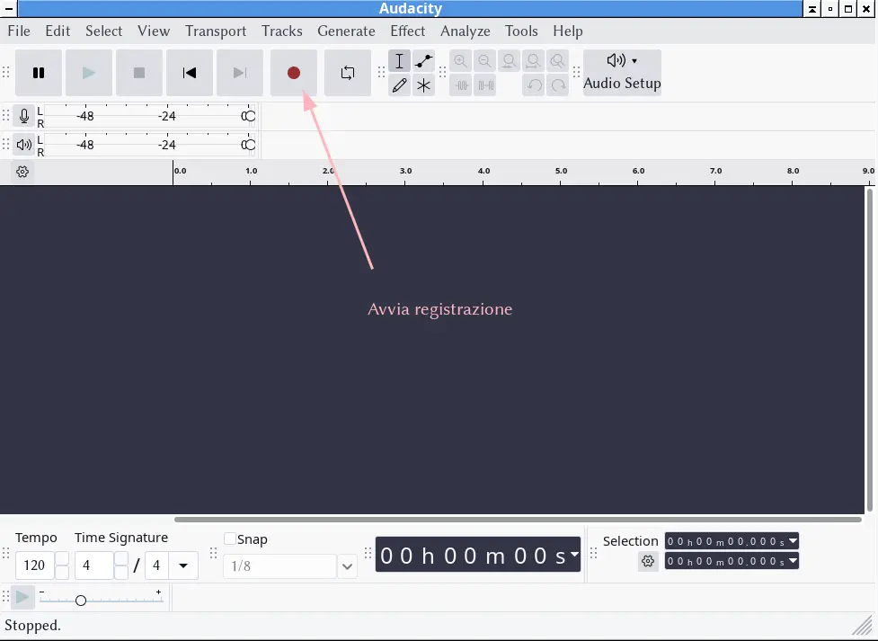{height=560px}

# Esempio con Audacity

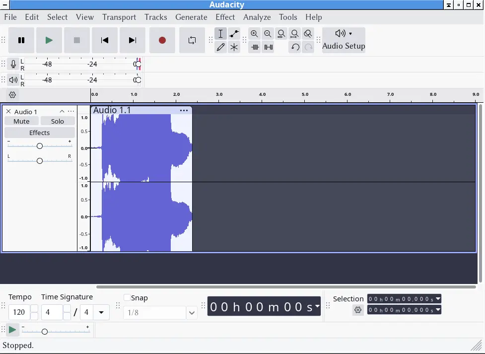{height=560px}

# Esempio con Audacity

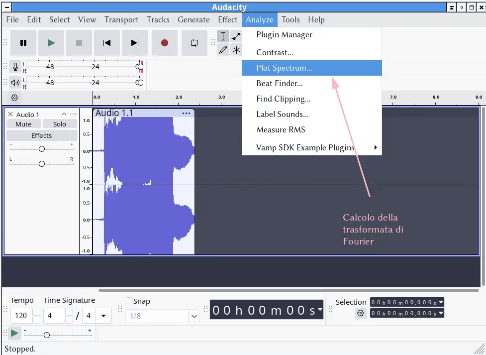{height=560px}

# Esempio con Audacity

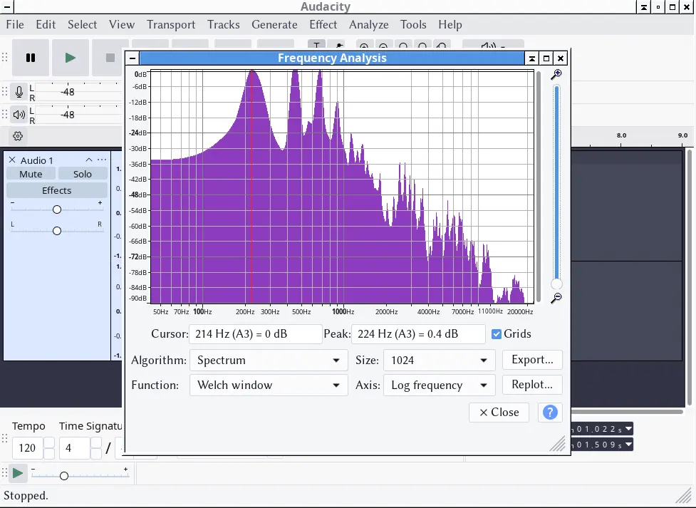{height=560px}

# Tuba Mirum

-   Consideriamo come esempio un’esecuzione del *Requiem* KV 626 di Mozart

-   In particolare, all’inizio del *Tuba mirum* c’è un famoso assolo di trombone, dove lo strumento suona senza accompagnamento

-   Prendiamo due esecuzioni su YouTube di questo brano:

    -   Esecuzione diretta da Karl Bohm (Wiener Symphoniker): <https://www.youtube.com/watch?v=0-i5S4uXlNg>

    -   Esecuzione dei Seraphic fire: <https://www.youtube.com/watch?v=_jFMZ4jguwY>

# Tuba Mirum

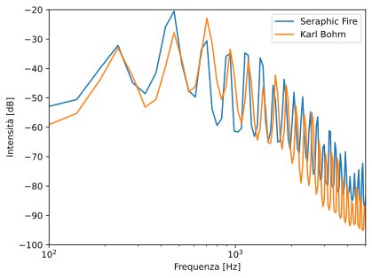

Rappresentazione spettrale della prima nota (Si♭³) del trombone nelle due esecuzioni del *Tuba Mirum*, calcolata con Audacity.

# Applicazioni della trasformata

-   Anche l’orecchio umano opera una decomposizione in frequenze: è in questo modo che un orecchio allenato distingue le note di un accordo

-   Un equalizzatore acustico è in grado di modificare i suoni gravi, medi ed acuti decomponendo il suono e agendo sulle ampiezze di alcune frequenze e non altre, come vedremo tra poco

-   I file MP3 riescono a registrare musica usando 10 volte meno spazio dei vecchi CD, perché usano la decomposizione di Fourier per registrare solo le frequenze nell’intervallo di frequenze udibili dall’uomo, e cancellare le frequenze troppo deboli (es., quelle di un violino in *pianissimo* sotto le trombe in *fortissimo*)

# Suono e rumore

# Suono e rumore

-   Nella vita quotidiana, usiamo spesso le parole “suono” e “rumore” in contrapposizione tra esse

-   Ma sappiamo qual è la differenza tra i due? In particolare, stiamo parlando di un fenomeno fisico oggettivo, o della **sensazione** che un certo fenomeno fisico (quale?) ci provoca?

# Rumore e suono

-   Quando si parla di “suono” contrapposto a “rumore”, la differenza è la seguente:

    -   Il **suono** (in senso musicale) è generato da un’onda sonora **periodica**, cioè che ripete la sua forma nel tempo in modo regolare.

    -   Il **rumore** è generato da un’onda **aperiodica**, che varia in modo casuale e non si ripete mai uguale a se stessa.

-   Vediamo subito la differenza con un esempio interattivo

---

<iframe src="iframes/sound-example.html" width="100%" height="580px" style="border:1px solid #ccc; border-radius: 8px;"></iframe>

# Il rumore secondo Fourier

-   Analizzando con la trasformata di Fourier un suono armonioso, come una nota suonata da un violoncello, si vede che l'onda è composta da una frequenza fondamentale precisa sommata alle sue armoniche ordinate.

-   Analizzando invece il rumore (es. il soffio dell'aria o un applauso), esso appare come un 'caos' di frequenze: moltissime sinusoidi di tutte le altezze ammassate insieme senza ordine.

-   Non esiste una differenza netta tra suono e rumore: aumentando il numero di componenti sinusoidali casuali, è possibile gradualmente mutare un suono in rumore. E molti suoni sono una via di mezzo: un colpo di tamburo ha un inizio rumoroso (l'impatto) e una coda più tonale.

# Filtraggio

# Filtraggio

-   Una volta calcolata la trasformata di Fourier, è possibile modificare l’ampiezza delle sinusoidi per cambiare il timbro del suono, e poi “rimettere insieme” le sinusoidi ottenendo un suono filtrato:

    

    
    

-   In questo modo si possono ad esempio amplificare i suoni più bassi, o quelli più alti: questo avviene ad esempio in fase di *editing* della registrazione di un concerto

# Esempio

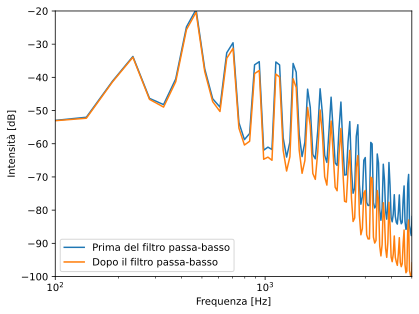

Ho usato Audacity per applicare un filtro passa-basso al Si♭³ del trombone nel *Tuba mirum* di Mozart: il filtro opera sopra i 1000 Hz, riducendo 6 dB ogni ottava sopra. (Menu “Effect | EQ and filters | Low-pass filter”)

# L’effetto Doppler

---

<iframe src="iframes/doppler-effect.html" width="100%" height="560"></iframe>

# L’effetto Doppler

-   Quando un emettitore di suoni si sposta **verso** l’ascoltatore (nella slide precedente, l’ascoltatore starebbe a **destra**), le onde arrivano separate da una distanza inferiore, perché ogni onda successiva parte un po’ più vicina all’osservatore della precedente

-   Viceversa, chi vede l’emettitore allontanarsi (nella slide precedente, un ascoltatore a **sinistra**) riceve le onde come se avessero una lunghezza d’onda maggiore

-   Se cambia la lunghezza d’onda λ, cambia necessariamente anche la frequenza: si avverte un suono più acuto (avvicinamento) o più grave (allontanamento) del normale

# Formule

-   Nel caso di **avvicinamento** con velocità $v$, si ha

    \[
    \lambda = \lambda_0\left(1 - \frac{v}{v_\text{suono}}\right), \qquad
    \nu = \frac{\nu_0}{1 - v/v_\text{suono}}.
    \]

    con $\lambda_0$ e $\nu_0$ riferiti al caso in cui non c’è moto.

-   Nel caso di **allontanamento** con velocità $v$, si ha

    \[
    \lambda = \lambda_0\left(1 + \frac{v}{v_\text{suono}}\right), \qquad
    \nu = \frac{\nu_0}{1 + v/v_\text{suono}}.
    \]

# Esempio

-   Il clacson di un’auto che viaggia a 50 km/h suona un La a 440 Hz.

-   Chi è fermo sul bordo della strada e vede l’automobile **avvicinarsi**, percepirà una frequenza

    \[
    \nu = \frac{440\,\text{Hz}}{1 - 13{,}9\,\text{m/s} / 343\,\text{m/s}} = 458{,}6\,\text{Hz}
    \]

-   Chi vede l’auto allontanarsi invece percepisce

    \[
    \nu = \frac{440\,\text{Hz}}{1 + 13{,}9\,\text{m/s} / 343\,\text{m/s}} = 422{,}9\,\text{Hz}
    \]

# Conclusioni

# Cosa sapere per l’esame

-   Timbro, scomposizione di Fourier
-   Onde stazionarie
-   Filtraggio
-   Effetto Doppler

---
title: Fisica -- Lezione 9
subtitle: Timbro, analisi di Fourier, filtraggio, effetto Doppler
author: Maurizio Tomasi ([`maurizio.tomasi@unimi.it`](mailto:maurizio.tomasi@unimi.it))
date: Mercoledì 3 dicembre 2025
...
